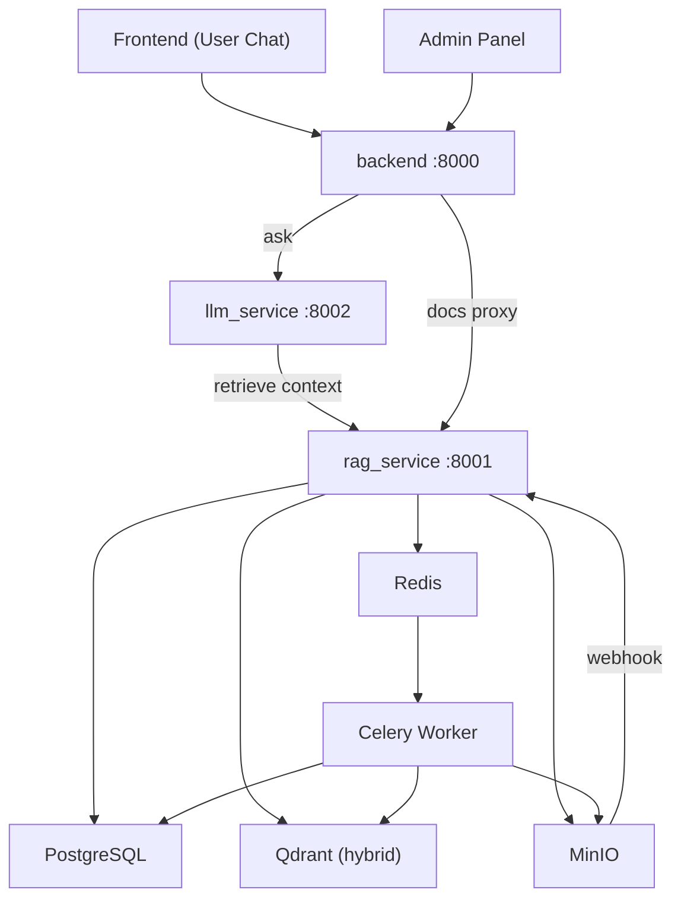
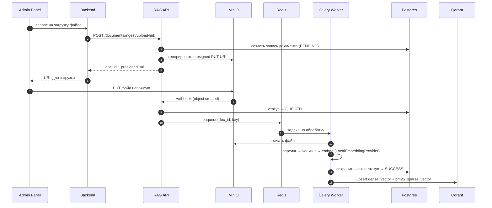
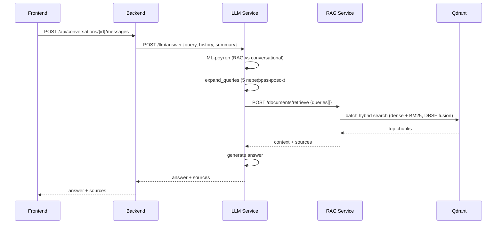

# RAGProgramm

## Vision

RAGProgramm — локальный корпоративный AI-ассистент для работы с внутренней документацией.
Self-hosted, развёртывается полностью внутри инфраструктуры компании.

**Текущее состояние:** AI-ассистент с RAG-поиском по загруженным документам, управление чатами, загрузка и индексация файлов через MinIO.

**Направление развития:** корпоративный мессенджер с AI как встроенным участником, управление проектами, AI-аудит документов на соответствие ГОСТам.

---

## Сервисы

| Сервис | Порт | Описание |
|---|---|---|
| `backend` | 8000 | Внешний API: auth, чаты, история, proxy в rag_service |
| `rag_service` | 8001 | Индексация и поиск документов, webhook MinIO |
| `llm_service` | 8002 | Генерация ответа через LangGraph RAG-агент |
| `frontend` | 5173 | Chat UI для пользователей |
| `admin-panel` | 5174 | Управление документами и пользователями |
| `rag-worker` | — | Celery-воркер: парсинг, чанкинг, векторизация |
| `PostgreSQL` | 5432 | Метаданные, статусы документов, чаты, пользователи |
| `Qdrant` | 6333 | Векторный индекс (гибридный поиск) |
| `MinIO` | 9000 | S3-хранилище файлов + webhook при загрузке |
| `Redis` | 6379 | Брокер задач для Celery |
| `Flower` | 5555 | Мониторинг Celery |

---

## Архитектура



### Поток загрузки и индексации



### Поток ответа на вопрос



---

## Поиск (Hybrid RAG)

Retrieval работает в два этапа:

1. **Query expansion** — LLM генерирует 5 перефразировок запроса
2. **Batch hybrid search** — для каждого запроса параллельный prefetch:
   - Dense: `dense_vector` (multilingual-e5-large, cosine)
   - Sparse: `bm25_sparse_vector` (серверный `qdrant/bm25`)
   - Fusion: **DBSF** (Distribution-Based Score Fusion)
3. **Parent chunk retrieval** — по найденным дочерним чанкам достаём родительский контекст из Postgres

---

## LLM Pipeline (LangGraph)

`llm_service` использует LangGraph-агент (`LeanRagAgent`) с нодами:

1. `route_node` — ML-роутер (e5-small + LogReg): RAG или conversational
2. `expand_queries_node` — расширение запроса через LLM
3. `retrieve_node` — batch-запрос в rag_service
4. `build_context_node` — сборка контекста из чанков
5. `generate_node` — финальный ответ

---

## Быстрый старт

```bash
cp .env.example .env
# Заполнить обязательные поля (помечены # ⬅ заполнить):
# POSTGRES_PASSWORD, MINIO_ACCESS_KEY, MINIO_SECRET_KEY,
# SECRET_KEY, HF_TOKEN, LLM_API_KEY, LLM_BASE_URL

docker compose -f docker-compose.full.yml up -d --build
```

Проверить статус:
```bash
docker compose -f docker-compose.full.yml ps
docker compose -f docker-compose.full.yml logs -f backend
```

---

## API

### Backend (`:8000`)

**Auth**
- `POST /auth/register`
- `POST /auth/login`
- `POST /auth/refresh`
- `POST /auth/logout`

**Чаты**
- `POST /api/conversations`
- `GET /api/conversations`
- `GET /api/conversations/{id}`
- `POST /api/conversations/{id}/messages`
- `PATCH /api/chats/{id}/rename`
- `DELETE /api/chats/{id}`

**Admin**
- `GET /admin/users/repo`
- `POST /admin/users/repo`
- `PUT /admin/users/repo/{user_id}`
- `DELETE /admin/users/repo/{user_id}`
- `GET /admin/documents`
- `POST /admin/documents/upload-link`
- `POST /admin/documents/batch-delete`
- `GET /admin/system/health`

### RAG Service (`:8001`)
- `POST /documents/retrieve`
- `POST /documents/ingest/upload-link`
- `POST /documents/ingest/webhook`
- `POST /documents/batch-delete`
- `GET /health`

### LLM Service (`:8002`)
- `POST /llm/answer`
- `POST /llm/summary`
- `GET /health`

---

## Миграции

```bash
alembic -n users upgrade head
alembic -n rag upgrade head
```

---

## Тесты

```bash
pytest rag_service/tests -q
pytest rag_service/tests/test_integration_upload_webhook_flow.py -s -vv
```

---

## Структура репозитория

```
backend/          — FastAPI, auth, chats, admin proxy
rag_service/      — ingestion, retrieval, Qdrant, MinIO webhook
llm_service/      — LangGraph RAG agent, ML router
frontend/         — React chat UI
admin-panel/      — React admin UI
migrations/       — Alembic (users, rag)
docker-compose.full.yml
.env.example
```

---

## Типичные проблемы

| Проблема | Решение |
|---|---|
| Webhook не приходит | Проверить `mc event list myminio/rag-documents`, endpoint доступен из контейнера |
| `Invalid hostname` в mc | Использовать DNS-имя без `_` (например `minio`) |
| Таблица не рендерится в чате | Убедиться что `remark-gfm` установлен и передан в `<ReactMarkdown>` |
| `node_modules` в контейнере устарел | `docker compose rm -sv frontend` → rebuild |
| Qdrant collection schema mismatch | Пересоздать коллекцию: удалить старую, переиндексировать |