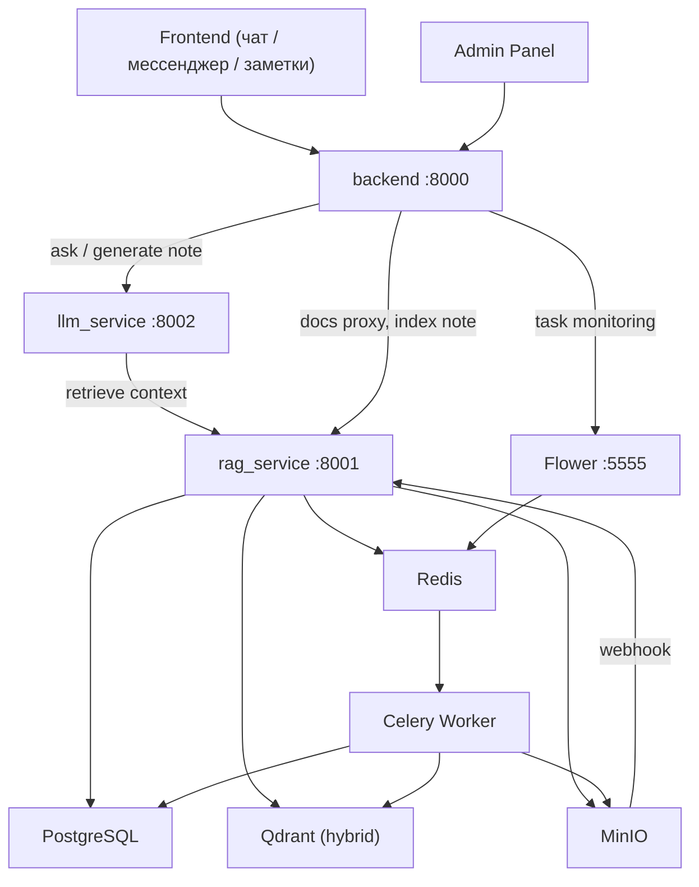
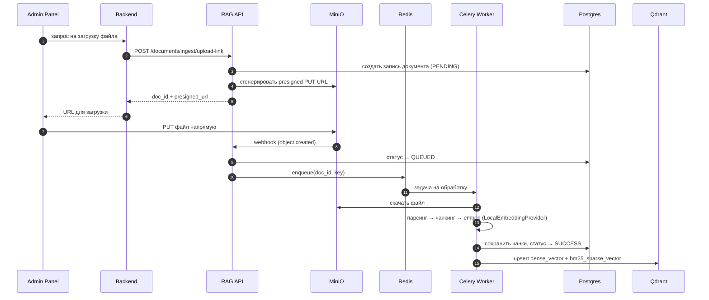
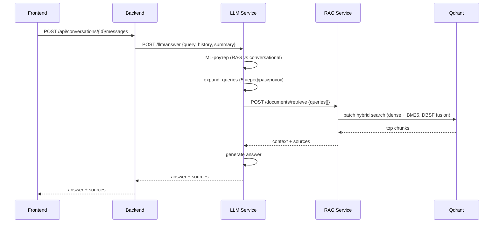
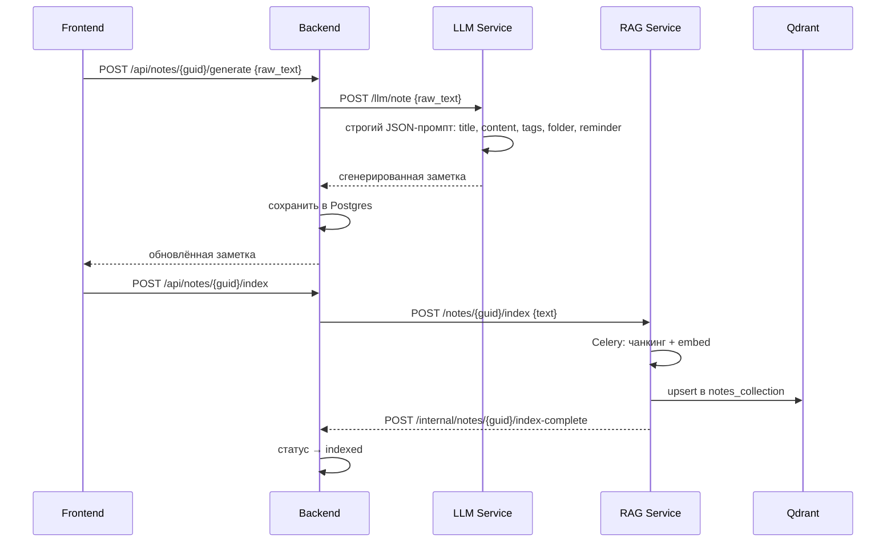

# RAGProgramm

Локальный корпоративный AI-ассистент поверх внутренней документации компании — с личными
заметками, корпоративным мессенджером и админ-панелью в одном self-hosted приложении.
Разворачивается полностью внутри инфраструктуры компании, без внешних облачных зависимостей
(кроме самого LLM-провайдера, который тоже настраивается на self-hosted вариант).

---

## Что это

Сотрудник заходит в один веб-интерфейс и получает:

- **AI-чат**, который отвечает по внутренней документации (регламенты, инструкции, ГОСТы) с
  указанием источника — не «где-то читал», а конкретный документ/глава/таблица;
- **Базу знаний** с полнотекстовой читалкой документов (главы, таблицы, гибридный поиск);
- **Личные заметки** — набросал мысль голосом/текстом, ИИ сам оформил в аккуратную заметку с
  заголовком, структурой и тегами;
- **Корпоративный мессенджер** — обычные личные чаты с коллегами, реалтайм через WebSocket;
- **Проекты** и **задачи на день** — координация работы команды (в разработке);
- **Админ-панель** — документы, пользователи, мониторинг фоновых задач, состояние сервисов.

---

## Возможности

### ✅ Готово

- **AI-чат с гибридным RAG-поиском** — LangGraph-агент, ML-роутер (RAG / просто диалог),
  расширение запроса в 5 перефразировок, dense + BM25 поиск с DBSF-fusion по Qdrant, ответ со
  ссылкой на источник (документ / глава / таблица)
- **База знаний** — загрузка документов (PDF/DOCX/MD), парсинг через Docling с сохранением
  структуры (главы, таблицы), полноэкранная читалка
- **Заметки с AI-генерацией** — сырой поток мыслей → структурированный Markdown одним запросом к
  LLM, который сразу же определяет заголовок, теги, папку и дату напоминания (строгий JSON-ответ,
  без отдельного агента — просто один хорошо спроектированный промпт)
- **Корпоративный мессенджер** — личные чаты, реалтайм через WebSocket (доставка сообщений,
  индикатор «печатает», статус прочтения), поиск коллег для нового чата
- **Ролевая модель** (`is_superuser`) — гейтинг админских разделов и API
- **Админ-панель** — пользователи (роли, блокировка), документы (загрузка, реиндексация,
  удаление), состояние всех сервисов онлайн, мониторинг фоновых задач Celery через Flower
  (список, статусы, отмена зависшей задачи)

### 🚧 В разработке

- **Проекты** — на фронте есть экран, бэкенда с реальным хранением пока нет
- **Задачи на день / Главная (дашборд)** — экраны собраны на моках, бэкенда нет
- Мессенджер: пагинация истории сообщений (бэкенд уже поддерживает, фронт пока грузит только
  последнюю страницу)

### 📋 Запланировано

- **AI как участник мессенджер-чата** (`@gpt`) — бот отвечает на упоминание прямо в чате
- **AI-аудит опросных листов на соответствие ГОСТам** — батчевая сверка технического задания
  (до 100+ страниц) с нормативной базой в Qdrant, отчёт по несоответствиям
- **Отложенные push-уведомления** — напоминания из заметок/задач приходят даже при закрытом
  браузере (RabbitMQ delayed exchange + Web Push)
- Автосаммари переписки по счётчику сообщений

Актуальный приоритетный план и известные баги — в [`TODO.md`](TODO.md); архитектурный долг
`rag_service` — в [`rag_service/ISSUES.md`](rag_service/ISSUES.md).

---

## Сервисы

| Сервис | Порт | Описание |
|---|---|---|
| `backend` | 8000 | Единая точка входа: auth, чаты, мессенджер (REST + WS), заметки, admin-proxy |
| `rag_service` | 8001 | Индексация и поиск документов/заметок, webhook MinIO |
| `llm_service` | 8002 | Генерация ответов и заметок через LangGraph RAG-агент |
| `frontend` | 5173 | Основной UI: чат, мессенджер, база знаний, заметки, проекты, встроенная админ-панель |
| `admin-panel` | 5174 | Отдельное legacy-приложение управления документами/пользователями (дублирует часть встроенной админки во `frontend`) |
| `rag-worker` | — | Celery-воркер: парсинг, чанкинг, векторизация документов и заметок |
| `PostgreSQL` | 5432 | Метаданные: документы, чаты, пользователи, заметки |
| `Qdrant` | 6333 | Векторный индекс (гибридный поиск), отдельные коллекции для документов и заметок |
| `MinIO` | 9000 | S3-хранилище файлов + webhook при загрузке |
| `Redis` | 6379 | Брокер задач для Celery |
| `Flower` | 5555 | Мониторинг и отмена задач Celery (используется и напрямую, и через админ-панель) |

---

## Архитектура



### Поток загрузки и индексации документа



### Поток ответа на вопрос



### Поток генерации и индексации заметки



---

## Поиск (Hybrid RAG)

Retrieval работает в два этапа:

1. **Query expansion** — LLM генерирует 5 перефразировок запроса
2. **Batch hybrid search** — для каждого запроса параллельный prefetch:
   - Dense: `dense_vector` (multilingual-e5-large, cosine)
   - Sparse: `bm25_sparse_vector` (серверный `qdrant/bm25`)
   - Fusion: **DBSF** (Distribution-Based Score Fusion)
3. **Parent chunk retrieval** — по найденным дочерним чанкам достаём родительский контекст из Postgres

Документы и заметки индексируются в отдельные коллекции Qdrant через общий переиспользуемый
клиент (`QdrantVectorStorage`), но одной и той же гибридной схемой поиска.

---

## LLM Pipeline (LangGraph)

`llm_service` использует LangGraph-агент (`LeanRagAgent`) с нодами:

1. `route_node` — ML-роутер (e5-small + LogReg): RAG или conversational
2. `expand_queries_node` — расширение запроса через LLM
3. `retrieve_node` — batch-запрос в rag_service
4. `build_context_node` — сборка контекста из чанков
5. `generate_node` — финальный ответ

Отдельно, вне графа — точечный эндпоинт `POST /llm/note` для генерации заметок: не требует
поиска по базе знаний, просто структурирует сырой текст в строгий JSON одним вызовом.

---

## Быстрый старт

```bash
cp .env.example .env
# Заполнить обязательные поля (помечены # ⬅ заполнить):
# POSTGRES_PASSWORD, MINIO_ACCESS_KEY, MINIO_SECRET_KEY,
# SECRET_KEY, HF_TOKEN, LLM_API_KEY, LLM_BASE_URL

docker compose -f docker-compose.full.yml up -d --build
```

Проверить статус:
```bash
docker compose -f docker-compose.full.yml ps
docker compose -f docker-compose.full.yml logs -f backend
```

`backend`/`llm_service`/`rag_service` смонтированы volume'ом — после правки кода достаточно
`docker compose restart <service>`, пересборка образа не нужна. `frontend` собирается на этапе
сборки образа (`npm run build` внутри `Dockerfile`) — после правки нужен `docker compose build frontend`.

---

## API

### Backend (`:8000`)

**Auth**
- `POST /auth/register`, `POST /auth/login`, `POST /auth/refresh`, `POST /auth/logout`

**AI-чаты**
- `POST /api/conversations`, `GET /api/conversations`, `GET /api/conversations/{id}`
- `POST /api/conversations/{id}/messages`
- `PATCH /api/chats/{id}/rename`, `DELETE /api/chats/{id}`

**Мессенджер** (REST для чатов и истории, отправка/typing/read-receipts — только через WebSocket)
- `GET /messenger/chats/`, `POST /messenger/chats/direct`, `DELETE /messenger/chats/{guid}`
- `GET /messenger/chats/{guid}/messages`
- `WS /websocket/ws/?token=` — `new_message`/`user_typing`/`message_read` от клиента,
  `new`/`new_chat_created`/`message_read`/`user_typing`/`chat_deleted` от сервера

**Заметки**
- `POST /api/notes`, `GET /api/notes`, `GET /api/notes/{guid}`
- `PATCH /api/notes/{guid}`, `DELETE /api/notes/{guid}`
- `POST /api/notes/{guid}/generate` — сгенерировать title/content/tags/folder/reminder через LLM
- `POST /api/notes/{guid}/index` — векторизовать в rag_service

**База знаний** (proxy в rag_service)
- `GET /api/knowledge/documents`, `GET /api/knowledge/documents/{id}`
- `GET /api/knowledge/documents/{id}/chapters/{n}`

**Admin** (весь роутер гейтится `require_admin_user`, 403 без `is_superuser`)
- `GET /admin/users/repo`, `POST /admin/users/repo`, `PUT /admin/users/repo/{id}`
- `PATCH /admin/users/repo/{id}/role`, `DELETE /admin/users/repo/{id}`
- `GET /admin/documents`, `GET /admin/documents/{id}`, `POST /admin/documents/upload-link`
- `POST /admin/documents/{id}/reindex`, `DELETE /admin/documents/{id}`, `POST /admin/documents/batch-delete`
- `GET /admin/tasks`, `POST /admin/tasks/{task_id}/revoke` — мониторинг/отмена задач Celery (proxy в Flower)
- `GET /admin/system/health`

### RAG Service (`:8001`)
- `POST /documents/retrieve`, `POST /documents/ingest/upload-link`, `POST /documents/ingest/webhook`
- `POST /documents/batch-delete`, `GET /documents/{doc_id}`
- `GET /documents/{doc_id}/chapters/{chapter_idx}` — текст главы + связанные таблицы (для читалки)
- `POST /notes/{note_id}/index`, `DELETE /notes/{note_id}/vectors`
- `GET /health`

### LLM Service (`:8002`)
- `POST /llm/answer`, `POST /llm/summary`
- `POST /llm/note` — генерация заметки (строгий JSON: title/content/tags/folder/reminder)
- `GET /health`

---

## Миграции

```bash
alembic -n users upgrade head
alembic -n rag upgrade head
```

---

## Тесты

```bash
pytest rag_service/tests -q
pytest rag_service/tests/test_integration_upload_webhook_flow.py -s -vv
```

---

## Структура репозитория

```
backend/          — FastAPI: auth, чаты, мессенджер, заметки, admin proxy
rag_service/      — ingestion, retrieval, Qdrant, MinIO webhook
llm_service/      — LangGraph RAG agent, ML router, генерация заметок
frontend/         — React UI: чат, мессенджер, база знаний, заметки, проекты, админка
admin-panel/      — React admin UI (legacy, частично дублирует frontend)
migrations/       — Alembic (users, rag)
docker-compose.full.yml
.env.example
```