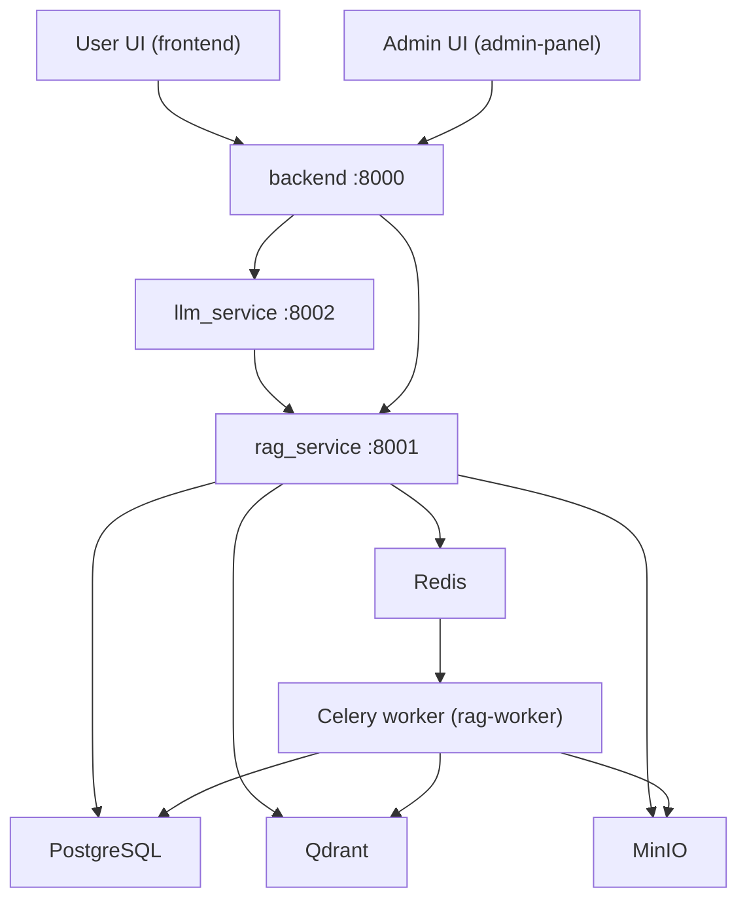
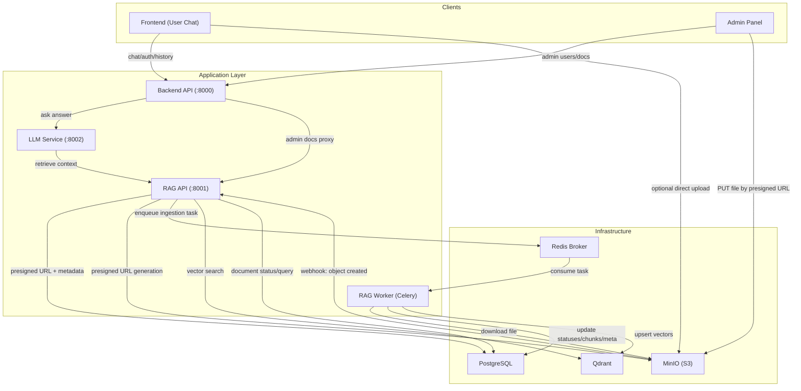
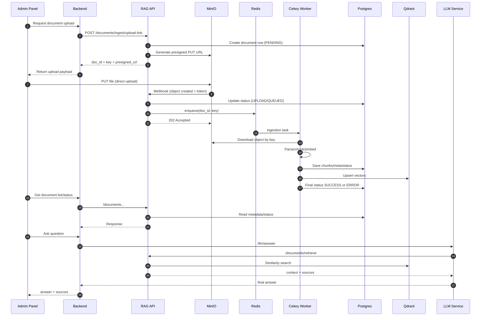

# RAGProgramm

## Vision / Product Direction

RAGProgramm is evolving into a **local enterprise AI application** for internal company use.

Current goal:
- help employees work with internal documentation faster;
- provide contextual answers based on uploaded company files;
- keep data inside company infrastructure (self-hosted/local deployment).

Planned evolution:
- grow from a document assistant into a full corporate messenger;
- keep AI as a built-in participant in employee communication;
- scale as a modular platform with new services and workflows.

Important:
- sections below describe what is already implemented and currently operational;
- the vision section describes the next product stage.

## Project Overview

Monorepo with a multi-service RAG platform:
- `backend` - application API (auth, chat, admin-proxy);
- `rag_service` - ingestion/retrieval, document handling, MinIO/Qdrant/Postgres;
- `llm_service` - answer generation from retrieved context;
- `frontend` - end-user chat UI;
- `admin-panel` - admin UI for documents and users.

## Architecture



### Component Diagram



### End-to-End Sequence (upload -> webhook -> ingestion -> retrieval)



## Responsibility Boundaries

1. `backend` - external app API, auth/chat/admin orchestration.
2. `rag_service` API - document management, retrieval, webhook receiver.
3. `rag-worker` - asynchronous document processing and indexing.
4. `llm_service` - answer generation using RAG context.
5. `MinIO` - source file storage and webhook events.
6. `PostgreSQL` - metadata, document statuses, chats, users.
7. `Qdrant` - vector index for semantic retrieval.
8. `Redis` - task broker between API and worker.

## Main Components

- `backend`
  - FastAPI + SQLAlchemy;
  - auth/tokens, chats, history;
  - admin routes for users/documents;
  - proxy for document operations into `rag_service`.

- `rag_service`
  - FastAPI API for retrieval and ingestion;
  - presigned URL generation for MinIO uploads;
  - MinIO webhook receiver -> enqueue to Redis/Celery;
  - worker pipeline: document processing, status updates, Qdrant indexing.

- `llm_service`
  - `/llm/answer` API;
  - consumes context from `rag_service`;
  - produces final user answer.

## Quick Start (Docker)

1. Copy env file:
```bash
cp .env.example .env
```

2. Validate `.env` (minimum):
- Postgres (`POSTGRES_*`);
- MinIO (`MINIO_ACCESS_KEY`, `MINIO_SECRET_KEY`);
- webhook:
  - `MINIO_NOTIFY_WEBHOOK_ENABLE_1=on`
  - `MINIO_NOTIFY_WEBHOOK_ENDPOINT_1=...`
  - `MINIO_NOTIFY_WEBHOOK_AUTH_TOKEN_1=...`

3. Start full stack:
```bash
docker compose -f docker-compose.full.yml up -d --build
```

4. Check containers:
```bash
docker ps
```

## Default Ports

- `backend` - `8000`
- `rag_service` - `8001`
- `llm_service` - `8002`
- `frontend` - `5173`
- `admin-panel` - `5174`
- `minio api` - `9000`
- `minio console` - `9001`
- `qdrant` - `6333`
- `postgres` - `5432`
- `redis` - `6379`

## Ingestion Flow (Presigned URL)

1. Client requests upload link:
   - `POST /documents/ingest/upload-link` (`rag_service`)
2. `rag_service` creates a document row and returns a presigned URL.
3. Client uploads file directly to MinIO (`PUT` by URL).
4. MinIO sends webhook to `rag_service`.
5. `rag_service` enqueues ingestion task to Redis/Celery.
6. `rag-worker` processes file, updates Postgres, indexes vectors in Qdrant.

## Key APIs

### Backend (`:8000`)
- `POST /auth/register`
- `POST /auth/login`
- `POST /auth/refresh`
- `POST /auth/logout`
- `POST /api/conversations`
- `GET /api/conversations`
- `GET /api/conversations/{conversation_id}`
- `POST /api/conversations/{conversation_id}/messages`
- `GET /admin/users/repo`
- `POST /admin/users/repo`
- `PUT /admin/users/repo/{user_id}`
- `DELETE /admin/users/repo/{user_id}`
- `GET /admin/documents`
- `POST /admin/documents/upload-link`
- `POST /admin/documents/batch-delete`
- `GET /admin/system/health`

### RAG Service (`:8001`)
- `POST /documents/retrieve`
- `POST /documents/ingest/upload-link`
- `POST /documents/ingest/webhook`
- `POST /documents/batch-delete`

### LLM Service (`:8002`)
- `POST /llm/answer`

## Migrations

Examples:

```bash
alembic -n users upgrade head
alembic -n rag upgrade head
```

If you need a specific DB URL, pass it via `-x db_url=...` and use it in your Alembic `env.py`.

## Tests

Run all RAG tests:
```bash
pytest rag_service/tests -q
```

Run upload/webhook integration scenario:
```bash
pytest rag_service/tests/test_integration_upload_webhook_flow.py -s -vv
```

## MinIO Webhook Validation

1. Check webhook config:
```bash
mc admin config get myminio notify_webhook:1
```

2. Check bucket event binding:
```bash
mc event list myminio/<bucket-name>
```

Important: event binding must be configured on the same bucket that receives uploads (for example `rag-documents`).

## Common Issues

- `Invalid hostname` in `mc alias set`  
  Use a DNS-safe service name (without `_`), for example `minio`.

- Webhook does not arrive  
  Usually event is bound to wrong bucket or endpoint is unreachable from container network.

- `psycopg2 ... pg_config not found` during build  
  Use `psycopg2-binary` or install required system dependencies in image.

- `torch==...+cpu not found`  
  Fix pinned version in `requirements.txt` to a version available for your platform.

## Local Development (without Docker)

Start services separately:

```bash
uvicorn backend.main:app --reload --port 8000
uvicorn rag_service.main:app --reload --port 8001
uvicorn llm_service.main:app --reload --port 8002
```

Start RAG worker separately:
```bash
celery -A rag_service.celery_app worker -l INFO
```

## Repository Structure

```text
backend/
rag_service/
llm_service/
frontend/
admin-panel/
migrations/
docker-compose.full.yml
docker-compose.infra.yml
docker-compose.app.yml
```

---

If README and live endpoints diverge after changes, verify router files first:
- `backend/api/routes.py`
- `backend/api/admin_routes.py`
- `rag_service/api/rag_routes.py`
- `llm_service/api/agent_routes.py`
