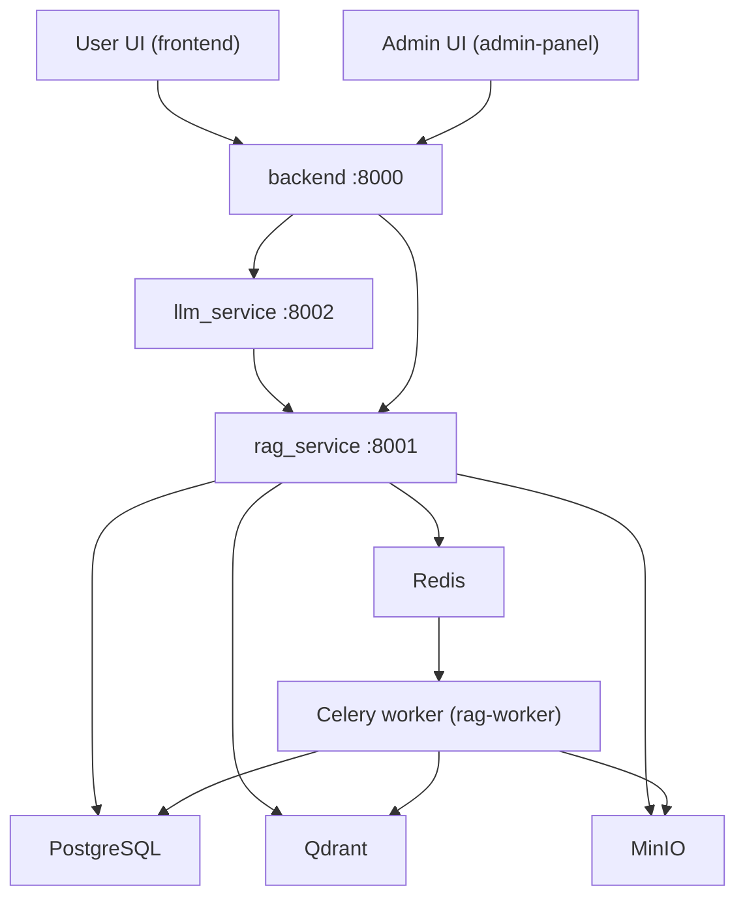
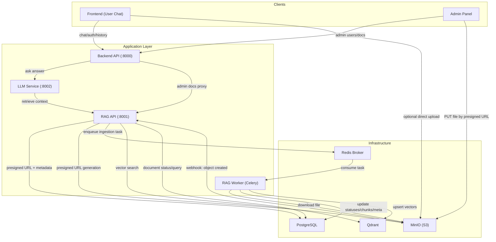
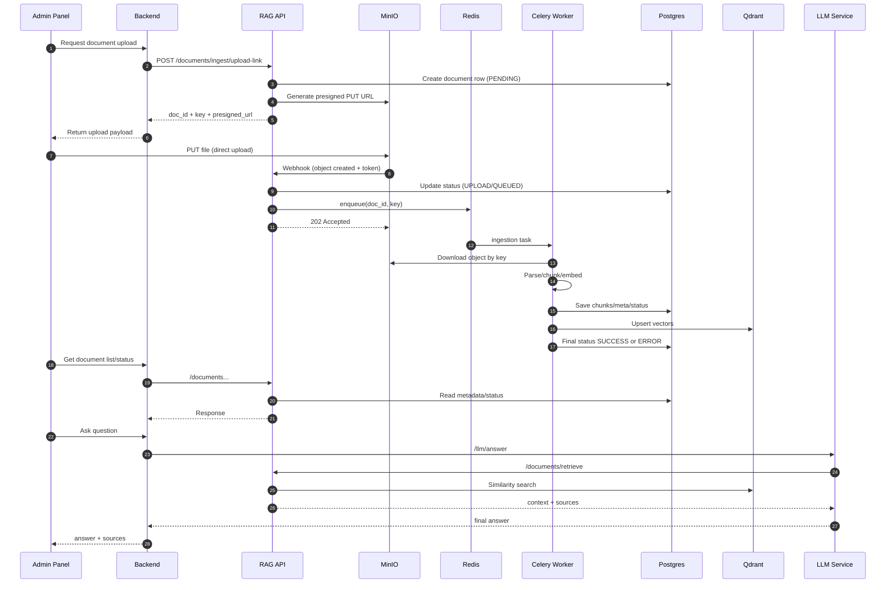

# RAGProgramm

Монорепозиторий с multi-service RAG-платформой:
- `backend` — API приложения (auth, chat, admin-proxy);
- `rag_service` — ingestion/retrieval, работа с документами, MinIO/Qdrant/Postgres;
- `llm_service` — генерация ответа по контексту;
- `frontend` — пользовательский чат;
- `admin-panel` — админка документов и пользователей.

## Архитектура



### Детальная компонентная схема



### Детальная последовательность (upload -> webhook -> ingestion -> retrieval)



### Зоны ответственности

1. `backend` — внешний API приложения, auth/chat/admin orchestration.
2. `rag_service` API — управление документами, retrieval, webhook-приемник.
3. `rag-worker` — асинхронная обработка документов и индексация.
4. `llm_service` — генерация ответа на основе контекста из RAG.
5. `MinIO` — хранение исходных файлов и генерация webhook событий.
6. `PostgreSQL` — метаданные, статусы документов, чаты, пользователи.
7. `Qdrant` — векторный индекс для поиска релевантного контекста.
8. `Redis` — брокер задач между API и воркером.

## Основные компоненты

- `backend`
  - FastAPI + SQLAlchemy;
  - авторизация/токены, чаты, история;
  - admin-роуты для пользователей;
  - проксирование document-операций в `rag_service`.

- `rag_service`
  - FastAPI API для retrieval и ingestion;
  - presigned URL для загрузки в MinIO;
  - webhook от MinIO -> постановка задач в Redis/Celery;
  - worker: обработка документа, обновление статусов, запись в Qdrant.

- `llm_service`
  - API `/llm/answer`;
  - получает контекст из `rag_service`;
  - формирует финальный ответ.

## Быстрый запуск (Docker)

1. Скопировать env:
```bash
cp .env.example .env
```

2. Проверить `.env` (минимум):
- Postgres (`POSTGRES_*`);
- MinIO (`MINIO_ACCESS_KEY`, `MINIO_SECRET_KEY`);
- webhook:
  - `MINIO_NOTIFY_WEBHOOK_ENABLE_1=on`
  - `MINIO_NOTIFY_WEBHOOK_ENDPOINT_1=...`
  - `MINIO_NOTIFY_WEBHOOK_AUTH_TOKEN_1=...`

3. Поднять полный стек:
```bash
docker compose -f docker-compose.full.yml up -d --build
```

4. Проверить контейнеры:
```bash
docker ps
```

## Порты по умолчанию

- `backend` — `8000`
- `rag_service` — `8001`
- `llm_service` — `8002`
- `frontend` — `5173`
- `admin-panel` — `5174`
- `minio api` — `9000`
- `minio console` — `9001`
- `qdrant` — `6333`
- `postgres` — `5432`
- `redis` — `6379`

## Ingestion flow (Presigned URL)

1. Клиент запрашивает ссылку:
   - `POST /documents/ingest/upload-link` (`rag_service`)
2. `rag_service` создает запись документа и возвращает presigned URL.
3. Клиент грузит файл напрямую в MinIO (PUT по URL).
4. MinIO отправляет webhook в `rag_service`.
5. `rag_service` ставит задачу в Redis/Celery.
6. `rag-worker` забирает файл, обрабатывает, обновляет Postgres, индексирует в Qdrant.

## Ключевые API

### Backend (`:8000`)
- `POST /auth/register`
- `POST /auth/login`
- `POST /auth/refresh`
- `POST /auth/logout`
- `POST /api/conversations`
- `GET /api/conversations`
- `GET /api/conversations/{conversation_id}`
- `POST /api/conversations/{conversation_id}/messages`
- `GET /admin/users/repo`
- `POST /admin/users/repo`
- `PUT /admin/users/repo/{user_id}`
- `DELETE /admin/users/repo/{user_id}`
- `GET /admin/documents` (proxy в `rag_service`)

### RAG Service (`:8001`)
- `POST /documents/retrieve`
- `POST /documents/ingest/upload-link`
- `POST /documents/ingest/webhook`

### LLM Service (`:8002`)
- `POST /llm/answer`

## Миграции

Примеры:

```bash
alembic -n users upgrade head
alembic -n rag upgrade head
```

Если нужна конкретная БД/URL через `-x db_url=...`, передавайте параметр в используемый `env.py`.

## Тесты

Пример запуска тестов RAG:
```bash
pytest rag_service/tests -q
```

Пример интеграционного сценария:
```bash
pytest rag_service/tests/test_integration_upload_webhook_flow.py -s -vv
```

## Проверка MinIO webhook

1. Проверка конфигурации webhook:
```bash
mc admin config get myminio notify_webhook:1
```

2. Проверка события на бакете:
```bash
mc event list myminio/<bucket-name>
```

Важно: событие должно быть на том же бакете, куда реально идет загрузка (например, `rag-documents`).

## Частые проблемы

- `Invalid hostname` в `mc alias set`  
  Используйте DNS-safe имя сервиса (без `_`), например `minio`.

- Webhook не приходит  
  Обычно причина: event привязан к другому бакету, либо endpoint недоступен из контейнера.

- `psycopg2 ... pg_config not found` при сборке  
  Используйте `psycopg2-binary` или ставьте системные зависимости в образ.

- `torch==...+cpu not found`  
  Исправьте pinned-версию в `requirements.txt` на доступную для вашей платформы.

## Локальная разработка без Docker

Каждый сервис можно запустить отдельно:

```bash
uvicorn backend.main:app --reload --port 8000
uvicorn rag_service.main:app --reload --port 8001
uvicorn llm_service.main:app --reload --port 8002
```

Для `rag_service` отдельно запускается воркер:
```bash
celery -A rag_service.celery_app worker -l INFO
```

## Структура репозитория

```text
backend/
rag_service/
llm_service/
frontend/
admin-panel/
migrations/
docker-compose.full.yml
docker-compose.infra.yml
docker-compose.app.yml
```

---

Если README не соответствует текущим endpoint-ам после изменений, сначала проверьте роутеры:
- `backend/api/routes.py`
- `backend/api/admin_routes.py`
- `rag_service/api/rag_routes.py`
- `llm_service/api/agent_routes.py`
