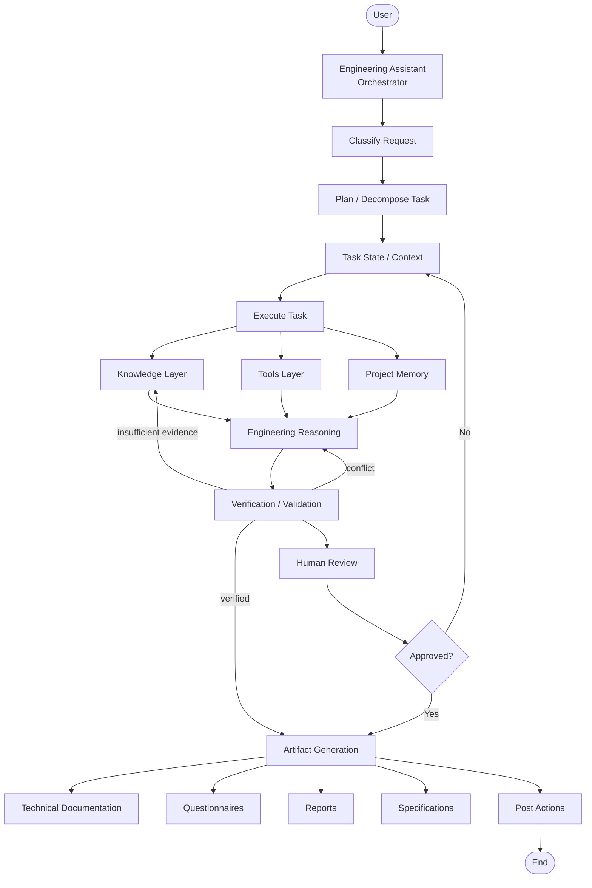
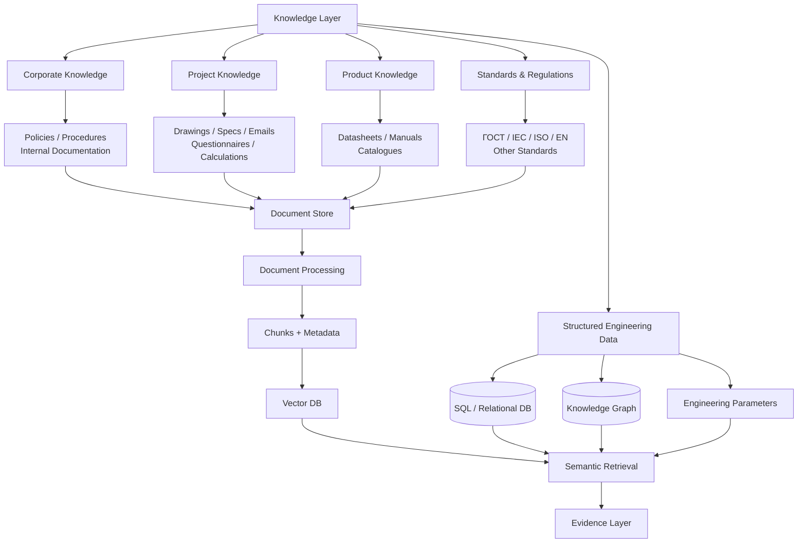
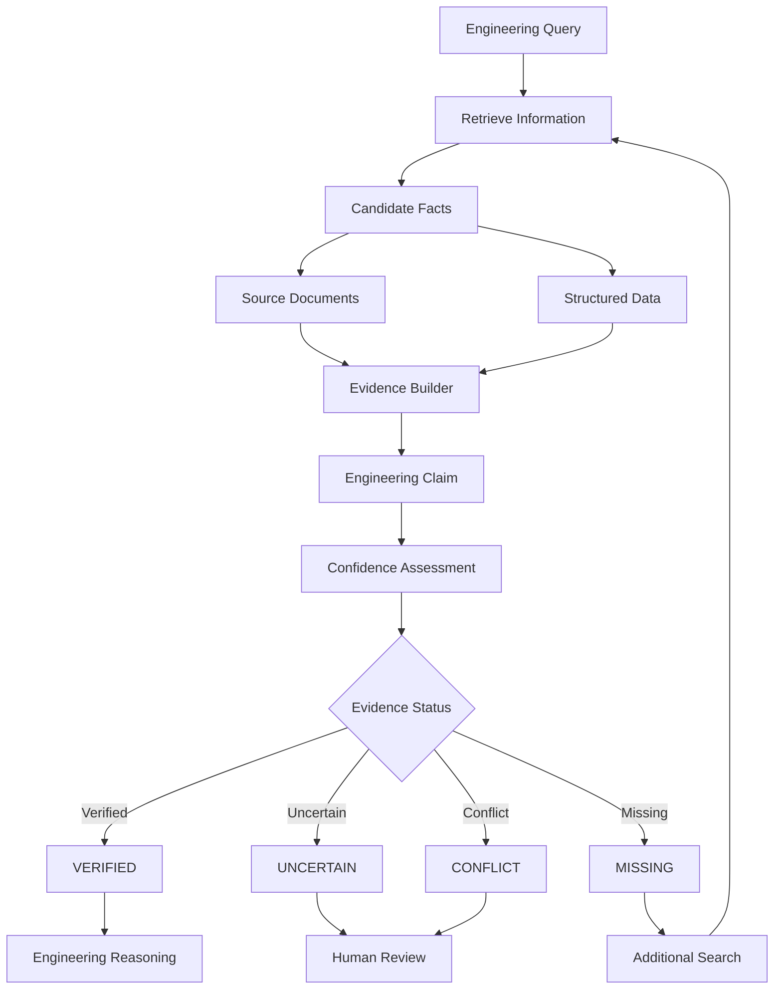
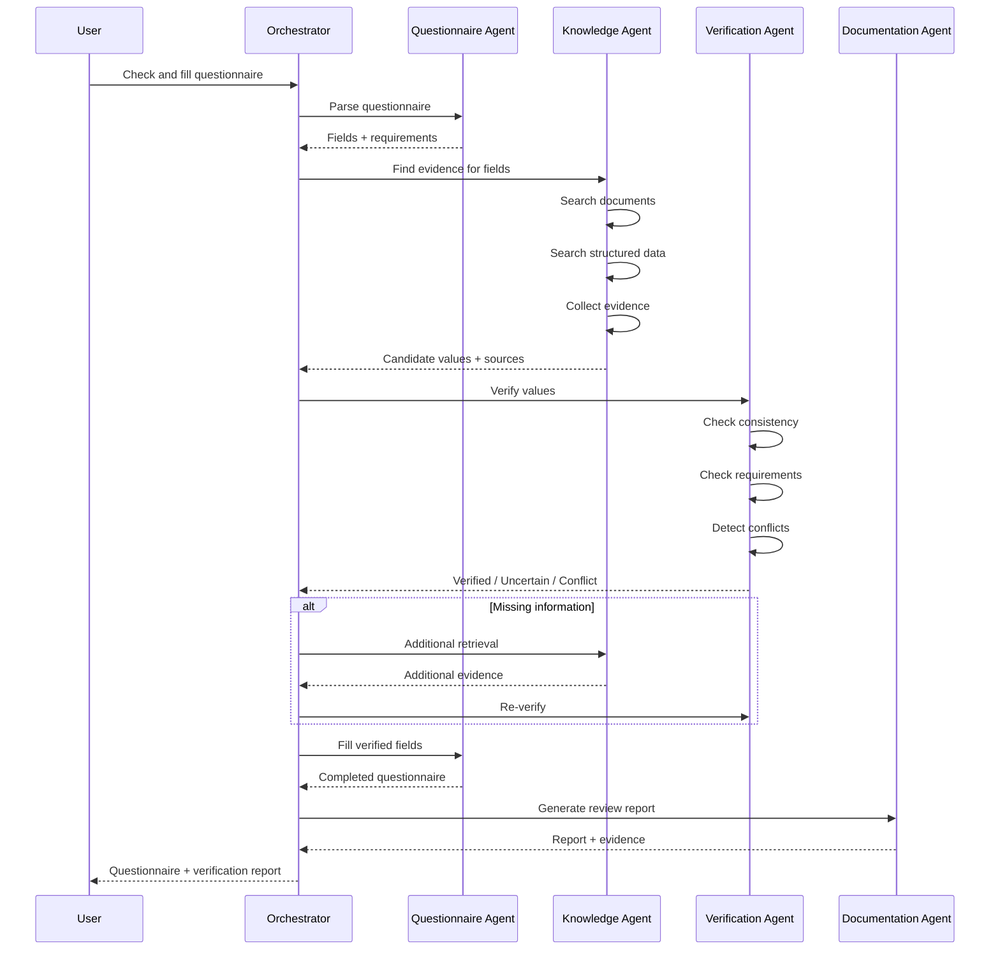
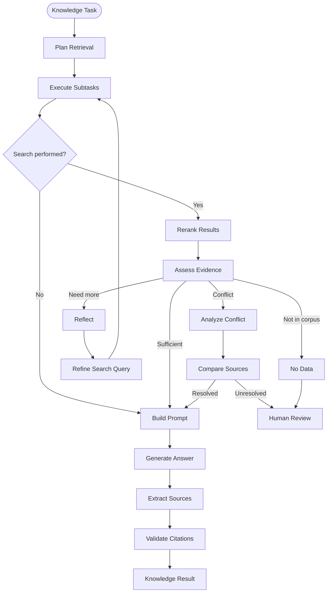
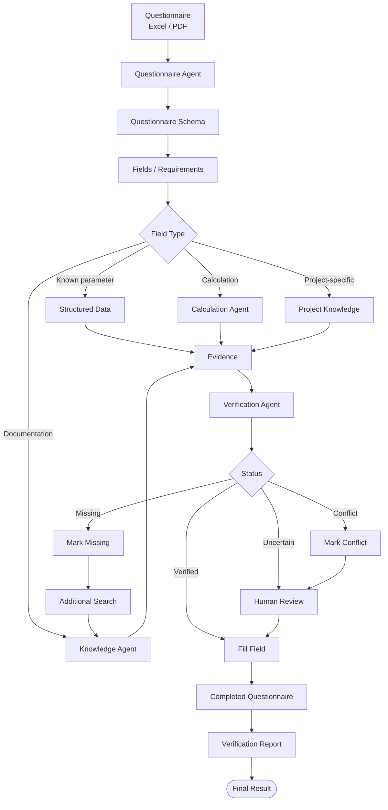
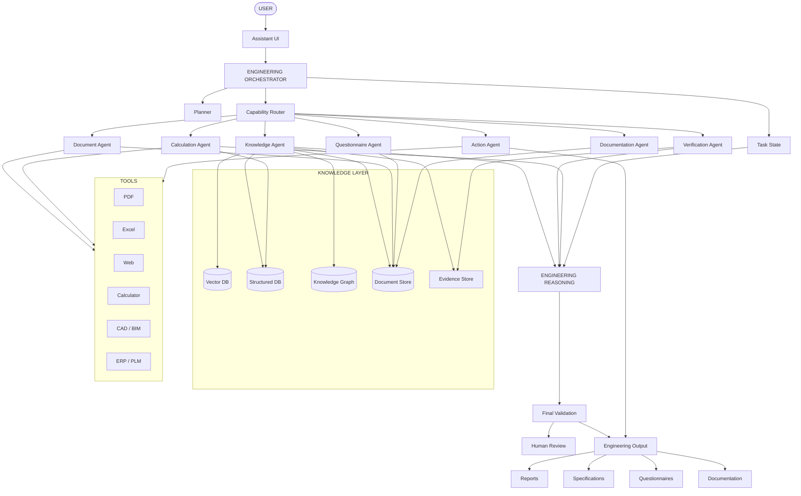

# Engineering Assistant — Target Architecture

## 1. Purpose

Этот документ описывает целевую архитектуру системы, которая начинается как RAG/knowledge agent для работы с документацией, а затем развивается в полноценного Engineering Assistant.

Основная идея:

> RAG — это не сам ассистент. RAG является одним из механизмов Knowledge Layer, которым управляет общий Orchestrator.

Целевая система должна уметь:

- искать и проверять информацию в технической документации;
- работать с проектной документацией;
- читать и заполнять опросные листы;
- сравнивать документы и ревизии;
- проверять требования и параметры;
- находить противоречия;
- выполнять инженерные расчёты;
- формировать техническую документацию;
- формировать отчёты и замечания;
- сохранять evidence для каждого важного утверждения;
- передавать неоднозначные или критические решения человеку.

---

# 2. Основная архитектура



## Архитектурный принцип

Orchestrator не должен быть RAG-агентом.

Он отвечает за:

1. понимание задачи;
2. планирование;
3. выбор capability;
4. управление состоянием;
5. передачу задач специализированным компонентам;
6. контроль результата;
7. повторные шаги при недостатке информации;
8. human-in-the-loop;
9. завершение workflow.

---

# 3. Knowledge Layer

Knowledge Layer объединяет разные типы знаний.

Не следует превращать всё в embeddings.



## Основные источники

### Corporate Knowledge

- внутренние инструкции;
- регламенты;
- процедуры;
- шаблоны;
- корпоративная документация.

### Project Knowledge

- чертежи;
- спецификации;
- BOM;
- опросные листы;
- расчёты;
- проектные документы;
- переписка;
- решения по проекту.

### Product Knowledge

- datasheets;
- manuals;
- catalogues;
- manufacturer documentation.

### Standards

- ГОСТ;
- IEC;
- ISO;
- EN;
- внутренние стандарты;
- нормативные документы.

### Structured Engineering Data

- оборудование;
- параметры;
- единицы измерения;
- диапазоны;
- ограничения;
- связи между объектами;
- совместимость;
- версии.

---

# 4. Почему нужен не только Vector DB

Некоторые запросы естественно решаются семантическим поиском:

> Какие ограничения эксплуатации указаны производителем?

Но другие лучше решать через структурированные данные:

> Какое напряжение у оборудования X?

Например:

```text
Equipment X
├── voltage = 400 V
├── power = 5.5 kW
├── IP = 65
├── temperature = -20..60 °C
└── manufacturer = X
```

Поэтому Knowledge Layer должен поддерживать как минимум:

```text
Document Store
Vector DB
SQL / Relational DB
Knowledge Graph (опционально на раннем этапе)
Evidence Store
```

---

# 5. Evidence Layer

Evidence должен быть центральной сущностью системы.

Ассистент не должен хранить только:

```json
{
  "field": "voltage",
  "value": "400 V"
}
```

Вместо этого:

```json
{
  "field": "voltage",
  "value": "400 V",
  "unit": "V",
  "status": "verified",
  "evidence": [
    {
      "document_id": "manual_2026",
      "page": 17,
      "section": "Electrical characteristics",
      "quote": "...",
      "source_type": "manufacturer"
    }
  ],
  "confidence": 0.97
}
```

## Evidence workflow



## Статусы

### VERIFIED

Есть достаточное подтверждение из доверенного источника.

### UNCERTAIN

Есть кандидат на ответ, но недостаточно уверенности.

### CONFLICT

Разные источники дают разные значения.

### MISSING

Информация не найдена или отсутствует в доступном corpus.

---

# 6. Specialized Agents / Capabilities

Не следует создавать одного огромного агента, который умеет всё.

Лучше использовать одного Orchestrator и специализированные capabilities.

```mermaid
flowchart TD
    ORCH[Engineering Orchestrator]

    ORCH --> KNOW[Knowledge Agent]
    ORCH --> DOC[Document Agent]
    ORCH --> QST[Questionnaire Agent]
    ORCH --> VERIFY[Verification Agent]
    ORCH --> CALC[Calculation Agent]
    ORCH --> GEN[Documentation Agent]
    ORCH --> ACTION[Action Agent]

    KNOW --> SEARCH[Search / Retrieval]
    KNOW --> EVIDENCE[Evidence Collection]

    DOC --> PDF[PDF Processing]
    DOC --> EXCEL[Excel Processing]
    DOC --> TABLES[Table Extraction]
    DOC --> COMPARE[Document Comparison]

    QST --> PARSE[Parse Questionnaire]
    QST --> MAP[Field Mapping]
    QST --> FILL[Fill Fields]
    QST --> MISSING[Find Missing Data]

    VERIFY --> CONSISTENCY[Consistency Checks]
    VERIFY --> REQUIREMENTS[Requirement Checks]
    VERIFY --> CONFLICTS[Conflict Detection]
    VERIFY --> CROSSDOC[Cross-document Validation]

    CALC --> FORMULAS[Engineering Formulas]
    CALC --> UNITS[Unit Conversion]
    CALC --> NUMERIC[Numeric Validation]

    GEN --> REPORT[Reports]
    GEN --> SPEC[Specifications]
    GEN --> TECHDOC[Technical Documentation]

    ACTION --> EXPORT[Export]
    ACTION --> CREATE[Create / Update Records]
    ACTION --> NOTIFY[Notifications]
```



---

# 7. Responsibility of Agents

## Knowledge Agent

Отвечает за получение знаний:

- semantic retrieval;
- keyword search;
- metadata filtering;
- structured data lookup;
- source prioritization;
- evidence collection;
- query refinement.

Не должен принимать окончательное инженерное решение только на основании similarity score.

---

## Document Agent

Работает с файлами:

- PDF;
- Excel;
- Word;
- таблицы;
- структурированные документы;
- сравнение ревизий;
- извлечение контекста.

---

## Questionnaire Agent

Специализирован на опросных листах:

- распознавание структуры;
- определение полей;
- mapping полей;
- определение обязательности;
- заполнение;
- поиск отсутствующих данных;
- подготовка результата.

---

## Verification Agent

Отвечает за проверку:

- consistency;
- requirements;
- допустимые диапазоны;
- cross-document consistency;
- conflicts;
- source validity;
- completeness.

---

## Calculation Agent

Отвечает за вычисления:

- инженерные формулы;
- численные проверки;
- единицы;
- преобразования;
- расчётные зависимости.

Для критических расчётов желательно использовать deterministic tools, а не полагаться на LLM arithmetic.

---

## Documentation Agent

Формирует:

- технические описания;
- спецификации;
- отчёты;
- review reports;
- change logs;
- проектную документацию.

---

## Action Agent

Отвечает за реальные действия:

- экспорт;
- создание файлов;
- обновление систем;
- создание записей;
- уведомления;
- интеграции с внешними системами.

Action Agent должен иметь отдельные permissions и validation.

---

# 8. Agent Interaction

Агенты не должны образовывать жёсткую цепочку.

Лучше использовать orchestrated workflow.



---

# 9. RAG / Knowledge Retrieval Loop

Текущую архитектуру RAG можно сохранить как внутренний workflow Knowledge Agent.



## Важное изменение относительно простого RAG

Нельзя использовать только:

```text
top_score >= threshold
```

как критерий достаточности.

Нужно оценивать как минимум:

```text
relevance
coverage
source quality
consistency
answerability
```

То есть:

> relevance != answerability

Документ может быть похож на запрос, но не содержать ответа.

---

# 10. Retrieval Reflection

`need_more` не должен означать «запусти весь pipeline заново».

Лучше хранить состояние:

```json
{
  "completed_subtasks": [
    "find voltage",
    "find power"
  ],
  "missing_information": [
    "operating temperature"
  ],
  "next_subtask": "search operating temperature"
}
```

И выполнять только отсутствующий subtask.

Это снижает:

- latency;
- token usage;
- стоимость;
- вероятность повторной работы;
- количество лишних tool calls.

---

# 11. Questionnaire Workflow

Опросный лист — хороший первый production use case.



---

# 12. Example of Evidence for a Questionnaire Field

Вместо:

```text
Operating temperature = -20..60 °C
```

система должна формировать:

```text
FIELD
Operating temperature

VALUE
-20..60 °C

STATUS
VERIFIED

SOURCE
Manufacturer Manual

SECTION
Operating Conditions

PAGE
17

CONFIDENCE
HIGH
```

При конфликте:

```text
FIELD
Protection class

SOURCE A
IP65

SOURCE B
IP66

STATUS
CONFLICT

ACTION
Human review required
```

Это делает результат пригодным для инженерной работы и аудита.

---

# 13. Target Architecture

Итоговая архитектура:



---

# 14. Core Architectural Philosophy

Целевую систему стоит мыслить следующим образом:

```text
                    Engineering Assistant
                           │
                    ┌──────┴──────┐
                    │ Orchestrator│
                    └──────┬──────┘
                           │
        ┌──────────────────┼──────────────────┐
        │                  │                  │
     Knowledge          Tools             Reasoning
        │                  │                  │
   ┌────┴────┐       ┌────┴────┐        ┌────┴────┐
   │          │       │         │        │         │
  RAG      Structured PDF/Excel Calc   Verify   Compare
   │          │       │         │        │         │
   └──────────┴───────┴─────────┴────────┴─────────┘
                           │
                        Evidence
                           │
                    Engineering Result
```

## Основные принципы

### 1. RAG не равен Assistant

RAG — только Knowledge capability.

### 2. Evidence first

Каждое важное утверждение должно по возможности иметь источник.

### 3. Structured data + documents

Vector search не должен заменять базы данных.

### 4. Verification отдельно от generation

LLM может сформировать текст, но отдельный механизм должен проверять результат.

### 5. Human-in-the-loop

Неопределённость и конфликты должны приводить к review, а не к выдуманному ответу.

### 6. Stateful orchestration

Ассистент должен знать:

- что уже сделал;
- какие subtasks выполнены;
- чего не хватает;
- какие источники использованы;
- какие решения приняты;
- какие действия разрешены.

### 7. Deterministic tools для критических операций

Расчёты, unit conversion, проверки диапазонов и другие критические операции желательно выполнять специализированными инструментами.

### 8. Ограниченный agent loop

Необходимо иметь:

```text
max_retrieval_rounds
max_subtasks
max_tool_calls
max_latency
max_tokens
```

### 9. Permissions

Особенно для Action Agent:

```text
read
write
create
update
delete
approve
```

должны быть разделены.

---

# 15. Recommended Development Path

Не стоит сразу пытаться реализовать полноценного автономного инженера.

## Phase 1 — Knowledge Core

```text
Documents
   ↓
Parsing
   ↓
Retrieval
   ↓
Reranking
   ↓
Reflection
   ↓
Evidence
   ↓
Answer
```

Цель: надёжно работать с документацией.

## Phase 2 — Questionnaire Assistant

```text
Excel/PDF
   ↓
Field extraction
   ↓
Knowledge retrieval
   ↓
Evidence
   ↓
Verification
   ↓
Fill
   ↓
Review report
```

Цель: первый полноценный production workflow.

## Phase 3 — Document Intelligence

Добавить:

- document comparison;
- revision tracking;
- table extraction;
- cross-document verification;
- project context.

## Phase 4 — Engineering Reasoning

Добавить:

- расчёты;
- requirements;
- engineering rules;
- consistency checks;
- parameter dependencies.

## Phase 5 — Engineering Assistant

Добавить:

- техническую документацию;
- проектные задачи;
- автоматические проверки;
- интеграции;
- controlled actions.

---

# 16. Core Domain Objects

При дальнейшем проектировании стоит заранее определить контракты между компонентами.

Минимальный набор:

```text
Task
TaskState
Subtask

Document
DocumentVersion
DocumentSection

Fact
Requirement
Parameter

Evidence
Claim
Finding

Questionnaire
QuestionnaireField

Calculation
ValidationResult

Artifact
Action
Review
```

Особенно важны:

```text
Task
Evidence
Fact
Requirement
Finding
Artifact
Action
```

Именно эти сущности могут стать основой общего state и взаимодействия агентов.

---

# 17. Final Goal

Конечный продукт — не chatbot с RAG.

Целевая модель:

```text
                    USER
                      │
                      ▼
            ENGINEERING ASSISTANT
                      │
              ┌───────┴───────┐
              │ ORCHESTRATOR │
              └───────┬───────┘
                      │
       ┌──────────────┼──────────────┐
       ▼              ▼              ▼
   KNOWLEDGE        TOOLS         REASONING
       │              │              │
       └──────────────┼──────────────┘
                      ▼
                  EVIDENCE
                      │
                      ▼
                VERIFICATION
                      │
             ┌────────┴────────┐
             ▼                 ▼
        HUMAN REVIEW       AUTOMATION
             │                 │
             └────────┬────────┘
                      ▼
             ENGINEERING OUTPUT
```

В этой модели ассистент способен постепенно перейти от:

> «Найди информацию в документации»

к:

> «Проверь этот опросный лист»

к:

> «Сравни две ревизии и найди изменения»

к:

> «Проверь соответствие требованиям»

к:

> «Сформируй техническую документацию»

и в конечном итоге:

> «Проанализируй инженерную задачу, собери необходимые данные, проверь ограничения, предложи решение и подготовь комплект документации для review».

Это и является целевой архитектурой Engineering Assistant.
