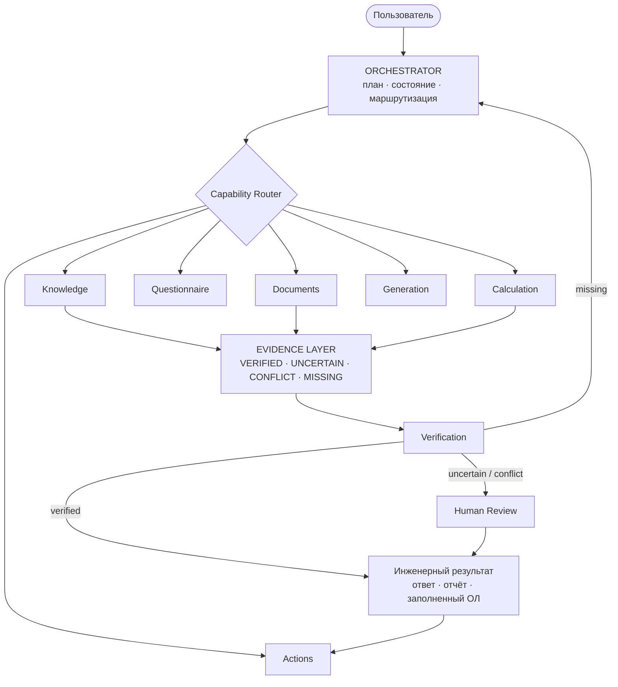
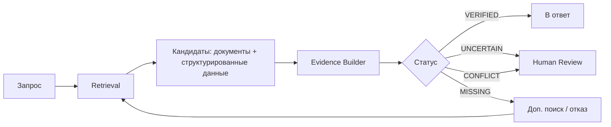
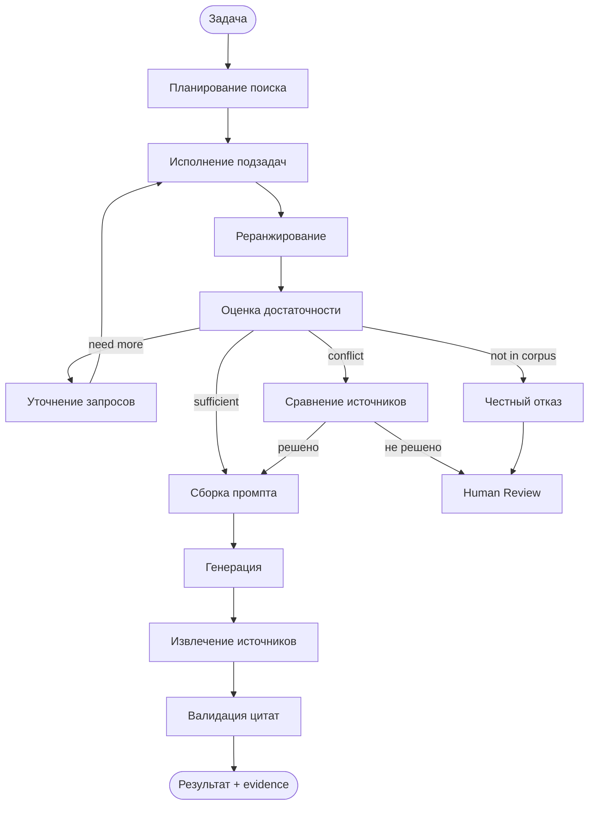
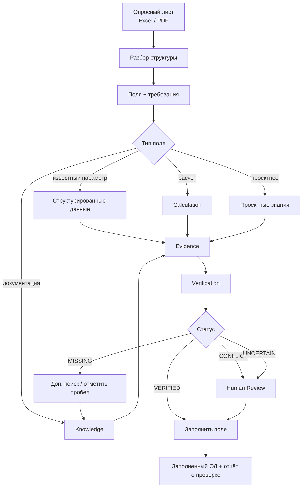

# Engineering Assistant — целевая архитектура

> **Что это за документ.** Компас, а не план работ. Описывает, куда развивается система
> и какие принципы нельзя нарушать по дороге. Пошаговое исполнение — в ROADMAP.md,
> текущее состояние агента — в AGENT_GRAPH_CURRENT.md.

**Главный тезис:** RAG — это не ассистент. RAG — одна из способностей Knowledge-слоя,
которой управляет общий оркестратор.

---

## 1. Что система должна уметь

| Способность | Фаза |
|---|---|
| Искать и проверять информацию в технической документации | 1 |
| Сохранять evidence (источник + цитата) для каждого утверждения | 1 |
| Передавать неоднозначные и критические решения человеку | 1 |
| Читать и заполнять опросные листы | 2 |
| Находить противоречия между документами | 2–3 |
| Сравнивать документы и ревизии | 3 |
| Работать с проектной документацией | 3 |
| Проверять требования и параметры, выполнять расчёты | 4 |
| Формировать техническую документацию, отчёты и замечания | 5 |

---

## 2. Ключевые принципы

Порядок важен: верхние принципы перевешивают нижние при конфликте.

1. **Evidence first.** Каждое существенное утверждение имеет источник: документ, раздел,
   страница, цитата. Утверждение без источника — не результат, а гипотеза.
2. **Честность важнее полноты.** Неопределённость и конфликт ведут к review, а не
   к выдуманному ответу. Отсутствие данных — валидный ответ.
3. **Verification отдельно от generation.** LLM формирует текст; проверяет результат
   отдельный механизм — по возможности детерминированный.
4. **Максимум кода, минимум LLM.** Модель вызывается только там, где детерминированного
   решения не существует. Расчёты, конверсия единиц, проверки диапазонов, сверка списков —
   это код, а не промпт.
5. **Structured data + documents.** Векторный поиск не заменяет базу данных. «Какое
   напряжение у оборудования X» — это SQL, а не эмбеддинги.
6. **Stateful orchestration.** Система знает, что уже сделала, что осталось, какие
   источники использованы и какие действия разрешены.
7. **Ограниченный agent loop.** Жёсткие бюджеты: `max_retrieval_rounds`, `max_subtasks`,
   `max_tool_calls`, `max_latency`, `max_tokens`.
8. **Разделение прав.** read / write / create / update / delete / approve — разные
   разрешения, особенно для действий во внешних системах.
9. **Измеримость.** Изменение принимается, если метрика улучшилась и ни одна страхующая
   не просела (см. §7).

---

## 3. Общая схема



**Роль оркестратора:** понять задачу → спланировать → выбрать capability → управлять
состоянием → проверить результат → при нехватке данных повторить → при неопределённости
позвать человека → завершить.

Оркестратор не является RAG-агентом. Он не ищет сам — он поручает.

---

## 4. Knowledge Layer

### 4.1 Источники знаний

| Тип | Содержимое | Где хранится |
|---|---|---|
| Нормативные документы | ГОСТ, СП, СТО, IEC, ISO, EN | Document Store + Vector DB |
| Корпоративные знания | регламенты, инструкции, процедуры, шаблоны | Document Store + Vector DB |
| Проектные знания | чертежи, спецификации, BOM, опросные листы, переписка, решения | Document Store + Vector DB + SQL |
| Продуктовые знания | datasheets, руководства, каталоги | Document Store + Vector DB |
| Структурированные данные | оборудование, параметры, единицы, диапазоны, совместимость, версии | SQL |

### 4.2 Почему не только векторный поиск

Разные вопросы требуют разных механизмов:

| Вопрос | Механизм |
|---|---|
| «Какие ограничения эксплуатации указал производитель?» | семантический поиск |
| «Какое напряжение у оборудования X?» | SQL-запрос |
| «Требования п. 5.4 СТО 802» | точный поиск по обозначению (BM25 / grep) |
| «Что изменилось между ревизиями 2019 и 2024?» | сравнение версий документов |

Отсюда состав хранилищ: **Document Store**, **Vector DB**, **SQL**, **Evidence Store**.
Knowledge Graph — отложен, см. §8.

---

## 5. Evidence Layer

Центральная сущность системы. Ассистент хранит не значение, а **значение с обоснованием**.

Вместо `{"field": "voltage", "value": "400 V"}`:

```json
{
  "field": "voltage",
  "value": "400 V",
  "unit": "V",
  "status": "VERIFIED",
  "evidence": [
    {
      "document_id": "manual_2026",
      "document_code": "СТО Газпром 2-2.3-1081-2016",
      "revision": "2016",
      "section": "Electrical characteristics",
      "page": 17,
      "quote": "номинальное напряжение питания 400 В",
      "source_type": "manufacturer"
    }
  ]
}
```

Числовой `confidence` намеренно отсутствует: ни скор реранкера, ни самооценка модели
не откалиброваны под «уверенность в факте», а число выглядит убедительнее, чем есть.
Статус категориальный.

### 5.1 Статусы

| Статус | Значение | Что делает система |
|---|---|---|
| `VERIFIED` | достаточное подтверждение из доверенного источника | использует в ответе |
| `UNCERTAIN` | кандидат есть, подтверждение слабое | помечает в UI, предлагает human review |
| `CONFLICT` | разные источники дают разные значения | показывает оба с источниками, зовёт человека |
| `MISSING` | в доступном корпусе информации нет | честный отказ, предложение доискать |

### 5.2 Жизненный цикл



### 5.3 Хранение: эфемерное против постоянного

- **Ответ в чате** — evidence живёт один запрос, отдаётся в payload ответа. Хранилище не нужно.
- **Аудит опросного листа, отчёт о проверке** — findings должны переживать сессию,
  быть перепроверяемыми и попадать в документ. Только здесь нужен Evidence Store как таблица.

### 5.4 Пример вывода для поля опросного листа

```
ПОЛЕ        Рабочая температура
ЗНАЧЕНИЕ    -20…+60 °C
СТАТУС      VERIFIED
ИСТОЧНИК    Руководство производителя, разд. «Условия эксплуатации», с. 17
```

```
ПОЛЕ        Степень защиты
ИСТОЧНИК A  IP65  (Каталог, с. 4)
ИСТОЧНИК B  IP66  (Руководство, разд. 2.1)
СТАТУС      CONFLICT
ДЕЙСТВИЕ    Требуется решение инженера
```

---

## 6. Capabilities

> **Терминология.** Это *capabilities*, а не «агенты». Слово «агент» подразумевает LLM-цикл;
> часть возможностей ниже реализуется чистым кодом без единого вызова модели (принцип 4).
> Один оркестратор + набор способностей — не мультиагентная система.

| Capability | Отвечает за | Доля LLM |
|---|---|---|
| **Knowledge** | семантический и точный поиск, фильтры по метаданным, lookup структурированных данных, сбор evidence, уточнение запроса | средняя |
| **Documents** | парсинг PDF/Excel/Word, извлечение таблиц, сравнение ревизий | низкая (код + Docling) |
| **Questionnaire** | распознавание структуры ОЛ, определение полей и обязательности, заполнение, поиск пробелов | средняя |
| **Verification** | consistency, соответствие требованиям, диапазоны, cross-document проверки, полнота | низкая (правила + код) |
| **Calculation** | инженерные формулы, конверсия единиц, числовые проверки | **нулевая** — только детерминированные инструменты |
| **Generation** | технические описания, спецификации, отчёты, change logs | высокая |
| **Actions** | экспорт, создание и обновление записей, уведомления, интеграции | нулевая; отдельные права и валидация |

**Knowledge не принимает окончательное инженерное решение по similarity score** — он
собирает evidence, решение принимает Verification или человек.

---

## 7. Ключевые workflow

### 7.1 Knowledge retrieval loop



**Оценка достаточности — не порог по одному скору.** Реранкер измеряет *релевантность*,
а нужна *answerability*: документ может быть похож на запрос и не содержать ответа.
Учитывать минимум: релевантность, покрытие вопроса, качество источника, непротиворечивость,
наличие прямого ответа.

**Повторный поиск не переисполняет план целиком.** Состояние между кругами:

```json
{
  "completed_subtasks": ["найти напряжение", "найти мощность"],
  "missing_information": ["рабочая температура"],
  "next_subtask": "поиск диапазона рабочих температур",
  "tried_queries": ["температура эксплуатации", "climatic conditions"]
}
```

Исполняется только недостающее; найденное ранее сохраняется и переранжируется вместе с новым.
Это снижает латентность, расход токенов и число лишних вызовов инструментов.

### 7.2 Опросный лист — первый production-workflow



Результат — не только заполненный лист, но и **отчёт**: что подтверждено, что найдено
с конфликтом, чего в базе нет.

---

## 8. Осознанные ограничения

Записаны явно, чтобы не воспринимались как невыполненные задачи.

| Отложено | Причина | Триггер к пересмотру |
|---|---|---|
| Knowledge Graph | высокая стоимость поддержки, отдача на текущем корпусе не доказана | появятся запросы про связи между объектами, не решаемые SQL + retrieval |
| Мультиагентность (агенты как отдельные LLM-циклы) | 10–15× токенов, нет верификатора, соло-разработка | появятся 2+ действительно разных домена и команда |
| Свободный ReAct-цикл без потолка | недетерминированная латентность, нет объективного сигнала остановки | появится дешёвый программный верификатор результата |
| Интеграции CAD / BIM / ERP | нет доступа и подтверждённого спроса | запрос от пользователей с конкретным сценарием |
| Автоматическая память агента | риск закрепления галлюцинаций, устаревание фактов | в логах видно, что люди повторяют одно и то же между сессиями |

---

## 9. Измерение качества

Архитектура без измерений — это картинка. Раздел определяет, как проверяется, что изменение
улучшило систему.

| Уровень | Что меряется |
|---|---|
| **Retrieval** | recall на стадии кандидатов (потолок пайплайна), hit@k и MRR после реранка, anchor hit |
| **Честность** | доля корректных отказов на вопросах вне корпуса; доля ложных отказов на вопросах внутри корпуса |
| **Evidence** | citation validity — каждая ссылка в ответе присутствовала в контексте; grounding — числа и термины ответа встречаются в источниках |
| **Устойчивость** | сопротивление инструкциям, внедрённым в документы |
| **Стоимость** | латентность p50/p95 по путям отдельно, токены на запрос |
| **Продукт** | доля вернувшихся пользователей через неделю; доля ответов, где открыли источник |

**Политика ворот:** изменение принимается, если целевая метрика выросла **и** ни одна
страхующая (честность, устойчивость, латентность) не просела больше допуска. Решение
принимается по списку выигранных и проигранных вопросов, не по третьему знаку в среднем.

---

## 10. Доменные объекты

Контракты между компонентами определяются заранее — это то, что переживёт смену реализации.

**Ядро:** `Task`, `Evidence`, `Fact`, `Requirement`, `Finding`, `Artifact`, `Action`.

**Полный набор:**

```
Task · TaskState · Subtask
Document · DocumentVersion · DocumentSection
Fact · Requirement · Parameter
Evidence · Claim · Finding
Questionnaire · QuestionnaireField
Calculation · ValidationResult
Artifact · Action · Review
```

Два поля, о которых легко забыть и дорого добавлять потом: **редакция документа**
(требования меняются между ревизиями норматива) и **права доступа** (кто какие документы
может искать — часть Knowledge, а не только Actions).

---

## 11. Путь развития

| Фаза | Содержание | Статус |
|---|---|---|
| **1. Knowledge Core** | парсинг → retrieval → реранк → рефлексия → evidence → ответ | **≈80%**: не хватает evidence-статусов и валидации цитат |
| **2. Questionnaire Assistant** | разбор ОЛ → поиск → evidence → проверка → заполнение → отчёт | спроектировано, не реализовано |
| **3. Document Intelligence** | сравнение документов и ревизий, извлечение таблиц, cross-document проверки, проектный контекст | не начато |
| **4. Engineering Reasoning** | расчёты, требования, инженерные правила, зависимости параметров | не начато |
| **5. Engineering Assistant** | генерация технической документации, проектные задачи, интеграции, controlled actions | не начато |

Ценность приходит не в конце: фаза 1 + фаза 2 — это уже инструмент, экономящий инженерам
часы еженедельно. Фазы 3–5 — расширение поверх работающего, их приоритет должны определить
реальные пользователи, а не этот документ.

---

## 12. Итог

Траектория продукта — от одного вопроса к рабочему процессу:

```
«Найди информацию в документации»
        ↓
«Проверь этот опросный лист»
        ↓
«Сравни две ревизии и найди изменения»
        ↓
«Проверь соответствие требованиям»
        ↓
«Сформируй техническую документацию»
        ↓
«Проанализируй задачу, собери данные, проверь ограничения,
 предложи решение и подготовь комплект для review»
```

На каждом шаге неизменны три вещи: **у каждого утверждения есть источник**, **проверка
отделена от генерации**, **неопределённость идёт к человеку, а не превращается
в правдоподобный текст**.
