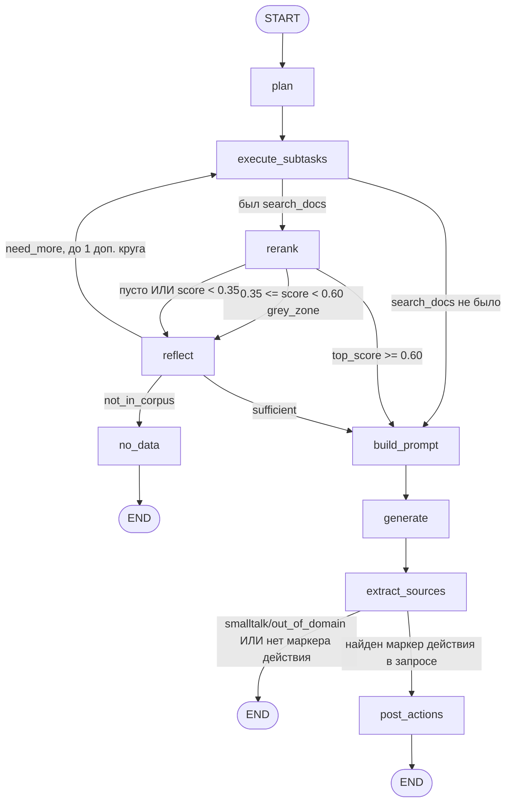

# Граф агента llm_service — реальное текущее состояние (2026-08-05, обновлено)

Этот документ описывает **то, что реально исполняется живым трафиком сегодня**, построчно
сверено с кодом на дату написания. Это НЕ то же самое, что `ARCHITECTURE.md` в этой же
папке — тот файл описывает **целевую** архитектуру (router с 4 классами, `complex`-ветка
сравнения документов, `personal`-ветка заметок/задач, MCP, Langfuse и т.д.), большая часть
которой **не подключена к графу** и не работает. Расхождения намеренны и задокументированы
(см. §7 ниже) — код не удалён, просто не подключён, чтобы можно было вернуть.

Если коротко: агент сегодня — это **planner-first граф из 9 живых нод**, без ML-роутера,
без "complex"/"personal" веток, без MCP. Один путь для абсолютно всех запросов.

**Правка в тот же день (после первой версии этого документа):** `route` больше не
захардкожен — теперь производится из решения `plan_node` (искать или нет), см. §2.1/§2.10.
`get_appendix` зарегистрирован как настоящий тул planner'а, см. §2.1/§5. Разделы ниже
обновлены под текущее состояние; §6.2/§6.4 (были открытыми вопросами) отмечены как закрытые.

**Вторая правка в тот же день (после аудита безопасности/логики + фичи реестра
документов):** добавлен `list_documents` — третий реально работающий тул (§5), поверх
общего лениво строящегося реестра документов (`RetrievalService._get_document_registry()`),
которым также пользуется `get_appendix`/`find_document_id_by_code`. Плюс раунд из семи
точечных фиксов найденных аудитом (роутер больше не роняет старт сервиса, JSON-контрактные
ноды используют отдельный системный промпт, `rerank_query` устойчив к планам вида
`[get_appendix, search_docs]`, `no_data` больше не показывает источники рядом с "нет
информации", LLM-клиент закрывается при остановке сервиса, code-gate приложений видит
упоминание не только в вопросе, но и в найденном контексте, типизированные исключения
из `/llm/answer` больше не тонут в generic `except`) — детали по каждому в §2 у
соответствующей ноды и сводкой в §6.6.

---

## 1. Граф целиком (актуальная сборка)

Источник истины: `application/agent/graph_builder.py::build_agent_graph()`.



**Обновлено 2026-08-05:** `route` в `LeanAgentState` конструируется со значением `"domain_rag"`
только как дефолт при старте — сразу после `plan_node` он перезаписывается. `plan_node`
теперь возвращает `route="smalltalk"`, если `plan.subtasks` пуст (planner решил, что поиск
не нужен), иначе `route="domain_rag"`. Это НЕ полноценная ML-классификация намерения
(нет отдельного класса `out_of_domain`, "smalltalk" технически означает "поиск не нужен",
не обязательно светскую беседу) — но `generate_node` теперь реально выбирает между
`system_prompt_rag`/`system_prompt_chat` по этому значению. См. §6.2 (было открытым вопросом,
закрыто).

Два входа, **один и тот же** скомпилированный граф (`self.app`) — ручного дублирования
топологии больше нет (было до 2026-08-05, см. ниже):
- `/llm/answer` (`api/agent_routers.py:38`) → `LeanRagAgent.run()` → `self.app.ainvoke(inputs)`,
  без токен-стриминга, ждёт полный ответ.
- `/llm/answer/stream` (`api/agent_routers.py:77`) → `LeanRagAgent.run_stream()` →
  `self.app.astream(inputs, stream_mode=["custom", "values"])` — **тот же граф**, без
  копии переходов. Ноды, которым есть что стримить (`plan_node`/`execute_subtasks_node` —
  событие `status`, `generate_node`/`no_data_node` — событие `token`), пишут напрямую через
  `get_stream_writer()`/`get_safe_stream_writer()` (`utils/stream_writer.py`) — это уходит
  наружу по `"custom"`-каналу `astream()`. `"values"`-канал в той же подписке даёт полный
  снэпшот состояния после каждой ноды; последний (после `END`) несёт финальные
  `response_model`/`retrieval_data`, из которых `run_stream()` строит `sources`/`done`.

**Почему не `astream_events()`/`on_chat_model_stream`** (стандартный способ стримить токены
из LangGraph): эти события всплывают только из LangChain `Runnable`/`BaseChatModel`. LLM-вызов
здесь (`LLM_provider.py`) — сырой `openai.AsyncOpenAI` SDK, не `Runnable` (ради собственной
ретрай/TTFT/fallback-логики, `_stream_completion_with_retry`) — из `astream_events()` не
пришло бы вообще ни одного токена. Custom stream mode эту зависимость от LangChain-обёртки
не требует — узел сам решает, что и когда писать в поток.

**До 2026-08-05** здесь стоял `StreamRunner.run()` (`application/agent/agent_stream.py`,
удалён) — тот же порядок нод, вызванный вручную императивным кодом, НЕ через LangGraph.
Раньше при правке топологии в `graph_builder.py` нужно было синхронно править и
`agent_stream.py`, иначе `/llm/answer` и `/llm/answer/stream` расходились в поведении (было
на практике один раз). Теперь это структурно невозможно — оба входа гоняют один объект графа.

---

## 2. Ноды — подробно

### 2.1 `plan` — точка входа графа

**Файл:** `application/agent/planning_nodes.py::PlanningNodesMixin.plan_node`
**Движок:** LLM (JSON-контракт через `LLMGateway.generate_json(schema=PlanOutput)`)
**Вход:** `state.query`, `state.summary`, `state.messages` (форматируются в `recent_history`
через `formatters.py::format_chat_history`)
**Выход:** `{"plan": PlanOutput, "route": "smalltalk" | "domain_rag"}`

Промпт — `ai_config.toml::plan_prompt` (см. §4.1). Модель видит **два** доступных
инструмента — `search_docs` и `get_appendix` (добавлен 2026-08-05) — и решает:
- вернуть ОДНУ подзадачу `search_docs` с 1-3 формулировками в списке `queries` (обычный
  документный вопрос; несколько формулировок — не несколько подзадач, см. §5),
- вернуть подзадачу `get_appendix(document_code=...)`, если пользователь явно назвал документ
  (ГОСТ/СП/ПУЭ) и просит именно его приложение (можно вместе с `search_docs`),
- вернуть пустой список `subtasks` (если запрос — светская беседа/не по теме/отвечается
  только из истории без похода в базу).

`route` (добавлено 2026-08-05) — производная от `plan.subtasks`: пусто → `"smalltalk"`,
иначе → `"domain_rag"`. Управляет выбором системного промпта в `generate_node` (§2.10).

Хвост списка обрезается по `gateway.max_subtasks` (4 в `ai_config.toml` — опущено с 12
2026-08-06: `execute_subtasks_node` последовательный, не `asyncio.gather` (§2.2/§6.5),
12 подряд сетевых вызовов в редком, но реальном случае — риск, не гипотетика).

**Обновлено 2026-08-06:** LLM/JSON-контракт теперь обёрнут в try/except — `plan_node`
точка входа 100% живого трафика (включая светскую беседу, которая вообще не требовала
бы LLM), и раньше сбой здесь означал голый 500 даже на "привет", хотя ниже по графу
`generate_node` обвешан ретраями/TTFT/фолбэком на нестримящий вызов. На любой сбой (невалидный
JSON после ретрая в `LLMGateway.generate_json`, таймаут, 5xx апстрима) — деградация до
дефолтного плана `[search_docs(queries=[state.query])]`, `synthesis="plan_fallback_used"`,
`route="domain_rag"`. Инкрементируется Prometheus-counter `llm_plan_fallback_total`
(`planning_nodes.py::PLAN_FALLBACK_COUNT`) — частота этого события прямой индикатор
здоровья JSON-контракта плана и качества дешёвой модели.

**Обновлено 2026-08-05 (StreamRunner удалён, §1):** перед `return` шлёт SSE-событие
`{"event": "status", "data": {"stage": "plan", "subtasks_count": ...}}` через
`get_safe_stream_writer()` (`utils/stream_writer.py`) — no-op вне `astream(stream_mode="custom")`
(и вне графа вообще — юнит-тесты, вызывающие `plan_node` напрямую, безопасны).

### 2.2 `execute_subtasks` — универсальный диспетчер тулов

**Файл:** `application/agent/planning_nodes.py::execute_subtasks_node`
**Движок:** код, `asyncio`-цикл (НЕ параллельно — последовательный `for`, несмотря на то что
`ARCHITECTURE.md` описывает `asyncio.gather` для целевой версии)
**Вход:** `state.plan.subtasks`
**Выход:** `{"subtask_results": [...], "retrieval_data": [...]}`

Для каждой подзадачи: находит `Tool` по имени в `tool_registry`, отклоняет `access != "read"`
(защита сверх системного промпта `plan`, на случай если LLM всё же предложит write-тул),
валидирует `args` по Pydantic-схеме тула, вызывает `fn`, оборачивает каждый вызов в свой
`try/except` (одна упавшая подзадача не роняет остальные).

`retrieval_data` этого круга строится через `formatters.py::merge_search_docs_results()` —
**только из результатов подзадач с `tool == "search_docs"`**; результат `get_appendix`
идёт отдельным путём через `merge_appendix_result()` в `appendix_context` (§5), в
`retrieval_data` не попадает.

**Обновлено 2026-08-06: накопление между кругами, не перезапись (было `ISSUES.md` A5,
§6.1).** Свежие находки этого круга мёржатся с уже накопленным `state.retrieval_data`
(а не заменяют его) — дедуп по `parent_id`, версия с большим score побеждает, тот же
принцип, что `merge_search_docs_results` уже применял внутри одного круга. На повторном
заходе (`reflect` → `need_more` → сюда снова) агент больше не теряет то, что нашёл на
предыдущем круге под другой формулировкой — объединённый пул целиком уходит в `rerank`
(§2.4), который единообразно пересчитает score для всех элементов сразу против актуальной
формулировки. `extract_sources_node` (§2.11) в конце теперь тоже видит находки обоих
кругов, не только последнего.

**Обновлено 2026-08-05 (StreamRunner удалён, §1):** перед `return update` шлёт SSE-событие
`{"event": "status", "data": {"stage": "retrieve", "count": ...}}` через
`get_safe_stream_writer()`. Эта нода может исполниться дважды за прогон (`reflect` → `need_more`
→ снова сюда, см. §2.6) — статус уходит на каждый реальный вызов, естественно давая
`status(retrieve)` дважды в SSE-потоке при уточняющем поиске, без специальной обработки цикла
в `run_stream()`.

**Получает 100% живого трафика** с тех пор, как `plan` стал реальным (не заглушкой).
Реально работают **три** тула в реестре — `search_docs`, `get_appendix`, `list_documents`
(добавлен 2026-08-05) — остальные 8 (`get_chapter`, `get_document_passport`, `search_notes`,
`search_tasks`, `create_task`, `create_note`, `update_note`, `calc_gas`, `run_audit`) —
`NotImplementedError` (см. §5). `list_documents` при этом **не значится в `plan_prompt`**
(см. §4.1) — planner никогда сам его не вызовет; сегодня это тул без вызывающего в живом
графе, зарегистрирован на будущее (см. §5 и обсуждение в §6.7).

### 2.3 `decide_after_execute_subtasks` (гейт, код)

**Файл:** `application/agent/routing_decisions.py:24`

```python
used_search_docs = any(r["tool"] == "search_docs" for r in state.subtask_results)
return "rerank" if used_search_docs else "build_prompt"
```

Если `plan` вернул пустой список подзадач (smalltalk) — граф идёт прямо в `build_prompt`,
минуя весь retrieval-путь.

### 2.4 `rerank` — кросс-энкодер

**Файл:** `application/agent/retrieval_nodes.py::RetrievalNodesMixin.rerank_node`
**Движок:** TEI, `bge-reranker-v2-m3`, отдельный контейнер `tei-reranker`
**Вход:** `state.retrieval_data`, `state.query`/`state.plan`
**Выход:** `{"retrieval_data": [...]}` (тот же список, пересортированный по новому score)

Ключевые детали:
- Ранжирует по **лучшему child-чанку** каждого parent (короткий точный фрагмент), не по
  `parent_chunk` целиком (может быть целой главой — разбавляет сигнал, рискует не влезть
  в контекст кросс-энкодера). Сам текст, который уйдёт в промпт, не меняется — меняется
  только порядок/score.
- `rerank_query` — **не** `state.query` напрямую, а формулировки из плана, если план есть.
  Живой баг, который это исправил (см. `ISSUES.md` в `rag_service`): один и тот же чанк
  получал score 0.004 против сырого вопроса и 0.85 против переписанного запроса.
  **Обновлено 2026-08-05 (B5):** раньше бралось буквально `subtasks[0]` — с появлением
  `get_appendix` как второго тула (его `args` — `{"document_code": ...}`, без формулировок)
  план вида `[get_appendix, search_docs]` тихо откатывал бы `rerank_query` обратно на сырой
  `state.query`, воспроизводя тот же баг заново. Теперь — явный поиск по наличию ключа, а
  не позиционное обращение.
  **Обновлено 2026-08-06 (дважды):** во-первых, если формулировок несколько, раньше в
  сравнении при реранке участвовала только первая — остальные использовались для поиска, но
  не для реранка. Во-вторых, `search_docs.args` сменил форму — раньше это был один ключ
  `"query": str` на подзадачу (несколько формулировок = несколько отдельных подзадач),
  теперь один ключ `"queries": list[str]` на подзадачу (несколько формулировок — один
  список внутри одной подзадачи, см. §5 про батчинг). `rerank_query` теперь собирает ВСЕ
  элементы `"queries"` со ВСЕХ `search_docs`-подзадач плана (на случай, если формулировки
  всё же оказались в разных подзадачах) и склеивает через пробел — `get_appendix`-подзадачи
  (без ключа `"queries"`) по-прежнему пропускаются тем же фильтром.
- Пустой `retrieval_data` — no-op, сетевой вызов не делается.

### 2.5 `decide_after_rerank` (гейт, код)

**Файл:** `application/agent/routing_decisions.py:32`

```python
if not state.retrieval_data: return "empty"
top_score = state.retrieval_data[0].metadata.score
if top_score < gateway.rerank_no_data_threshold: return "empty"   # 0.35
if top_score < gateway.rerank_grey_zone_threshold: return "grey_zone"  # 0.60
return "sufficient"
```

Пороги — **не откалиброваны eval'ом**, стартовые оценки (см. `ARCHITECTURE.md` §1 п.3).

### 2.6 `reflect` — контролируемый повторный поиск

**Файл:** `application/agent/retrieval_nodes.py::reflect_node`
**Движок:** LLM (JSON-контракт, `ReflectOutput`)
**Вход:** `state.query`, `state.retrieval_data` (форматируется через
`formatters.py::format_retrieval_item_for_prompt`), `state.plan.subtasks` (обновлено
2026-08-06 — см. п.2 ниже)
**Выход:** `{"reflect_rounds", "reflect_verdict", ["plan"], ["appendix_context"]}`

Вызывается только когда `decide_after_rerank` вернул `grey_zone` или `empty` (высокий
скор идёт напрямую в `build_prompt`, минуя `reflect` полностью — см. §6.3, это важно).

Логика:
1. Если `state.reflect_rounds >= 1` — **LLM не вызывается вообще**, fast-path:
   `verdict = "sufficient" if retrieval_data else "not_in_corpus"`. Жёсткий потолок —
   максимум один дополнительный круг уточнения.
2. Иначе — реальный LLM-вызов, промпт `ai_config.toml::reflect_prompt` (см. §4.2).
   **Обновлено 2026-08-06:** промпт теперь получает третью секцию — УЖЕ ПРОБОВАННЫЕ
   ЗАПРОСЫ этого круга (`{tried_queries}`, собирается из `state.plan.subtasks` по
   наличию ключа `"queries"` в `args` — тот же фильтр, что и в `rerank_node`, §2.4) плюс
   лучший итоговый score среди `state.retrieval_data` (общий на все запросы круга сразу,
   не по отдельности — `rerank_node` скорит чанки, не исходные формулировки, которые их
   нашли). Раньше `reflect` видел только НАЙДЕННОЕ, не то, КАКИМИ ЗАПРОСАМИ искали — не
   мог отличить "первая формулировка почти правильная, дожать синонимом" от "нужен
   принципиально другой заход", и мог предложить `new_queries`, близкие по смыслу к уже
   провалившимся (тот же результат заново). Модель возвращает:
   - `verdict`: `sufficient` / `need_more` / `not_in_corpus`
   - `new_queries`: список новых формулировок (используется только при `need_more`)
   - `needs_appendix` (добавлено 2026-08-05): `true`, если запрос/найденное ссылаются на
     приложение документа, а самого текста приложения среди найденного нет
3. `need_more` + есть `new_queries` → строит **новый** `PlanOutput` с ОДНОЙ `search_docs`-
   подзадачей, `args={"queries": new_queries, ...}` (обновлено 2026-08-06 вместе со сменой
   схемы тула, см. §5 — раньше было по отдельной подзадаче на каждый `new_query`), и
   кладёт в `state.plan` — **полностью затирая** план первого круга. **Обновлено
   2026-08-06 (§6.1, было открытым вопросом, частично закрыто):** сам `state.plan`
   по-прежнему перезаписывается целиком (значит `rerank_node` на повторном круге
   реранкает объединённый пул только против формулировок ЭТОГО круга, без исходных
   запросов первого) — но `state.retrieval_data`, в отличие от плана, теперь НЕ
   перезаписывается, а мёржится в `execute_subtasks_node` (§2.2) — сами найденные
   документы первого круга больше не теряются, теряется только текст запроса, которым
   их нашли (сейчас нужен `reflect_prompt`-у для п.2 выше, где и сохранён — см.
   `tried_queries`).
4. `need_more` без `new_queries` → трактуется как `sufficient` (если что-то нашли) или
   `not_in_corpus` (если пусто).
5. Если `needs_appendix=true` и `retrieval_data` не пуст — резолвит `doc_id` из **первого**
   (топового) элемента `retrieval_data` и напрямую (не через `tool_registry`!) вызывает
   `self.retrieval_service.get_appendix(doc_id)` → `rag_service GET /documents/{doc_id}/appendices`.
   Результат (обрезанный до 6000 символов) кладётся в отдельное поле состояния
   `appendix_context` — НЕ в `retrieval_data` (чтобы не потеряться при повторном
   `execute_subtasks`, см. §3).

### 2.7 `decide_after_reflect` (гейт, код)

**Файл:** `application/agent/routing_decisions.py:50` — просто читает `state.reflect_verdict`,
который выставил `reflect_node`.

### 2.8 `no_data` — терминальный честный отказ

**Файл:** `application/agent/retrieval_nodes.py::no_data_node`
**Движок:** код, LLM не вызывается
**Выход:** `{"retrieval_empty": true, "response_model": "В базе знаний нет информации по вашему запросу.", "retrieval_data": []}`

Реализация Принципа №4 из `ARCHITECTURE.md` ("честность важнее умности") — граф
обрывается сразу в `END`, не доходя до `generate`.

**Обновлено 2026-08-05 (A7):** теперь дополнительно очищает `retrieval_data`. До фикса
`not_in_corpus` от `reflect_node` был достижим и при непустом (просто слабом/нерелевантном)
`retrieval_data` — `extract_sources_node` строил бы список источников рядом с текстом
"в базе знаний нет информации", что читается как противоречие.

**Обновлено 2026-08-05 (третий раз в тот же день — StreamRunner удалён, §1):** граф уходит
отсюда прямо в `END`, минуя `generate_node` — значит для SSE (`/llm/answer/stream`) это
единственное место на этом пути, которое может доставить текст ответа наружу, и делает это
сама нода — `get_safe_stream_writer()({"event": "token", "data": {"text": _NO_DATA_ANSWER}})`
перед `return`. Это важно: фронт (`useAiChat.js`) строит текст сообщения ТОЛЬКО из
`token`-событий, `done.answer` он не читает вообще — без этой строчки no_data-ответ приходил
бы в SSE-потоке как пустой пузырь сообщения (только `sources`+`done`, без единого `token`).

### 2.9 `build_prompt` — сборка финального контекста

**Файл:** `application/agent/generation_nodes.py::GenerationNodesMixin.build_prompt_node`
**Движок:** код
**Выход:** `{"final_context": FinalPromptData}`

1. `context_str` = все элементы `state.retrieval_data`, отформатированные через
   `format_retrieval_item_for_prompt` (`[Документ: <source> | Раздел <title>]\n<parent_chunk>`),
   склеены через `\n\n`.
2. **Code-gate для приложений** (добавлено 2026-08-05): если `state.appendix_context`
   ещё пуст, но `state.retrieval_data` не пуст И упоминание приложения найдено
   (regex `_APPENDIX_MENTION_RE` = подстрока "приложени") — синхронно дозапрашивает
   `get_appendix` для `doc_id` топового найденного элемента, минуя `reflect`. Это
   подстраховка на случай, когда `rerank` сразу дал `sufficient` и `reflect` вообще не
   вызывался. С тех пор как `get_appendix` стал настоящим тулом `plan_node` (§2.1/§5), это
   уже не единственный путь — явно названный документ ("приложение А в СП 1.13130") идёт
   через тул сразу из `plan`, без похода в `search_docs`/rerank вообще; этот code-gate
   остаётся подстраховкой на случай, когда документ не назван явно, но выясняется по уже
   найденному контексту (см. §6.4, закрыто).
   **Обновлено 2026-08-05 (B6, частичное смягчение):** регекс раньше проверял только
   `state.query` — если пользователь спросил без слова "приложение" ("что в конце
   документа?"), а само найденное содержимое ссылалось на приложение, гейт не срабатывал.
   Теперь проверяется **и** `state.query`, **и** уже собранный `context_str` (найденные
   чанки). Если ни вопрос, ни найденные чанки текстуально не содержат "приложени" (а
   `reflect` тоже не вызвался, §6.3), сигнал по-прежнему не сработает.
   **Обновлено 2026-08-06 (B6, доразобрано):** триггер по контексту оказался ШИРЕ, чем
   казалось — в нормативке "см. приложение А" встречается в каждом втором чанке, значит
   гейт срабатывал часто, а `doc_id` до этой правки брался из топового элемента
   безусловно — система регулярно подтягивала приложение НЕ того документа, к которому
   относился топ-чанк (тот же баг §6.4, только с более широким триггером). Теперь
   различаем два случая: если упоминание в **самом вопросе** — top-1 остаётся разумной
   догадкой (пользователь явно спрашивает про приложение). Если упоминание нашлось
   **только в контексте** — `doc_id` резолвится из того конкретного чанка (`item`, не
   `state.retrieval_data[0]`), где регекс реально совпал с его отформатированным текстом,
   с фолбэком на top-1, если совпадение почему-то не находится по чанкам отдельно (не
   должно случаться, раз оно уже нашлось в склеенном `context_str`).
3. Если есть `appendix_context` (из `reflect` или из этого code-gate) — дописывается в
   конец `context_str` блоком `\n\n[Приложения документа]\n{appendix_context}`.
4. `FinalPromptData(context=context_str, route=state.route, chat_history=state.messages,
   summary=state.summary, current_query=state.query)`.

### 2.10 `generate` — вызов основной LLM

**Файл:** `application/agent/generation_nodes.py::generate_node`
**Движок:** основная LLM (`OpenAICompatLLMProvider`/`GroqLLMProvider`, `LLM_provider.py`)
**Выход:** `{"response_model": answer}`

Собирает messages-массив через `LLM_provider.py::_build_answer_messages()`:
```
[system, *история_диалога_role_сообщениями, user: CURRENT_TURN_TEMPLATE]
```
`system` выбирается по `data_prompt.route`:
- `"domain_rag"` → `system_prompt_rag`
- иначе → `system_prompt_chat`

**Обновлено 2026-08-05:** `route` больше не захардкожен (§2.1) — `system_prompt_chat`
теперь реально выбирается для запросов, на которые `plan_node` решил не искать (пустой
`subtasks`). До этой правки `route` был всегда `"domain_rag"`, `system_prompt_chat` был
мёртвой веткой, и даже чисто разговорные/мета-запросы получали "используй ИСКЛЮЧИТЕЛЬНО
документный контекст" — см. §6.2 (было открытым вопросом, закрыто).

История диалога передаётся **не текстом**, а отдельными role-сообщениями (`_history_to_messages`)
— границы реплик определяются структурой запроса к LLM API, не текстовой разметкой.

**Не путать с JSON-контрактными вызовами `plan_node`/`reflect_node` (§2.1/§2.6).** Они идут
через отдельный `LLMGateway.generate_json()` → `LLMProvider.generate_json_raw()` с
`json_contract_system_prompt` (§4.5, B7) — `generate_node` этого не касается, у него своя
система (`system_prompt_rag`/`system_prompt_chat`, выше).

**Обновлено 2026-08-05 (второй раз в тот же день — StreamRunner удалён, §1):**
`generate_node` теперь ВСЕГДА зовёт `LLMProvider.generate_stream()` (не `generate()`) и
пишет каждую дельту через `get_safe_stream_writer()` как SSE-событие `token` — единый код
для `/llm/answer` (writer — no-op, дельты просто копятся в `answer_parts` и склеиваются) и
`/llm/answer/stream` (writer реально доставляет токены через `astream(stream_mode="custom")`,
см. §1). Retry-логика TTFT (до первого чанка) — внутри самого `generate_stream()`
(`_stream_completion_with_retry`, `LLM_provider.py`); `generate_node` добавляет поверх два
случая, которые тот ретрай не покрывает:
1. Обрыв **после** первых токенов — не ретраим (вторая генерация поверх уже показанного
   текста бессмысленна), дописываем `\n\n_[ответ прерван: обрыв соединения с LLM]_` как ещё
   один `token`.
2. Полный сбой **без единого** токена — одноразовый fallback на нестримящий `generate()`
   (живой инцидент с gatellm.ru: `stream=true` падал на 100% запросов при рабочем
   `stream=false`). Если и fallback падает — финальная нота `_Не удалось получить ответ: сбой при
   обращении к LLM._` (без текста исключения — раньше туда шёл `{exc}` напрямую, что могло утечь
   пользователю в чат внутренние детали апстрима; сам exc остаётся в логах через `logger.exception`).

Раньше эта ретрай/fallback-логика жила ТОЛЬКО в `agent_stream.py::StreamRunner` (удалён) —
`/llm/answer` вообще не имел этой защиты (звал простой `generate()`, любой сбой сразу
пробрасывался как 502). Теперь оба входа получают одинаковую устойчивость — поведенческое
изменение: `/llm/answer` на сбой ПОСЛЕ частичной генерации больше не может случиться (LLM
либо стримит, либо нет — но для non-stream вызывающего это невидимо, он получает уже
склеенную строку), а на **полном** сбое без единого токена — раньше это сразу было бы 502 в
`agent_routers.py`, теперь `generate_node` сам пробует fallback `generate()` и при его успехе
тихо возвращает ответ без ошибки вообще (при неудаче обоих — `response_model` содержит
текстовую ноту об ошибке, а не исключение, так что `/llm/answer` тоже теперь может вернуть
`200` с текстом-нотой вместо `502` в этом сценарии — согласуется с принципом "честность
важнее сдачи" (§4.3 п.3/`no_data_node`), но стоит иметь в виду, если что-то на стороне
`backend`/фронта полагалось именно на HTTP-код ошибки в этом редком случае).

### 2.11 `extract_sources` (код)

**Файл:** `application/agent/generation_nodes.py::extract_sources_node`

`{"sources": build_sources_payload(state.retrieval_data)}` — тот же маппинг, что используется
и в SSE-варианте. Источники строятся из **финального** `state.retrieval_data` — если был
второй круг `reflect`, это только чанки второго круга (см. §6.1).

### 2.12 `decide_after_generate` (гейт, код)

**Файл:** `application/agent/routing_decisions.py:56`

```python
if _ACTION_MARKERS_RE.search(state.query): return "post_actions"
return "end"
```

`_ACTION_MARKERS_RE` = `сохрани|закинь|запиши|создай задачу|добавь заметку|поправь заметку|обнови`
(регистронезависимо). Проверяется по **исходному запросу пользователя**, не по
сгенерированному ответу — дешёвый код-фильтр перед потенциальным LLM-вызовом `post_actions`.

**Обновлено 2026-08-05:** раньше здесь была ранняя проверка `if state.route in
{"smalltalk", "out_of_domain"}: return "end"`. Убрана — с тех пор как `route="smalltalk"`
стал означать "plan решил не искать" (§2.1), а не гарантированное отсутствие намерения
действия, запрос вида "сохрани это в заметку" (не требует похода в базу) тоже получал бы
`route="smalltalk"` и молча пропускал бы проверку маркера. Теперь маркер проверяется
всегда, независимо от route.

### 2.13 `post_actions` (ЗАГЛУШКА)

**Файл:** `application/agent/generation_nodes.py::post_actions_node`

```python
async def post_actions_node(self, state): return {"proposed_action": None}
```

Настоящий no-op — никакого I/O, никакого LLM-вызова. Достижима (маркер в запросе ловится),
но ничего не делает — ни один из write-тулов (`create_task`/`create_note`/`update_note`)
не реализован (см. §5).

---

## 3. Состояние графа — `LeanAgentState`

**Файл:** `application/lean_rag_models.py`

LangGraph по умолчанию мёржит обновления от нод как **полную перезапись поля**
(last-write-wins), если явно не указан редьюсер (`Annotated[T, operator.add]` и т.п.).
В `lean_rag_models.py` есть `import operator`, но **ни один редьюсер нигде не применён** —
это заготовка, оставшаяся неиспользованной. Значит для абсолютно всех полей ниже
действует правило "последняя нода, которая написала в поле, победила".

| Поле | Кто пишет | Персистентность |
|---|---|---|
| `query` | только `run()`/`run_stream()` при старте | неизменно весь прогон |
| `messages` | только при старте | неизменно весь прогон |
| `summary` | только при старте | неизменно весь прогон |
| `route` | старт (дефолт `"domain_rag"`), затем `plan_node` перезаписывает | с 2026-08-05 отражает решение `plan_node` (пустой `subtasks` → `"smalltalk"`), дальше неизменно |
| `plan` | `plan_node` (1й раз), `reflect_node` (если `need_more`) | **перезаписывается целиком** на втором круге — план первого круга теряется |
| `subtask_results` | `execute_subtasks_node` | перезаписывается целиком при повторном вызове — итоги ЭТОГО круга (какой tool/результат), для прошлого круга не нужны |
| `retrieval_data` | `execute_subtasks_node` (мёржит с предыдущим значением, обновлено 2026-08-06), `rerank_node` (пересортировка/новый score) | **накапливается** между кругами — дедуп по `parent_id`, версия с большим score побеждает (см. §6.1, было "перезаписывается целиком", закрыто) |
| `reflect_rounds` | `reflect_node` (`+1` вручную в коде, не редьюсер) | накапливается, но capped на 1 доп. круг кодом, не LangGraph-механизмом |
| `reflect_verdict` | `reflect_node` | перезаписывается |
| `appendix_context` | `reflect_node` ИЛИ code-gate в `build_prompt_node` | пишется один раз за прогон, переживает повторный `execute_subtasks` (специально вынесено в отдельное поле именно поэтому) |
| `final_context` | `build_prompt_node` | пишется один раз |
| `sources` | `extract_sources_node` | пишется один раз, в конце |
| `response_model` | `generate_node` (или `no_data_node`) | пишется один раз |
| `resolved_docs`, `document_passports` | нигде (legacy-ноды не подключены) | остаются дефолтными/пустыми весь прогон |
| `expanded_queries` | только `run()`/`run_stream()` при старте (`[query]`) | не пустое, но мёртвое — legacy-ноды, которые его читали, не подключены, дальше по графу никто не читает |

---

## 4. Промпты — полный текст (актуальный на 2026-08-05)

Источник: `ai_config.toml`. Читается через `get_live_config()` — ленивый mtime-check
синглтон, правки в файле подхватываются на следующий запрос **без перезапуска сервиса**.

### 4.1 `plan_prompt` (использует `plan_node`)

```
Ты — планировщик ассистента по базе технической документации. По истории диалога
и текущему вопросу реши, нужен ли поиск по базе знаний, и если да — какими запросами.

Тебе доступны два инструмента:
- "search_docs" — гибридный поиск по базе технической документации (dense + BM25). args:
  {"queries": ["формулировка 1", "формулировка 2 (опц.)"], "doc_filter": null} — список, НЕ одна
  строка (обновлено 2026-08-06, было "query": str — см. §5 про батчинг несколько
  формулировок в один вызов rag_service вместо отдельной подзадачи на каждую).
- "get_appendix" — текст приложений (ПРИЛОЖЕНИЕ N) КОНКРЕТНОГО документа по его названию/номеру.
  args: {"document_code": "название или номер документа, как его назвал пользователь"}.
  search_docs приложения НЕ находит (не проиндексированы) — используй get_appendix, когда
  пользователь явно называет документ и просит именно приложение.
Другие инструменты недоступны — не предлагай их.

Правила:
1. Если вопрос требует информации из базы документации — верни ОДНУ подзадачу search_docs с 1-3
   формулировками в "queries" (раскрой местоимения из истории, добавь техническую формулировку и
   синонимы, если вопрос расплывчатый). Обычно достаточно одной точной формулировки. Не создавай
   несколько ОТДЕЛЬНЫХ search_docs-подзадач — все формулировки в один список одной подзадачи.
1а. (обновлено 2026-08-06) Если вопрос сформулирован абстрактно/обобщённо — добавь вторую
    формулировку с ДРУГИМ углом, не синонимом первой (конкретное оборудование/параметр/процедура
    вместо общей темы) — разные углы повышают шанс попасть на содержательный раздел, а не только
    на общий/вводный (живой пример провала: см. §6.9).
2. Если вопрос явно называет документ и просит его приложение — добавь подзадачу get_appendix с этим
   document_code. Можно вместе с search_docs.
3. Если вопрос — приветствие, благодарность, светская беседа, вопрос не по теме документации, или на него
   можно ответить только из истории диалога без похода в базу — верни пустой список subtasks. Не ходи в базу
   "на всякий случай" — пустой план для такого вопроса ПРАВИЛЬНЫЙ ответ.
4. "synthesis" — короткая заметка о твоём решении для логов (не показывается пользователю), можно оставить
   пустой строкой.
5. Твой ответ должен быть СТРОГО валидным JSON-объектом без markdown-тегов и без текста вокруг.

[+ четыре примера JSON, включая пример с двумя формулировками в одной подзадаче]
```

**Обновлено 2026-08-05:** раньше здесь была заметка "модель не знает про get_appendix,
если запрос про приложение попадёт сюда без явных документных терминов, plan всё равно
предложит search_docs" — с живым примером бага (см. §6.4, теперь закрыт). Правило 2 выше и
описание тула это устраняют для случая, когда документ назван явно. Если документ НЕ назван
явно ("покажи приложение") — planner всё ещё не может вызвать get_appendix (нет document_code
для резолва), тогда работает только запасной путь через `reflect`/code-gate (§2.6/§2.9),
резолвящий doc_id из уже найденного контекста, а не из этого промпта.

### 4.2 `reflect_prompt` (использует `reflect_node`)

```
Ты оцениваешь, достаточно ли найденных фрагментов документации, чтобы содержательно
ответить на вопрос пользователя.

Правила:
1. Если фрагментов достаточно... — verdict "sufficient", new_queries — пустой список.
2. Если фрагменты есть, но не по теме... — verdict "need_more", new_queries: 1-5 новых
   формулировок с учётом того, что уже найдено. Смотри на УЖЕ ПРОБОВАННЫЕ ЗАПРОСЫ — не
   предлагай формулировки, близкие по смыслу к уже провалившимся (обновлено 2026-08-06)...
3. Если по вопросу в принципе не может быть ответа в этой базе... — verdict "not_in_corpus".
4. needs_appendix — true, если вопрос пользователя или найденные фрагменты явно ссылаются
   на приложение документа (например "см. Приложение А", "указано в приложении",
   пользователь прямо спрашивает про приложение), а среди найденных фрагментов текста
   самого приложения нет. Иначе — false. Это независимо от verdict.
5. Твой ответ должен быть СТРОГО валидным JSON-объектом без markdown-тегов и без текста вокруг.

ВОПРОС / УЖЕ ПРОБОВАННЫЕ ЗАПРОСЫ этого круга + их общий лучший score (добавлено
2026-08-06, `{tried_queries}` — см. §2.6) / НАЙДЕННЫЕ ФРАГМЕНТЫ

[+ три примера JSON]
```

### 4.3 `system_prompt_rag` (использует `generate_node`, когда `route="domain_rag"`)

```
Ты — технический ассистент инженерной лаборатории. Отвечай на вопрос,
опираясь ИСКЛЮЧИТЕЛЬНО на блок КОНТЕКСТ ИЗ ДОКУМЕНТАЦИИ.

ИСТОЧНИК ИСТИНЫ
1. Используй только информацию из КОНТЕКСТА...
2. ИСТОРИЯ ДИАЛОГА и РЕЗЮМЕ — только для разрешения местоимений и отсылок — не как источник фактов.
2а. Реплики диалога переданы отдельными сообщениями... местоимения по умолчанию — к последней реплике.
2б. Если ВОПРОС просит переформатировать/сократить/пересказать конкретное прошлое сообщение
    диалога — источник строго ОДНА эта реплика, КОНТЕКСТ ИЗ ДОКУМЕНТОВ игнорируй полностью.
    Не смешивай несколько прошлых реплик, если явно не попросили резюме всего диалога.
3. Если прямого ответа в КОНТЕКСТЕ нет — сразу скажи об этом первой строкой...

ТОЧНОСТЬ
4. Числа/единицы/диапазоны — дословно, не округлять, не пересчитывать.
5. Ссылайся только на документы/главы/таблицы, буквально названные в КОНТЕКСТЕ...
6. Разные документы дают разные требования — покажи оба с источником.

ФОРМА ОТВЕТА
7. Объём пропорционален вопросу...
8. Жирным — только итоговые значения параметров.
9. Без приветствий и вступлений.
10. Служебные пометки контекста (score, ID) в ответ не выносить.

ТАБЛИЦЫ (только если ответ требует таблицу)
11. ТОЛЬКО стандартный Markdown (GFM): заголовок, разделитель из дефисов, строки данных.
    НИКОГДА HTML-теги (<table>, <tr>, <td>, <br> и т.п.) — фронт их не рендерит.
12. Ячейка — одна строка без переноса; несколько пунктов — через "; " в той же строке.
13. Номер пункта / содержание / нормативная ссылка — в отдельных колонках.
```

Правила 2б и 11-13 добавлены 2026-08-05 по живым репортам (см. `ISSUES.md`).

### 4.4 `system_prompt_chat` (использует `generate_node`, когда `route="smalltalk"` — оживлён 2026-08-05, см. §6.2)

```
Ты — профессиональный инженер-консультант.
Сейчас идет свободное обсуждение задачи, поиск по базе документации не производился.

Правила:
1. Отвечай на вопрос, опираясь на ИСТОРИЮ ДИАЛОГА, РЕЗЮМЕ ПРЕДЫДУЩЕЙ БЕСЕДЫ и свои
   глубокие технические знания.
1а. Реплики диалога переданы отдельными сообщениями... местоимения — к последней.
2. Будь лаконичен, точен и вежлив.
3. Выводи только текст ответа, без дежурных вступлений и приветствий.
```

### 4.5 Прочие промпты (не в графе агента, отдельные HTTP-роуты `agent_routers.py`)

| Промпт | Используется в | Роут |
|---|---|---|
| `general_system_prompt` | `generate_general()` — используется только легаси-`expand_queries_node` (не подключён к графу) | — |
| `summary_system_prompt` | `generate_summary()` | `POST /llm/summary` (саммари чата, вызывает backend) |
| `note_system_prompt` | `generate_note()` | `POST /llm/note` |
| `chapter_summary_system_prompt` | `generate_chapter_summary()`, модель из `[llm_summary]` (дешёвая) | `POST /llm/chapter-summary` (вызывает rag_service) |
| `document_summary_system_prompt` | `generate_document_summary()`, `[llm_summary]` | `POST /llm/document-summary` |
| `table_summary_system_prompt` | `generate_table_summary()`, `[llm_summary]` | `POST /llm/table-summary` |
| `query_expansion_prompt` | легаси `expand_queries_node`, не подключён к живому графу | — |
| `json_contract_system_prompt` | `LLMProvider.generate_json_raw()` (добавлено 2026-08-05, B7) — вызывается `LLMGateway.generate_json()`, а её — `plan_node`/`reflect_node` (§2.1/§2.6) | не отдельный HTTP-роут, часть графа | инструкция "отвечай строго валидным JSON без markdown-обёртки"; до фикса JSON-контрактные ноды получали `general_system_prompt` (разговорный, "ты — ассистент...") — модель иногда добавляла вступительный текст перед JSON, парсинг падал |

---

## 5. Реестр тулов (`tool_registry.py`)

Единственная точка расширения графа по задумке (`plan`/`execute_subtasks` читают его
универсально, ничего не хардкодя). Реально работают **три** тула из одиннадцати:

| Тул | access | Статус | Заметка |
|---|---|---|---|
| `search_docs` | read | ✅ реально работает | args: `queries: list[str]` (обновлено 2026-08-06, было `query: str` — см. §5.2 про батчинг), `doc_filter` (принимается, не применяется). Оборачивает `RetrievalService.retrieve(queries)` |
| `get_appendix` | read | ✅ реально работает (добавлен 2026-08-05) | args: `document_code`. Внутри: `RetrievalService.find_document_id_by_code()` → `RetrievalService.get_appendix(doc_id)`. Результат идёт в `state.appendix_context` через `merge_appendix_result()` (`formatters.py`), НЕ в `retrieval_data` — `execute_subtasks_node` обрабатывает его отдельно от `merge_search_docs_results`. Матчинг НЕ fuzzy — точная подстрока в имени файла, опечатка/лишний год не найдутся |
| `list_documents` | read | ✅ реально работает (добавлен 2026-08-05) | без args. Возвращает `{"documents": [...], "total": N}` из того же реестра, что и `get_appendix`. **Не вызывается сегодня** — `plan_prompt` его не описывает модели (сознательное решение, см. §6.7), в реестре зарегистрирован на будущее (диагностика/будущие ноды) |
| `get_chapter` | read | ❌ `NotImplementedError` | — |
| `get_document_passport` | read | ❌ `NotImplementedError` | — |
| `search_notes` | read | ❌ `NotImplementedError` | — |
| `search_tasks` | read | ❌ `NotImplementedError` | — |
| `create_task` | write | ❌ `NotImplementedError` | защита `access != "read"` в `execute_subtasks_node` всё равно не дала бы её авто-исполнить |
| `create_note` | write | ❌ `NotImplementedError` | то же |
| `update_note` | write | ❌ `NotImplementedError` | то же |
| `calc_gas` | read | ❌ `NotImplementedError` | — |
| `run_audit` | write | ❌ `NotImplementedError` | то же |

### 5.1 Реестр документов — общий кэш под `get_appendix`/`list_documents`

**Файл:** `application/services/retrieval_service.py::RetrievalService._get_document_registry()`

И `get_appendix` (через `find_document_id_by_code`), и `list_documents` читают один и тот же
in-memory словарь `doc_id -> {filename, s3key, status, chunk_count, size, has_summary,
created_at}` — сырые поля из `GET /documents` в `rag_service` (лимит 500).

- **Строится лениво**, при первом реальном обращении (не при старте сервиса) — сетевой сбой
  сюда не блокирует запуск llm_service (тот же урок, что и B4 у ML-роутера, см. §6.6).
- **Кэшируется на весь процесс**, защищено `asyncio.Lock()` от повторной параллельной сборки.
  Повторные вызовы `find_document_id_by_code`/`list_documents` сетевой запрос не повторяют.
- **Сбой (пере)сборки НЕ затирает уже имеющиеся данные** — следующий вызов попробует собрать
  заново, отдав пока протухшие (или пустые, если это самая первая сборка) данные (в отличие
  от ML-роутера, который сдаётся навсегда после первого сбоя — здесь смысла в этом нет,
  `rag_service` мог просто быть временно недоступен).
- `find_document_id_by_code(document_code)` — подстрочный, регистронезависимый поиск по
  `filename` внутри уже построенного реестра (не сетевой запрос на каждое обращение — это
  изменилось по сравнению с более ранней версией, которая делала `ilike`-запрос к `rag_service`
  на каждый вызов). Несколько совпадений — берётся первое по порядку словаря.
- **TTL, не вебхук-инвалидация (обновлено 2026-08-06).** Между "вебхук" (обсуждался и был
  осознанно отклонён, см. §6.8) и "вообще никогда не обновляется" — `_DOCUMENT_REGISTRY_TTL_S`
  = 300с (5 минут). Документ, добавленный/удалённый/переиндексированный в `rag_service`
  **после** того, как `llm_service` уже построил реестр, станет виден `get_appendix`/
  `list_documents` не позже чем через TTL — без межсервисного контракта, без вебхука. До этой
  правки инвалидации не было вообще (тот же паттерн, что `AbbreviationExpander` в
  `rag_service`) — теперь протухание ограничено сверху, а не бессрочно до перезапуска процесса.

### 5.2 `search_docs` — батч нескольких формулировок в один вызов (2026-08-06)

До этой правки `SearchDocsArgs.query` была одной строкой — если `plan_node`/`reflect_node`
хотели поискать несколькими формулировками, каждая уходила ОТДЕЛЬНОЙ `search_docs`-подзадачей,
`execute_subtasks_node` (§2.2, последовательный `for`, не `asyncio.gather`, §6.5) вызывал тул
N раз — N отдельных HTTP round-trip'ов к `rag_service`, каждый со своим вызовом эмбеддера и
поиском в Qdrant.

Это была не архитектурная необходимость, а потерянная возможность: `RetrievalService.retrieve()`
(`application/services/retrieval_service.py`) и HTTP-эндпоинт `rag_service POST
/documents/retrieve` уже принимали `list[str]` и умели батчить — на стороне `rag_service`
`RetrieveService.retrieve()` при `len(queries) > 1` уходит в `batch_search()` (один вызов
эмбеддера на все запросы + один batch-запрос в Qdrant вместо N последовательных). Именно этим
пользовалась legacy-нода `retrieve_multi_node` (`legacy_disabled_nodes.py`, отключена при
переходе на planner-first 2026-08-04 вместе со всей `route_node`/`expand_queries_node`-связкой,
не потому что батчинг был плох, а как побочный эффект того, что `search_docs`-тул при
проектировании получил `query: str` вместо `list[str]`).

Исправлено: `SearchDocsArgs.queries: list[str]`. `plan_node` теперь просят вернуть ОДНУ
`search_docs`-подзадачу с 1-3 формулировками в списке (см. §4.1 правило 1/1а), `reflect_node`
на `need_more` тоже строит одну подзадачу со всеми `new_queries` (§2.6), не по одной на каждую.
`rerank_query` (§2.4) собирает формулировки из ключа `"queries"` (списком) со всех
`search_docs`-подзадач плана — работает и для одной подзадачи с несколькими формулировками, и
защитно для случая, если формулировки всё же окажутся в разных подзадачах.

---

## 6. Ключевые расхождения между кодом и ожидаемым поведением

### 6.1 Потеря контекста первого круга `reflect` — ЗАКРЫТО частично 2026-08-06 (было `ISSUES.md` A5)

Было: когда `reflect` просил `need_more`, `execute_subtasks_node` на повторном вызове строил
`retrieval_data` **с нуля** только из подзадач нового плана — чанки первого (неудачного)
круга поиска терялись безвозвратно, не мёржались. `extract_sources_node` в конце видел
только результаты последнего круга.

Исправлено (найденные чанки): `execute_subtasks_node` (§2.2) теперь мёржит свежие находки
с уже накопленным `state.retrieval_data`, дедуп по `parent_id`, версия с большим score
побеждает — объединённый пул уходит в `rerank_node`, который единообразно пересчитает score
для всех элементов сразу. `extract_sources_node` в конце теперь видит находки обоих кругов.

Не закрыто (сам план/формулировки): `state.plan` по-прежнему перезаписывается целиком —
запросы первого круга физически теряются из `state.plan`, `rerank_query` (§2.4) и
`tried_queries` в `reflect_prompt` (§2.6) видят только формулировки последнего круга. Найденные
документы больше не теряются, но история "какими именно словами их нашли на первом круге"
всё ещё теряется. Не мешает текущему сценарию (`reflect` видит и вопрос, и найденное), но
стоит иметь в виду при дальнейшей работе над reflect.

### 6.2 `route` захардкожен, `system_prompt_chat` мёртв — ЗАКРЫТО 2026-08-05 (было `ISSUES.md` A6)

Было: `route_node` (реальная классификация smalltalk/domain_rag/out_of_domain через
ML-роутер) отключён вместе со всем ML-роутером при переходе на planner-first (2026-08-04),
`route` всегда `"domain_rag"`, `system_prompt_chat` не выбирался никогда.

Исправлено: `plan_node` теперь сам выставляет `route` по факту своего решения (пустой план →
`"smalltalk"`, иначе → `"domain_rag"`) — не полноценная ML-классификация намерения (нет
`out_of_domain` как отдельного случая), но реально расшивает `system_prompt_chat` и убирает
"используй ИСКЛЮЧИТЕЛЬНО документный контекст" для разговорных/мета-запросов. Заодно из
`decide_after_generate` убран ранний выход по `route`, который стал бы риском регрессии
(запрос-действие без похода в базу тоже получил бы `route="smalltalk"`) — маркер действия
теперь проверяется всегда. См. §2.1/§2.10/§2.12.

### 6.3 `reflect` вызывается не всегда

`reflect_node` достижим только через ветки `grey_zone`/`empty` гейта `decide_after_rerank`.
Если первый же поиск дал `top_score >= 0.60` — граф идёт прямо в `build_prompt`, `reflect`
не вызывается вообще, `needs_appendix` (пункт 4 в `reflect_prompt`) никогда не спрашивается.
Раньше (до 6.4) это было проблемой конкретно для запросов "найди приложение X документа Y" —
теперь для случая, когда документ назван явно, есть прямой путь через тул `get_appendix`
(§2.1/§5), который вообще не заходит в `search_docs`/`rerank`/`reflect`. Для случая, когда
документ НЕ назван явно, ограничение остаётся — единственная подстраховка код-гейт в
`build_prompt_node` (§2.9, п.2), резолвящий `doc_id` из топового найденного результата,
который в принципе может оказаться не тем документом.

### 6.4 Живой пример проблемы поиска приложений — ЗАКРЫТО 2026-08-05

Было: запрос "найди приложение А в СП 1.13130" — векторный поиск нашёл чанк из **другого**
документа ("СП 2.13130.2020" вместо "СП 1.13130") со score 0.85, `reflect` не вызвался (6.3),
code-gate в `build_prompt_node` подтянул приложение не того документа.

Исправлено: новый тул `get_appendix` (§2.1/§5) резолвит документ по имени напрямую
(`RetrievalService.find_document_id_by_code`, подстрочный поиск по filename в реестре
документов, §5.1), минуя семантический поиск чанков полностью. Проверено живьём: тот же
запрос с точным названием документа ("СП 1.13130")
теперь корректно возвращает приложение А именно этого документа, без единого обращения к
`search_docs`/`rerank`. ⚠️ Матчинг по-прежнему не fuzzy (§5) — неточное название документа
(лишний год, опечатка) не найдётся, тогда `find_document_id_by_code` вернёт `None` и
`get_appendix`-подзадача просто ничего не даст (без ошибки, но и без результата).

### 6.5 `execute_subtasks_node` — последовательный, не параллельный

`ARCHITECTURE.md` (целевой документ) описывает `execute_subtasks` как `asyncio.gather`
(параллельно). Реальный код — обычный `for`-цикл, подзадачи выполняются последовательно.
При 1-3 подзадачах (типичный план) разница в латентности небольшая, но при использовании
`max_subtasks=12` в потолке это может быть заметно.

### 6.6 Раунд аудита безопасности/логики 2026-08-05 (`ISSUES.md` B4/A6/A7/A8/B5/B6/B7) — ЗАКРЫТО

Полный аудит `llm_service` нашёл семь точечных дефектов, все исправлены в тот же день (детали
у каждой ноды в §2, здесь — сводка):

| ID | Что было | Что стало |
|---|---|---|
| B4 | `_build_query_router()` (`infrastructure.py`) без try/except — битый/отсутствующий `intent_model.pkl` ронял `build_container()` и не давал сервису подняться, хотя роутер мёртв на живом графе (§7) | Обёрнут в try/except, возвращает `None` на любой сбой — сервис стартует, `agent.query_router` просто `None` (никто его не читает) |
| A6 | `/llm/answer` (`agent_routers.py`) ловил всё в один `except Exception` → всегда `502 "LLM pipeline failed"`, даже для типизированных `RagUnavailableError`/`RagResponseError` с собственным `status_code`, для которых уже зарегистрирован `llm_error_handler` в `main.py` | Добавлен `except LLMServiceError: raise` перед общим `except` — типизированные ошибки долетают до своего хендлера. `/llm/answer/stream` НЕ тронут — SSE намеренно ловит всё в `error`-событие |
| A7 | см. §2.8 | см. §2.8 |
| A8 | `OpenAICompatLLMProvider`/`GroqLLMProvider` не закрывали свой HTTP-клиент при остановке сервиса | `aclose()` добавлен в оба провайдера + `Protocol`, вызывается из `main.py::lifespan` вместе с закрытием `retrieval_service`/`reranker_service` |
| B5 | см. §2.4 | см. §2.4 |
| B6 | см. §2.9 | см. §2.9 (частичное смягчение, не полный фикс) |
| B7 | см. §2.10/§4.5 | см. §2.10/§4.5 |

### 6.7 `list_documents` зарегистрирован, но не подключён к `plan_prompt` — сознательное решение

Пользователь явно попросил добавить и `get_appendix`-оптимизацию (реестр документов), и
`list_documents`-тул одним заходом, но **без промпта** — то есть без строки в `plan_prompt`,
которая рассказала бы planner-модели, что такой тул существует. Причина (с его слов): не до
конца ясна практическая польза автоматического вызова "покажи мне список всех документов"
внутри обычного RAG-диалога. Результат: `list_documents` реально работает и покрыт тестами
(`test_tool_registry.py::test_list_documents_returns_registry_contents`,
`test_retrieval_service.py::TestDocumentRegistry`), но сегодня у него **нет вызывающего** в
живом графе — тул существует "про запас", для будущей ноды/эндпоинта (например, отдельного
`GET /llm/documents` для админки, или будущей diagnostic-ноды), не для planner'а.

### 6.8 Устаревание реестра документов — ЗАКРЫТО 2026-08-06 (было открытым ограничением)

Обсуждалось отдельно от аудита: если документ добавлен в `rag_service` уже после того, как
`llm_service` построил свой реестр (§5.1), `llm_service` узнавал об этом только после
перезапуска процесса. Рассматривался вариант с веб-хуком (`rag_service` →
`POST /llm/internal/documents-changed` → `llm_service` сбрасывает кэш), инфраструктура для
него частично существует в других сервисах (`INTERNAL_WEBHOOK_TOKEN`/`hmac.compare_digest`,
см. `backend/api/notes_routes.py`) — но реализация была начата и затем явно отменена ("стой
не надо веб хук"). В коде от этой попытки ничего не осталось.

Исправлено: TTL в 5 минут (`_DOCUMENT_REGISTRY_TTL_S`, §5.1) — три строки кода, без
межсервисного контракта. `get_appendix`/`list_documents` теперь видят изменения корпуса не
позже чем через TTL, а не только после рестарта процесса. Сбой обновления по истечении TTL
не затирает уже имеющийся (протухший, но валидный) реестр — следующий вызов повторит попытку.

### 6.9 «Обманутый порог» — уверенный сфабрикованный ответ на слабом-но-высокооценённом контексте (ОТКРЫТО, 2026-08-06)

Живой пример, пойманный через `users_shema.messages.sources` в проде: вопрос «какие основные
требования к данным станциям» (по ГИС, из истории диалога). `plan_node` резолвил референс
корректно (`queries: ["основные требования к газоизмерительным станциям", "требования к
станциям газоизмерения и контроля (ГИС) согласно ГОСТ 35236-2024"]`) — это НЕ проблема
резолюции местоимений. Проблема ниже: топ-скор `rerank_node` (0.94) достался разделу
«Область применения» — структурному разделу, который называет тему («…распространяется на
газоизмерительные станции…»), но не раскрывает её. `decide_after_rerank` (§2.5) увидел
`top_score ≥ 0.60` → `"sufficient"` → `reflect_node` (единственная нода, способная отличить
«нашли тему» от «нашли ответ») не вызывается вообще. `generate_node` получил контекст, где
тема есть, а конкретики нет, но правило 3 `system_prompt_rag` («если прямого ответа нет —
скажи об этом первой строкой») не сработало — модель написала структурированный обзор
ЛЭС/АВО/ПХГ/ГРС/АГРС-НП (2603 символа), из которых термин «ЛЭС» отсутствует в retrieved-
тексте (46КБ, проверено программно) целиком — то есть модель не пересказала лишнее из
контекста, а **сочинила** его из общих знаний, не признавшись в этом.

Обсуждённый (но НЕ реализованный в коде) план из пяти пунктов, по убыванию отдачи:
1. Ужесточить правило 3/5 `system_prompt_rag` — явный чек-лист «термин/номер пункта из ответа
   ОБЯЗАН быть в КОНТЕКСТЕ буквально» + «проверь: это прямой ответ или только общая тема».
2. Boilerplate-сигнал: детектировать заголовки-разделы («область применения», «термины и
   определения» и т.п.) регэкспом по `headers.title` (уже есть в payload, без миграции
   `rag_service`) — не исключать, использовать как сигнал слабости в гейте.
3. Композитный гейт в `decide_after_rerank`: не только `top_score` одного чанка, а «высокий
   скор И ≥N substantive-чанков выше порога» — самый рискованный пункт, трогает единственный
   гейт для 100% `domain_rag`-ответов, нужно конфигурируемым (как `rerank_*_threshold`) и
   хорошо покрытым тестами.
4. Grounding-check ПОСЛЕ генерации — только в лог/метрику, не блокирующий (переиспользовать
   код `citation_validity`/`number_grounding` из `EVAL_PLAN.md`, перенести из офлайна в
   рантайм). Не включать в UI сразу — риск ложных срабатываний на легитимных перефразировках.
5. Этот кейс — материал для eval-датасета (категория paraphrase/negative: правильный ответ —
   честный `no_data`, если в корпусе действительно нет содержательного раздела про ГИС).

**Что уже сделано** (частично закрывает **симптом**, не сам механизм из п.1-4 выше): §5
батчинг `search_docs.queries` — несколько РАЗНЫХ углов поиска в одной подзадаче (не только
парафразы одной мысли) увеличивают шанс, что содержательный раздел (если он есть в корпусе)
вообще попадёт в пул кандидатов на реранк. Не решает случай, когда содержательного раздела в
корпусе просто нет — тогда единственно верный исход — честный `no_data`, за что отвечают
пп. 1/4 выше, оба ещё не реализованы.

---

## 7. Легаси-код графа (`legacy_disabled_nodes.py`) — что там и почему не удалено

Ноды/гейты старой ML-роутер-схемы — методы класса, не свободные функции (используют
`self.query_router`/`self.llm_provider`/`self.retrieval_service`), НЕ подключены в
`build_agent_graph()` (не вызывается `add_node`/`add_edge`). Вернуть старую схему можно,
не переписывая код этих нод — только правкой сборки графа.

| Нода | Что делала бы | Почему сейчас недостижима |
|---|---|---|
| `route_node` | Классификация smalltalk/domain_rag/out_of_domain через `MLQueryRouter` (e5 + LogReg) | Не вызывается — graph_builder не добавляет её в граф |
| `decide_after_router` | Роутинг по `route`, включая `personal`/`complex` | То же; даже в старой схеме `personal`/`complex` были недостижимы — нет обучающих примеров в датасете роутера |
| `expand_queries_node` | LLM-переформулировка запроса (до 5 вариантов) через `query_expansion_prompt` | Заменено генерацией подзадач внутри `plan_node` |
| `retrieve_multi_node` | Поиск по всем переформулировкам сразу (батч через `retrieval_service.retrieve(expanded_queries)`) | Заменено `execute_subtasks_node` + `search_docs`-тулом; сам батч-вызов восстановлен 2026-08-06 в `search_docs.queries` (см. §5.2) — этот конкретный кусок функциональности больше не нужно доставать отсюда |
| `personal_search_node` | Поиск по заметкам/задачам | ЗАГЛУШКА и в старой схеме — `search_notes`/`search_tasks` тулы не реализованы |
| `resolve_docs_node` | Определение набора документов для сравнения | ЗАГЛУШКА и в старой схеме |
| `decide_after_resolve_docs`, `clarify_node`, `background_report_node`, `gather_passports_node` | Вся `complex`-ветка сравнения документов | Ни разу не были реально реализованы, только код-каркас |

---

## 8. Прочие узлы наблюдения (не про сам граф, но рядом)

- **SSE keep-alive** — забота `fastapi.sse`/`EventSourceResponse` (нативно с FastAPI 0.136+),
  не собственный код агента — комментарии в старом коде про "ручной ping" устарели, машинерия
  убрана при миграции (см. `llm_service/TODO.md`, Фаза 3.4b).
- **Кэш конфига** (`get_live_config()`) — ленивый singleton с mtime-проверкой файла, без lock,
  но проверка-и-загрузка синхронна без `await` внутри — не racy под asyncio несмотря на
  отсутствие явной блокировки.
- **`AskRequest.doc_id`/`include_context`** (`api/schemas.py`) — принимаются, логируются,
  нигде не используются пайплайном — мёртвые поля API-контракта (`ISSUES.md` A3).

---

## 9. Как это всё проверить самому

```bash
# Живой прогон без стрима
curl -X POST http://llm_service:8002/llm/answer \
  -H "Content-Type: application/json" \
  -d '{"query": "...", "summary": "", "history_messages": []}'

# Логи по конкретной ноде (внутри контейнера llm_service)
docker logs llm_service --tail 50 | grep -i "plan\|reflect\|rerank\|appendix"
```

Каждая живая нода логирует `duration_ms` и ключевые поля через `logger.info(..., extra={...})`
с именем логгера `llm_service.lean_rag_agent` — это самый быстрый способ увидеть, какие
ветки графа реально сработали на конкретном запросе.
