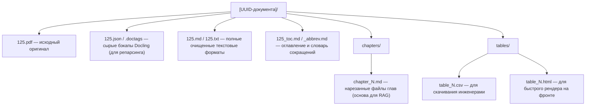
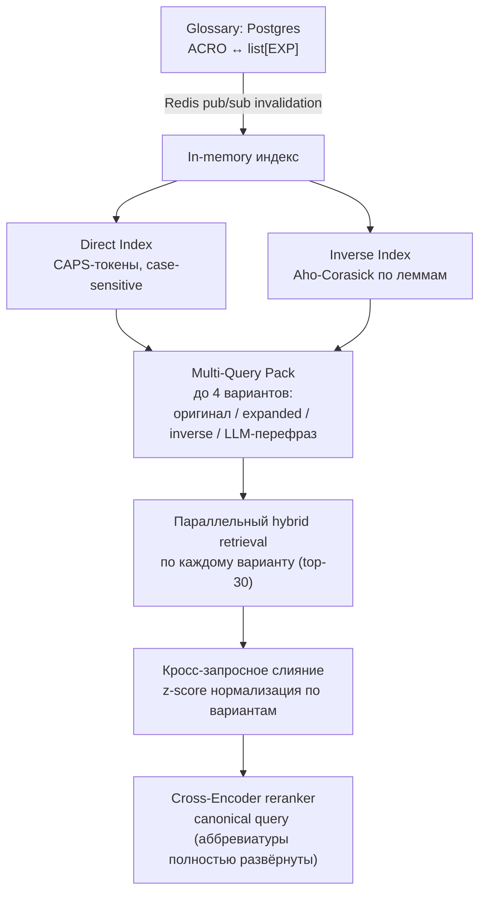

# RAG Service — Issues & Fixes

Закрытые пункты (все "✅ Исправлено") вынесены в `ISSUES_ARCHIVE.md` — здесь только открытое.

---

## 🔴 Баги

Найдено аудитом безопасности 2026-08-03 (агент-исследование всего проекта), не исправлено:

| # | Было | Файл | Строка |
|---|---|---|---|
| B12 | `build_worker_infrastructure()` создаёт новый `AsyncEngine` и новый `AsyncQdrantClient` при каждом вызове; вызывается заново в начале каждой Celery-таски (`ingest_document_task`/`summarize_document_chapters_task`/`index_note_task`) и ни разу не диспозится — в отличие от `main.py`, который закрывает движок API-процесса в `lifespan`. Долгоживущий воркер, обработавший много документов/заметок, копит непровере́дённые до конца соединения/сокеты (SQLAlchemy engine + httpx-клиент внутри `AsyncQdrantClient`) до исчерпания лимита файловых дескрипторов | `worker_container.py::build_worker_infrastructure` (вызовы — `workers/task.py:21,162,233`) | 69 |
| B13 | Проверка дубликата файла в `_download_and_validate_hashes` — чистый `SELECT` (`get_document_by_hash`), не защищённый от гонки. Атомарный аналог `update_document_hash_atomically` (полагается на `uq_documents_file_hash`) определён, но нигде не вызывается — мёртвый код. Два одновременных инжеста одинакового файла оба проходят `SELECT`, оба гоняют полный Docling-парсинг; проигравший падает на `IntegrityError`, которая не ловится ни одним конкретным except (не `OperationalError`, не `ValueError`) — уходит в общий `except Exception` и помечается `ERROR` вместо чистого `DUPLICATE` с уборкой файла | `application/ingestion_service.py::_download_and_validate_hashes` | 229–236 |
| B14 | `index_note_task` уведомляет backend о `note_status="error"` уже на первой транзиентной ошибке, до `self.retry()` — притом что до 3 ретраев ещё в запасе и задача обычно проходит со следующей попытки. UI статуса заметки может мелькнуть "error", который через секунды перезаписывается на "indexed" | `workers/task.py` | 238–243 |

---

## 🟠 Архитектурные / поведенческие проблемы

| # | Описание | Файл | Строка |
|---|---|---|---|
| A9 | **OOM при инжекте:** `bm25_sparse_vector` строит инвертированный индекс в RAM → Qdrant крашится и обрывает соединение. ✅ Полностью закрыто 2026-08-03: `on_disk=True` на обе прод-коллекции, все 8 `COMPLETED`-документов переиндексированы. Заметки (1 шт.) скрипт не переиндексировал (rag_service не владеет текстом заметок) — требуется ручной `POST /api/notes/{guid}/index`, ещё не выполнено | `infrastructures/repositories/qdrant_vector_storage.py` | 340–349 |
| A10 | Реструктуризация хранения документов — гибридная архитектура PostgreSQL + MinIO. Детали ниже ⬇️ | — | — |
| A11 | Обработка сокращений (аббревиатур) — отдельно от таблиц, нужна нормализация/расшифровка перед индексацией и поиском. Живьём подтверждено: "ПНР" в теле документа не матчится на запрос "пусконаладочные работы". Целевая архитектура и урезанный MVP-план — ниже ⬇️ | — | — |
| A16 | `GET /documents` не ограничивает верхнюю границу `limit`, а `ilike`-фильтр по `filename` передаёт сырую строку в шаблон `%...%` без экранирования `%`/`_` (не SQL-инъекция — параметризовано, просто неограниченный wildcard-запрос). Низкий риск — роут уже за admin-авторизацией backend'а, но при большом корпусе документов может быть дорогим | `api/rag_routes.py`, `infrastructures/repositories/document_repository.py` | 148–152, 138 |
| A17 | `DocumentOrchestrator.get_file_s3_by_s3key(key)` принимает произвольный ключ без проверки принадлежности вызывающему документу. Сейчас вызывается только с ключами из БД (безопасно), но закомментированный `/admin/storage/files/content?key=...` в том же файле скормил бы туда произвольный ключ, если его когда-нибудь раскомментируют | `application/document_orchestrator.py` | 100–101 |
| A18 | **OCR-артефакты тяжелее hyphenminus.** Живьём найдено на «СТО Газпром 4.2-0-003-2009» (глава 4): (1) пробел перед `,.;:)]` почти на каждом знаке препинания по всему документу — безопасно чистится regex'ом, не сделано; (2) слово разорвано через "буква ПРОБЕЛ-дефис буква" (`предотвра -щение`, `деятель -ности`) — другой вариант того же класса бага, что и `слово-\nслово` (уже чинится), но не покрыт. **Неоднозначность**: склейка через тот же принцип ("дефис на разрыве — всегда убираем") в этом же документе сломала настоящее составное слово `информационно-управляющих` → `информационноуправляющих`, т.к. регэксп не отличает случайный OCR-разрыв от реального дефиса. Есть и третий вариант без дефиса вообще (`без опасности` вместо `безопасности`) — регэкспом принципиально не лечится, нужен словарь/спелчекер. Выбор между "не трогать дефисный разрыв" / "чинить с риском попортить редкие составные слова" — не сделан, ждёт решения | `domain/chunking/docling_text_cleaner.py` | 17–47 |
| A21 | **Приложения (ПРИЛОЖЕНИЕ N) не ищутся и не попадают в ответы.** `ChapterSplitter.split()` останавливает нарезку на главы полностью, как только встречает заголовок приложения (`if self._patterns.appendix.match(s): break`) — весь текст после этой точки никогда не режется на чанки и не эмбеддится в Qdrant. `MetaSectionExtractor` параллельно вытаскивает тот же текст как `MetaSection(section_type="APPENDICES")`, но он получает то же обращение, что и сырое оглавление (TOC) — только `S3` + строка `document_meta_sections`, без прохода через `store_chunks`/`_run_pipeline`. Контент физически лежит в хранилище, но семантический поиск (`/documents/retrieve`) и, соответственно, ответы ассистента никогда до него не дотянутся. Найдено по прямому вопросу пользователя (2026-08-05) — для нормативки (ГОСТ/СП) в приложениях часто лежат как раз таблицы допустимых значений/форм документов, то есть наиболее "спрашиваемый" контент | `domain/chunking/docling_segmenter.py:170-171` (обрыв `ChapterSplitter`), `application/ingestion_service.py::_store_docling_artifacts` (meta_sections не идут в векторизацию) |

---

### 📦 A10 — Реализация гибридной архитектуры хранения документов (PostgreSQL + MinIO)

**🎯 Цель**
Организовать надежное и масштабируемое хранение структурированных результатов парсинга (Markdown-глав, таблиц, метаданных) согласно разработанному пайплайну Docling. Разделить хранение тяжелых бинарных/текстовых файлов и легких реляционных связей.

**🏛️ Архитектурный паттерн**
- MinIO (S3): Хранилище «сырых» и обработанных файлов. Файлы изолируются в бакете по UUID документа.
- PostgreSQL: Индексный навигатор. Хранит структуру документа, метаданные, JSONB-копии таблиц и текстовые саммари от LLM. Сами файлы целиком в БД не сохраняются.

**📂 0. Схема бакетов (домены, не сущности)**

Вместо бакета на каждый документ/пользователя/проект — 3 доменных бакета, изоляция внутри по папке-префиксу:

| Бакет | Папка внутри | Назначение |
|---|---|---|
| `knowledge-base` | `{doc_uuid}/...` | База знаний — ГОСТы и прочие документы (см. п.1 ниже) |
| `users` | `{user_id}/...` | Личные файлы пользователей (аватары и т.п.) |
| `projects` | `{project_id}/...` | Файлы проектов (Фича 5, `TODO.md`) |

Версионирование и lifecycle-политики настраиваются на уровне бакета — при таком подходе они общие для всех документов/проектов/пользователей внутри домена (не per-сущность). Если понадобится точечная политика — MinIO поддерживает lifecycle rules с ограничением по префиксу.

**📂 1. Структура объектов в MinIO (S3) — бакет `knowledge-base`**

**🏛️ 2. Схема таблиц в PostgreSQL (DDL)**
- `documents` — главная карточка документа (`id UUID`, `filename`, `title`, `s3_prefix`).
- `document_chapters` — навигация по главам (`doc_id`, `chapter_number`, `title`, `s3_md_path`, `summary TEXT` от LLM).
- `document_tables` — индекс таблиц (`doc_id`, `table_index`, `title`, `s3_csv_path`, `s3_html_path`, `raw_json JSONB` — для сборки в Excel через Pandas «на лету»).
- `document_meta_sections` — служебные разделы (`doc_id`, `section_type` [TOC/ABBREVIATIONS/APPENDICES], `s3_md_path`).

⚠️ Важно: для всех дочерних таблиц настроить `ON DELETE CASCADE` по ключу `doc_id` для чистого каскадного удаления данных.

**🔄 3. Алгоритм работы Celery-воркера (после Этапа 5)**
1. Создать запись в `documents`, сгенерировать UUID.
2. Загрузить все локальные файлы из `scratch1/` в MinIO, подставив UUID в путь.
3. Записать структуру глав, мета-разделов и метаданные таблиц в Postgres. В `raw_json` таблицы упаковать через Pandas (`df.to_json(orient="split")`).
4. Отправить текст глав в LLM-воркер для асинхронной генерации кратких summary.

**Статус: реализовано целиком** (все 4 таблицы/миграции есть, presigned-URL вместо `scratch1/`, каскадное удаление подтверждено, `document_chapters.summary`/`document_tables.summary` заполняются LLM-саммари, таблицы эмбеддятся в Qdrant поверх маркера) — детали и живые прогоны в `ISSUES_ARCHIVE.md`.

---

### 📦 A11 — Обработка сокращений/аббревиатур

**Проблема (подтверждена живьём 2026-07-31):** документ в теле использует аббревиатуру
("ПНР"), пользователь спрашивает полной формой ("пусконаладочные работы") или наоборот —
эмбеддинг не матчит одно на другое, релевантный чанк не находится. Решение не выбрано,
ждало отдельного разговора — см. память `table_summary_feature_and_abbreviation_gap`.

Пользователь прислал 2026-08-03 развёрнутую спеку (`SafeQueryExpander` + multi-query
expansion + канонический запрос для реранкера) как долгосрочный ориентир архитектуры —
адаптирована ниже под то, что уже есть в коде (не копирую как есть — см. отличия).

**🎯 Целевая архитектура (к чему стремиться, не текущий план)**

Ключевые компоненты из спеки: `SafeQueryExpander` (pymorphy3-лемматизация с пропуском
CAPS-токенов, `ahocorasick` автомат на леммах для обратного поиска "длинная форма →
аббревиатура", множественные расшифровки на одну аббревиатуру), Celery-таск с
regex+LLM-валидацией для авто-наполнения словаря при инжесте, Redis pub/sub для
инвалидации in-memory индекса между процессами.

**Чем целевая архитектура отличается от того, что реально в коде (проверено 2026-08-03):**
- **DBSF fusion уже есть — но не тот.** `qdrant_vector_storage.py` уже использует нативный
  `FusionQuery(fusion=Fusion.DBSF)` для слияния dense+sparse **внутри одного запроса**.
  Функция `dbsf_fusion()` из спеки — про другое: слияние результатов **нескольких разных
  запросов** (вариантов expansion) через ручную z-score нормализацию в Python. Совпадение
  названия при разном назначении — источник путаницы, при реализации развести термины.
- **Сырьё для словаря уже частично собирается.** `MetaSectionExtractor`
  (`domain/chunking/docling_segmenter.py`) уже вырезает раздел "Сокращения" при инжесте
  каждого документа и кладёт в `document_meta_sections` (S3 `meta/abbreviations.md`).
  Проверено на живых данных 2026-08-03: у 2 из 8 документов такой раздел реально есть,
  формат — `ЕСТД -единая система технической документации ;` построчно. Предложенный в
  спеке отдельный Celery-таск "с регуляркой + LLM-валидацией по всему корпусу" во многом
  дублирует то, что уже извлечено — не хватает только парсера этого конкретного формата
  в пары `(acro, exp)`, не нового пайплайна экстракции.
- **pymorphy3/ahocorasick — новые зависимости**, ни в одном requirements.txt их нет.
- **Не решено, где живёт LLM-перефраз варианта запроса** — по конвенции проекта retrieval
  в rag_service, LLM-вызовы в llm_service; та же нерешённая развилка, что в спеке Фичи 1
  (AI-аудит опросников, `TODO.md`).

**🟢 Урезанный MVP — Фаза 1 (согласовано 2026-08-03)**

Ключевое решение: **Conditional Multi-Query**, не always-on fan-out. Обычный запрос без
аббревиатур идёт как сегодня (1 запрос, 0 доп. нагрузки). Только если в запросе найден
известный CAPS-токен из словаря — генерируются ровно 2 варианта (оригинал + канонический
развёрнутый), без LLM-перефраза на этой фазе. В реранкер уходит канонический (Q2)
вариант. Причины отказа от безусловных 4 вариантов: (1) латентность — SSE/nginx уже
борются за секунды отклика, always-on 4x fan-out + LLM-rewrite — гарантированное узкое
место; (2) в подавляющем большинстве запросов аббревиатур вообще нет — гонять расширение
для них чистый оверхед без пользы для recall; (3) найденный баг узкий (ПНР ↔
пусконаладочные работы) — точечный детерминированный расширитель закрывает его полностью,
не трогая производительность остальных запросов.

Цель — закрыть ровно найденный баг (ПНР ↔ пусконаладочные работы) минимумом кода, без
новых тяжёлых зависимостей и без always-on 4x нагрузки на каждый запрос:

1. **Таблица `abbreviations`** (Postgres, rag_kernel): `id`, `acronym`, `expansion`,
   `doc_id` (источник), уникальность на `(acronym, expansion)` — повторно используем
   уже дедуплицированный список расшифровок на одну аббревиатуру.
2. **Парсер уже существующего `abbreviations.md`** — простой regex на формат
   `АББРЕВИАТУРА -расшифровка ;` (см. живой пример выше), без LLM-валидации и без
   отдельного скана корпуса. Запускается как шаг после `add_document_meta_sections`
   для секций `section_type='ABBREVIATIONS'`, либо разовым backfill-скриптом по уже
   проиндексированным документам.
3. **Query-time expansion без лемматизации и без Aho-Corasick:** прямой индекс
   `dict[acronym, list[expansion]]`, case-sensitive поиск CAPS-токенов (`\b[А-ЯA-Z0-9-]{2,}\b`)
   в запросе. Обратный поиск (длинная форма → аббревиатура) на MVP — простое
   регистронезависимое совпадение подстроки на точную формулировку расшифровки из
   словаря (без учёта словоформ) — компромисс осознанный, ловит меньше случаев словоформ,
   зато без новой зависимости; лемма-based обратный индекс — в целевой архитектуре, не MVP.
4. **Не всегда 4 варианта — расширение только при найденном совпадении.** Если в запросе
   нет CAPS-токена/известной аббревиатуры — идёт как сегодня, один запрос, без доп.
   нагрузки. При совпадении — максимум 2 варианта (оригинал + развёрнутый), без
   LLM-перефраза (снимает нерешённый вопрос владения на MVP).
5. **Слияние результатов вариантов — без z-score/новой "DBSF".** Один и тот же
   эмбеддер/метрика для обоих вариантов — шкалы скоров уже сравнимы, достаточно взять
   максимум скора на `parent_id` при слиянии (переиспользовать логику дедупликации,
   уже существующую в `RetrieveService.batch_search`), не городить отдельную
   z-score-нормализацию ради 2 вариантов.
6. **Без Redis pub/sub.** Словарь — не более пары сотен строк, держать в памяти процесса
   с ручной перезагрузкой (или по TTL) вместо pub/sub-инвалидации между процессами —
   усложнение того не стоит на этом масштабе.
7. **Оценка — переиспользовать `llm_service/eval`** (E0-харнесс уже есть, признак
   успеха — рост `hit@5` на вопросах с аббревиатурами), не строить отдельный скрипт замера.

**Открытые вопросы перед стартом реализации:**
- [ ] Где физически живёт `AbbreviationExpander` — новый application-сервис в
  `rag_service` рядом с `RetrieveService`, или встраивается прямо в него?
- [ ] Нужен ли backfill по уже проиндексированным 8 документам сразу, или парсинг
  запускать только для новых документов вперёд?
- [ ] Список открытых A11-вопросов пересекается с A10 (`document_meta_sections` уже
  есть, `MetaSectionExtractor` уже пишет ABBREVIATIONS) — держать A11 отдельно от A10
  или объединить, раз общая инфраструктура?

---

## 🗑️ Мёртвый код

| # | Описание | Файл | Строка |
|---|---|---|---|
| D1 | ~180 строк закомментированных роутов (`/documents/{doc_id}/status`, detail, `/admin/storage/files*`, placeholder-роуты) | `api/rag_routes.py` | 94–275 |
| D6 | `update_metadata_document()` пустой stub (`pass`) | `application/document_service.py` | 198–199 |
| D7 | `set_status()` дублирует `update_document()`; в проде вызывается только изнутри самого сервиса, воркер (`ingestion_service.py`) использует исключительно `update_document()`. Вызывается лишь из тестов | `application/document_service.py` | 160–169 |
| D8 | `RequestLoggingMiddleware` — оба ветки `dispatch()` просто вызывают `call_next` и возвращают результат, ничего не логируют и не замеряют. Название вводит в заблуждение — выглядит как логирование запросов, по факту no-op прогонка через лишний слой `BaseHTTPMiddleware` на каждый запрос | `main.py` | 23–29 |
| D9 | Dev-скретчи не на своём месте в тестовой директории — `server_docling.py`, `rag_core_test/ChunkingEngine.py`, `rag_core_test/chunking.py` не являются тестами | `tests/` | — |
| D10 | Корневой (не `rag_service/tests/`) `tests/test_chinking_engine.py` — импортирует `ChinkingEngine` из `rag_service.workers.ingestion_service`, которого не существует (модуль удалён в рамках Docling-рефакторинга, остался только stale `.pyc` в `__pycache__`). Файл вдобавок содержит синтаксическую ошибку (`engine.process_document(,` — незакрытый вызов) — упадёт на импорте/парсинге, не только на логике. Найдено случайно при проверке T16, не исправлялось — не было в скоупе сессии | `tests/test_chinking_engine.py` | 3, 18 |
| D12 | Найдено аудитом 2026-08-05: `exception_handlers.py` регистрирует отдельный handler для `PostgresError`, но класс нигде в кодовой базе не поднимается (`grep "raise PostgresError"` — ноль совпадений). Реальные ошибки Postgres (asyncpg/SQLAlchemy exceptions) падают в generic `except Exception` — безопасно, но handler создаёт ложное впечатление, что ошибки БД получают отдельную обработку | `exception_handlers.py` | 22–25 |
| D13 | Найдено при обзоре обработки исключений 2026-08-05: `DeadlockRetryExceeded`/`ChunkInsertError`/`DocumentReadError`/`DocumentCreateError`/`DocumentUpdateError`/`DocumentDeleteError` определены, но нигде не поднимаются. Особо: `document_repository.py::bulk_insert_chunks` (строка ~373) — та самая ретрай-петля по дедлоку (`sqlstate == "40P01"`), для которой `DeadlockRetryExceeded` явно задуман по имени, — на исчерпании попыток делает голый `raise` исходного `DBAPIError`/`OperationalError`, а не оборачивает в типизированное исключение. **Сознательно не тронуто**: `OperationalError` — единственный маркер, по которому `ingestion_service.py::process_document` классифицирует ошибку как транзиентную и ретраит через Celery; если обернуть в `DeadlockRetryExceeded` (`PostgresError`, не `OperationalError`), деадлок после исчерпания внутренних попыток перестанет ретраиться на уровне Celery-таски и уйдёт сразу в ERROR — реальная регрессия, не улучшение | `domain/errors/postgres.py`, `infrastructures/repositories/document_repository.py:373` | — |
