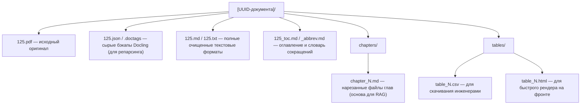
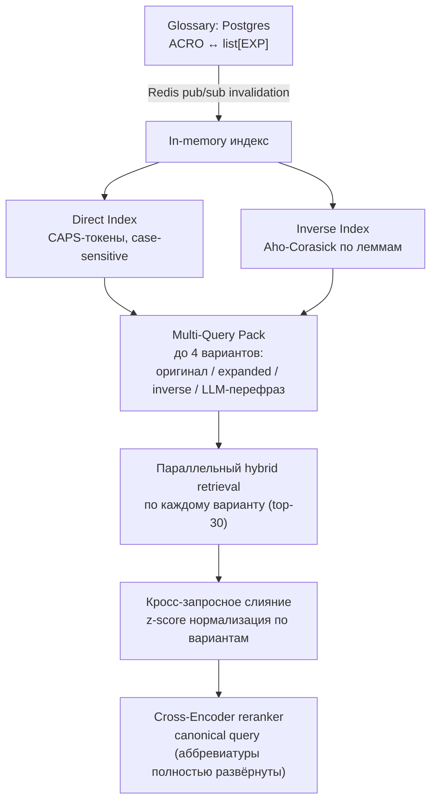

# RAG Service — Issues & Fixes

## ✅ Исправлено (сессия Docling-рефакторинга)

| # | Было | Как исправлено |
|---|---|---|
| A2 | `source` в child chunks — временный путь во `TemporaryDirectory()` | Временные файлы убраны полностью — конвертация PDF идёт через bytes/`DocumentStream` от S3 до Docling, temp-директорий в пайплайне больше нет |
| T1 | `raise e` вместо `raise` — терялся traceback | `application/ingestion_service.py` переписан с явной политикой исключений (retry/no-retry по типу), голого `raise e` не осталось |
| T5 | Дублирующиеся импорты `uuid`/`Any` | `document_parser.py` → `chunk_builder.py`, файл реструктурирован (датаклассы `ParentChunk`/`ChildChunk`), импорты собраны в одном месте |

## ✅ Исправлено (2026-07-17)

| # | Было | Как исправлено |
|---|---|---|
| B4 | Ретрай Celery не идемпотентен: `_store_structural_data` при повторной попытке заново вставляла те же `document_chapters`/`document_tables`/parent chunks → `UniqueViolationError` на `uq_document_chapters_doc_chapter_number`, которая сама классифицировалась как "transient" и ретраилась бесконечно до исчерпания `max_retries` | `DocumentRepository.delete_structural_data()` + `DataBaseDocumentService.reset_structural_data()`, вызывается в начале `IngestionService._store_structural_data()` — ретрай теперь стартует с чистого состояния |

## ✅ Исправлено (2026-07-20)

| # | Было | Как исправлено |
|---|---|---|
| B5 | Ретрай-политика ловила `DBAPIError` целиком как "транзиентную инфраструктуру" — базовый класс и для `IntegrityError`/`ProgrammingError`/`DataError`, не только connection/timeout. Реальный constraint-баг ретраился бы молча до `max_retries` вместо немедленного ERROR | `ingestion_service.py` — из except-кортежа убран `DBAPIError`, оставлен только `OperationalError` (специфично про соединение/операционные сбои). Всё остальное из `DBAPIError` теперь падает в общий `except Exception` → `doc.fail()` + статус ERROR сразу |
| B6 | Webhook от MinIO обрабатывал `event.records` без per-record try/except — упавшая запись рвала весь ответ non-200, MinIO ретраил весь вебхук, уже задиспатченные записи продиспатчились бы повторно | `rag_routes.py::handle_webhook` — per-record try/except, 200 всегда (кроме сбоя авторизации), список `failed` в ответе при частичном провале. Плюс идемпотентность в `TaskDispatcherService.dispatch_ingestion` — пропускает диспатч, если `doc.status != PENDING` |

## ✅ Исправлено (2026-07-21)

| # | Было | Как исправлено |
|---|---|---|
| B7 | `delete_by_field` падал, если целевая Qdrant-коллекция ещё не существует (первый когда-либо апсерт в неё, например самая первая заметка пользователя) — Celery ретраил 3 раза и сдавался, сущность навсегда оставалась неиндексированной | `infrastructures/repositories/qdrant_vector_storage.py` — отсутствующую коллекцию теперь просто пропускают (нечего удалять), а не бросают исключение. Найдено по ходу работы над Заметками, не отдельная задача |

## ✅ Исправлено (2026-07-22)

| # | Было | Как исправлено |
|---|---|---|
| D4 | `dispatch_reindexing()` пустой stub — кнопка «↻ Переиндексировать» в админке ничего не делала, роута в rag_service не было вообще | Переиспользует ту же `ingest_document_task`, что и первичная загрузка (`process_document` уже идемпотентен по Postgres). Добавлен `POST /documents/{doc_id}/reindex` в `rag_routes.py`. Попутно закрыт скрытый баг: `_run_pipeline` вставлял новые чанки под новыми `point_id`, не трогая старые — реиндекс плодил бы в Qdrant дубликаты. Перед индексацией теперь `vector_storage.delete_by_field("doc_id", ...)` сносит старые векторы документа (`ingestion_service.py`), `VectorDeleteError` добавлен в список транзиентных ошибок, которые ретраит Celery |
| T14 | UTF-8 BOM в начале файла (`ef bb bf`) | BOM снят напрямую (`open(...,"rb")`, срез первых 3 байт) — `git diff` подтверждает единственное реальное изменение (первая строка), `py_compile` чисто |
| T15 | BOM + CRLF-концовки строк | BOM снят, `\r\n` → `\n`; `git diff` показал, что CRLF был лишь локальным артефактом Windows-чекаута (`core.autocrlf`) — в самом блобе строки уже хранились как LF, реально изменилась только первая строка |
| T16 | Опечатки в именах файлов | `git mv local_embedding_reposittory.py → local_embedding_repository.py`, `git mv ChinkingEngine.py → ChunkingEngine.py` (история сохранена через `git mv`). Импорты поправлены в `container.py` и внутри самого файла (`if __name__ == "__main__"` блок). Заодно снят найденный по ходу BOM в `ChunkingEngine.py` (не был в исходном списке ревью) |

---

## 🔴 Баги

Найдено аудитом безопасности 2026-08-03 (агент-исследование всего проекта), не исправлено:

| # | Было | Файл | Строка |
|---|---|---|---|
| B12 | `build_worker_infrastructure()` создаёт новый `AsyncEngine` и новый `AsyncQdrantClient` при каждом вызове; вызывается заново в начале каждой Celery-таски (`ingest_document_task`/`summarize_document_chapters_task`/`index_note_task`) и ни разу не диспозится — в отличие от `main.py`, который закрывает движок API-процесса в `lifespan`. Долгоживущий воркер, обработавший много документов/заметок, копит непровере́дённые до конца соединения/сокеты (SQLAlchemy engine + httpx-клиент внутри `AsyncQdrantClient`) до исчерпания лимита файловых дескрипторов | `worker_container.py::build_worker_infrastructure` (вызовы — `workers/task.py:21,162,233`) | 69 |
| B13 | Проверка дубликата файла в `_download_and_validate_hashes` — чистый `SELECT` (`get_document_by_hash`), не защищённый от гонки. Атомарный аналог `update_document_hash_atomically` (полагается на `uq_documents_file_hash`) определён, но нигде не вызывается — мёртвый код. Два одновременных инжеста одинакового файла оба проходят `SELECT`, оба гоняют полный Docling-парсинг; проигравший падает на `IntegrityError`, которая не ловится ни одним конкретным except (не `OperationalError`, не `ValueError`) — уходит в общий `except Exception` и помечается `ERROR` вместо чистого `DUPLICATE` с уборкой файла | `application/ingestion_service.py::_download_and_validate_hashes` | 229–236 |
| B14 | `index_note_task` уведомляет backend о `note_status="error"` уже на первой транзиентной ошибке, до `self.retry()` — притом что до 3 ретраев ещё в запасе и задача обычно проходит со следующей попытки. UI статуса заметки может мелькнуть "error", который через секунды перезаписывается на "indexed" | `workers/task.py` | 238–243 |

---

## ✅ Исправлено (2026-07-24)

| # | Было | Как исправлено |
|---|---|---|
| B8 | (backend, не rag_service) `Chats.summary_link` в модели и в корневой миграции типизирован как `UUID(as_uuid=True)`, а `ConversationService` везде трактует его как integer — id последнего сообщения в батче, курсор для `get_messages_after`. Каждый раз, когда чат переваливает `SUMMARY_THRESHOLD` и `update_summary()` пытается сохранить `chat.summary_link = <int>`, запись падала с ошибкой типа | `backend/models/database_models.py:115` → `Integer`; та же правка в `migrations/users/versions/8506a89ad7d9_..._.py:67` (pre-release база, миграция поправлена на месте, не поверх). `ALTER TABLE users_shema.chats ALTER COLUMN summary_link TYPE INTEGER USING NULL` выполнен на dev-БД (`myapp_db`) — у всех 25 чатов значение было `NULL`, данных не потеряно. `rag_backend` перезапущен, поднялся чисто |
| B9 | `ChapterSplitter` путал нумерованные шаги внутри примеров («Пример N» → «1. Исходные данные.») с настоящими главами документа — коллизия номеров роняла `bulk_insert_chapters` на `UniqueViolationError`, плюс тихая порча данных (контент примера утекал не в ту главу) | `docling_segmenter.py::ChapterSplitter.split()` — `seen_numbers: set[str]`, номер, который уже встречался, дописывается в текущую главу вместо открытия новой (коммит `073a260`) |

---

## ✅ Исправлено (2026-07-28)

| # | Было | Как исправлено |
|---|---|---|
| B3 | `score_threshold` в `search()` не доходил до Qdrant — `query_points()` вызывался без этого kwarg (в `batch_search()` передавался корректно, асимметрия между методами). Реальный эффект: `RetrieveService.search()` вызывающие код передавали `score_threshold`, ожидая отсечение нерелевантных чанков, но фильтрация молча не работала — приходили все top_k результатов независимо от скора | `infrastructures/repositories/qdrant_vector_storage.py::search()` — `score_threshold=score_threshold` добавлен в вызов `query_points()`. Тест: `tests/test_qdrant_vector_storage_search.py` |
| B10 | `DocumentOrchestrator.delete_document` чистил только оригинальный файл (`document.s3key`) + Qdrant + Postgres. Производные S3-артефакты инжеста (`{doc_id}/full.md`, `chapters/*.md`, `tables/*.csv\|html`, `meta/*.md`) не удалялись никогда — подтверждено живьём (`mc ls` после `DELETE /documents/{id}` всё ещё показывал эти файлы). Утечка объектов в MinIO с каждым удалённым документом | Оригинальный файл и все производные артефакты лежат под одним префиксом `{doc_id}/` (см. `IngestionDocument.create_new`, `IngestionService._store_docling_artifacts`) — `delete_document` теперь листит `s3_storage.list(prefix=str(doc_id))` и удаляет всё найденное. Тест: `tests/test_document_orchestrator_delete.py::test_delete_document_removes_derivative_ingestion_artifacts` |
| A12 | Пайплайн инжеста сам себе слал вебхуки — записи собственных артефактов (`full.md`, `chapters/*`, `tables/*`, `meta/*`) триггерили `handle_webhook` → `DocumentByStorageKeyNotFound` → ERROR-лог, до сотни лишних записей на документ | `TaskDispatcherService._is_ingestion_artifact()` — проверка по суффиксам пути перед обращением к БД, тихий `return`. Тест: `tests/test_task_dispatcher_service.py` |

---

## ✅ Исправлено (2026-07-31)

| # | Было | Как исправлено |
|---|---|---|
| A1 | `_ensure_collection` вызывался при каждом upsert — лишний `collection_exists()` к Qdrant на каждый документ, даже после того как коллекция уже подтверждена | `QdrantVectorStorage` — флаг `self._collection_ready`, double-checked locking: после первого успешного создания/подтверждения коллекции все следующие вызовы возвращаются сразу, без похода в Qdrant и без lock |
| A5 | Webhook-токен читался через `os.getenv("MINIO_NOTIFY_WEBHOOK_AUTH_TOKEN_1")` вместо `pydantic-settings` — нарушение архитектурного соглашения | `RagSettings.minio_notify_webhook_auth_token_1` (`settings.py`), `rag_routes.py::handle_webhook` использует `settings.minio_notify_webhook_auth_token_1`; неиспользуемый `import os` убран |
| A6 | Глобальный синглтон `v_indexing_service` без thread-safety — `if v_indexing_service is None` без lock, race condition при параллельном старте воркеров | `container.py::get_v_indexing_service` — `threading.Lock` + double-checked locking |
| A7 | Докстринг/тайп-хинт `batch_search()` заявляли ключ дедупликации `(doc_id, parent_id)`, а по факту использовался голый `parent_id` — аннотация врала. Функционально не баг: `parent_id` — глобально уникальный PK `parent_chunks` (не составной с `doc_id`), коллизий между документами быть не может | `application/retrieve_service.py` | 191, 214–217 — докстринг и `seen: dict[str, dict]` приведены в соответствие с реальным поведением, ключ не менялся |
| A8 | `DocumentStatus` был определён в `api/schemas.py` — `domain/document.py`, `models/models.py`, `application/task_dispatcher_service.py` импортировали доменное понятие из API-слоя, зависимость в обратную сторону от DDD | `DocumentStatus` перенесён в `domain/document.py` (его естественный владелец); `api/schemas.py` реэкспортирует (`from rag_service.domain.document import DocumentStatus`) — внешние импорты не сломаны; `models/models.py` и `task_dispatcher_service.py` переключены на прямой импорт из `domain.document` |

---

## 🟠 Архитектурные / поведенческие проблемы

| # | Описание | Файл | Строка |
|---|---|---|---|
| A9 | **OOM при инжекте:** `bm25_sparse_vector` строит инвертированный индекс в RAM → Qdrant крашится и обрывает соединение. ⚠️ Частично исправлено 2026-07-31: `index=models.SparseIndexParams(on_disk=True)` добавлен в `SparseVectorParams` при `create_collection` — действует только на **новые** коллекции. ✅ Полностью закрыто 2026-08-03: одноразовый скрипт (`scripts/migrate_sparse_index_on_disk.py`, уже удалён из репозитория за ненадобностью — своё дело сделал) пересоздал обе прод-коллекции (`rag_documents_collection_with_sparse_vector`, `notes_collection_with_sparse_vector`) с `on_disk=True` и переиндексировал все 8 `COMPLETED`-документов через `dispatch_reindexing`. Заметки (1 шт. в статусе `indexed`) скрипт не переиндексировал (rag_service не владеет текстом заметок) — требуется ручной `POST /api/notes/{guid}/index`, ещё не выполнено | `infrastructures/repositories/qdrant_vector_storage.py` | 340–349 |
| A10 | Реструктуризация хранения документов — гибридная архитектура PostgreSQL + MinIO. Детали ниже ⬇️ | — | — |
| A11 | Обработка сокращений (аббревиатур) — отдельно от таблиц, нужна нормализация/расшифровка перед индексацией и поиском. Живьём подтверждено: "ПНР" в теле документа не матчится на запрос "пусконаладочные работы". Целевая архитектура и урезанный MVP-план — ниже ⬇️ | — | — |
| A16 | `GET /documents` не ограничивает верхнюю границу `limit`, а `ilike`-фильтр по `filename` передаёт сырую строку в шаблон `%...%` без экранирования `%`/`_` (не SQL-инъекция — параметризовано, просто неограниченный wildcard-запрос). Низкий риск — роут уже за admin-авторизацией backend'а, но при большом корпусе документов может быть дорогим | `api/rag_routes.py`, `infrastructures/repositories/document_repository.py` | 148–152, 138 |
| A17 | `DocumentOrchestrator.get_file_s3_by_s3key(key)` принимает произвольный ключ без проверки принадлежности вызывающему документу. Сейчас вызывается только с ключами из БД (безопасно), но закомментированный `/admin/storage/files/content?key=...` в том же файле скормил бы туда произвольный ключ, если его когда-нибудь раскомментируют | `application/document_orchestrator.py` | 100–101 |
| A18 | **OCR-артефакты тяжелее hyphenminus.** Живьём найдено на «СТО Газпром 4.2-0-003-2009» (глава 4): (1) пробел перед `,.;:)]` почти на каждом знаке препинания по всему документу — безопасно чистится regex'ом, не сделано; (2) слово разорвано через "буква ПРОБЕЛ-дефис буква" (`предотвра -щение`, `деятель -ности`) — другой вариант того же класса бага, что и `слово-\nслово` (уже чинится), но не покрыт. **Неоднозначность**: склейка через тот же принцип ("дефис на разрыве — всегда убираем") в этом же документе сломала настоящее составное слово `информационно-управляющих` → `информационноуправляющих`, т.к. регэксп не отличает случайный OCR-разрыв от реального дефиса. Есть и третий вариант без дефиса вообще (`без опасности` вместо `безопасности`) — регэкспом принципиально не лечится, нужен словарь/спелчекер. Выбор между "не трогать дефисный разрыв" / "чинить с риском попортить редкие составные слова" — не сделан, ждёт решения | `domain/chunking/docling_text_cleaner.py` | 17–47 |

---

### 📦 A10 — Реализация гибридной архитектуры хранения документов (PostgreSQL + MinIO)

**🎯 Цель**
Организовать надежное и масштабируемое хранение структурированных результатов парсинга (Markdown-глав, таблиц, метаданных) согласно разработанному пайплайну Docling. Разделить хранение тяжелых бинарных/текстовых файлов и легких реляционных связей.

**🏛️ Архитектурный паттерн**
- MinIO (S3): Хранилище «сырых» и обработанных файлов. Файлы изолируются в бакете по UUID документа.
- PostgreSQL: Индексный навигатор. Хранит структуру документа, метаданные, JSONB-копии таблиц и текстовые саммари от LLM. Сами файлы целиком в БД не сохраняются.

**📂 0. Схема бакетов (домены, не сущности)**

Вместо бакета на каждый документ/пользователя/проект — 3 доменных бакета, изоляция внутри по папке-префиксу:

| Бакет | Папка внутри | Назначение |
|---|---|---|
| `knowledge-base` | `{doc_uuid}/...` | База знаний — ГОСТы и прочие документы (см. п.1 ниже) |
| `users` | `{user_id}/...` | Личные файлы пользователей (аватары и т.п.) |
| `projects` | `{project_id}/...` | Файлы проектов (Фича 5, `TODO.md`) |

Версионирование и lifecycle-политики настраиваются на уровне бакета — при таком подходе они общие для всех документов/проектов/пользователей внутри домена (не per-сущность). Если понадобится точечная политика — MinIO поддерживает lifecycle rules с ограничением по префиксу.

**📂 1. Структура объектов в MinIO (S3) — бакет `knowledge-base`**

**🏛️ 2. Схема таблиц в PostgreSQL (DDL)**
- `documents` — главная карточка документа (`id UUID`, `filename`, `title`, `s3_prefix`).
- `document_chapters` — навигация по главам (`doc_id`, `chapter_number`, `title`, `s3_md_path`, `summary TEXT` от LLM).
- `document_tables` — индекс таблиц (`doc_id`, `table_index`, `title`, `s3_csv_path`, `s3_html_path`, `raw_json JSONB` — для сборки в Excel через Pandas «на лету»).
- `document_meta_sections` — служебные разделы (`doc_id`, `section_type` [TOC/ABBREVIATIONS/APPENDICES], `s3_md_path`).

⚠️ Важно: для всех дочерних таблиц настроить `ON DELETE CASCADE` по ключу `doc_id` для чистого каскадного удаления данных.

**🔄 3. Алгоритм работы Celery-воркера (после Этапа 5)**
1. Создать запись в `documents`, сгенерировать UUID.
2. Загрузить все локальные файлы из `scratch1/` в MinIO, подставив UUID в путь.
3. Записать структуру глав, мета-разделов и метаданные таблиц в Postgres. В `raw_json` таблицы упаковать через Pandas (`df.to_json(orient="split")`).
4. Отправить текст глав в LLM-воркер для асинхронной генерации кратких summary.

**✅ Критерии приемки (Acceptance Criteria) — статус на 2026-07-17**
- [x] Миграции для 4-х таблиц БД ✅ 2026-07-31 — все 4 таблицы теперь есть: `documents`, `document_chapters`, `document_tables`, `document_meta_sections` (модель + миграция `d8ab6726a58b`, down_revision `660bef991125`). `_store_docling_artifacts` в `ingestion_service.py` теперь собирает и возвращает `meta_section_rows` (раньше грузил только в S3, БД-строки терялись), `_store_structural_data` пишет их через новый `DataBaseDocumentService.add_document_meta_sections`; `delete_structural_data` чистит и эту таблицу при Celery retry. Миграция применена к живой БД (`alembic -n rag upgrade head`, подтверждено `alembic_version_rag` = `d8ab6726a58b`)
- [x] Настроен клиент MinIO в приложении — `S3StorageRepository` работает; концепция `scratch1/` как локального стейджинга упразднена целиком (пайплайн работает с bytes в памяти, без временных файлов) — критерий выполнен по духу, не буквально.
- [x] Пайплайн парсинга завершается успешным Bulk Insert в Postgres и Upload в MinIO — подтверждено (`ingestion_service.py:284-297`, `_store_docling_artifacts`).
- [x] При удалении документа из `documents` через каскад стираются все связанные строки — подтверждено, `ondelete="CASCADE"` + `cascade="all, delete-orphan"` на всех child-таблицах (`models/models.py:47-61,76,100,122`).
- [x] `document_chapters.summary` ✅ 2026-07-21 — теперь заполняется реальным LLM-саммари (`POST /llm/chapter-summary`, синтез документа через `POST /llm/document-summary`), плюс новая колонка `documents.summary` (миграция `447772e59ca2`). Ручной ре-триггер — `POST /documents/{doc_id}/summarize`. Подробности — `TODO.md`, раздел «Саммари документов и глав»
- [x] `document_tables.summary` ✅ 2026-07-31 — колонка добавлена (миграция `a4f7289b065b`, применена), заполняется через новый `POST /llm/table-summary` в `summarize_document_chapters_task` (`rag_service/workers/task.py`). Дополнительно: то же саммари эмбеддится и упсертится в Qdrant отдельной точкой (`_index_table_summary`) поверх маркера `[→ Таблица N]` — раньше содержимое таблиц было невидимо для семантического поиска (в parent_chunk главы лежал только нерасшифрованный маркер), теперь запрос по данным из таблицы может смэтчиться на её саммари напрямую; `retrieve_service.py` не менялся — маркер разворачивается уже существующим `_resolve_tables_in_items`. **Живой прогон выполнен** 2026-07-31 на реальном документе (СТО Газпром, 8 таблиц) через `/documents/retrieve`: запрос про содержимое таблицы, не упомянутое в окружающем тексте главы, находит именно её саммари (top score) и возвращает уже развёрнутую в Markdown таблицу. По ходу прогона найден и исправлен баг: LLM на плотной 9-строчной таблице выдавала саммари ~2000 символов, TEI отклонял его по лимиту токенов (`413 Payload Too Large`) без обработки исключения — это роняло всю Celery-таску и блокировало обработку остальных таблиц документа. Исправлено: промпт (`table_summary_system_prompt`) больше не требует построчного перечисления, `_index_table_summary` обёрнут в try/except (best-effort, как остальной пайплайн) + защитный обрез эмбеддируемого текста до `_MAX_TABLE_SUMMARY_EMBED_CHARS=1500`

---

### 📦 A11 — Обработка сокращений/аббревиатур

**Проблема (подтверждена живьём 2026-07-31):** документ в теле использует аббревиатуру
("ПНР"), пользователь спрашивает полной формой ("пусконаладочные работы") или наоборот —
эмбеддинг не матчит одно на другое, релевантный чанк не находится. Решение не выбрано,
ждало отдельного разговора — см. память `table_summary_feature_and_abbreviation_gap`.

Пользователь прислал 2026-08-03 развёрнутую спеку (`SafeQueryExpander` + multi-query
expansion + канонический запрос для реранкера) как долгосрочный ориентир архитектуры —
адаптирована ниже под то, что уже есть в коде (не копирую как есть — см. отличия).

**🎯 Целевая архитектура (к чему стремиться, не текущий план)**

Ключевые компоненты из спеки: `SafeQueryExpander` (pymorphy3-лемматизация с пропуском
CAPS-токенов, `ahocorasick` автомат на леммах для обратного поиска "длинная форма →
аббревиатура", множественные расшифровки на одну аббревиатуру), Celery-таск с
regex+LLM-валидацией для авто-наполнения словаря при инжесте, Redis pub/sub для
инвалидации in-memory индекса между процессами.

**Чем целевая архитектура отличается от того, что реально в коде (проверено 2026-08-03):**
- **DBSF fusion уже есть — но не тот.** `qdrant_vector_storage.py` уже использует нативный
  `FusionQuery(fusion=Fusion.DBSF)` для слияния dense+sparse **внутри одного запроса**.
  Функция `dbsf_fusion()` из спеки — про другое: слияние результатов **нескольких разных
  запросов** (вариантов expansion) через ручную z-score нормализацию в Python. Совпадение
  названия при разном назначении — источник путаницы, при реализации развести термины.
- **Сырьё для словаря уже частично собирается.** `MetaSectionExtractor`
  (`domain/chunking/docling_segmenter.py`) уже вырезает раздел "Сокращения" при инжесте
  каждого документа и кладёт в `document_meta_sections` (S3 `meta/abbreviations.md`).
  Проверено на живых данных 2026-08-03: у 2 из 8 документов такой раздел реально есть,
  формат — `ЕСТД -единая система технической документации ;` построчно. Предложенный в
  спеке отдельный Celery-таск "с регуляркой + LLM-валидацией по всему корпусу" во многом
  дублирует то, что уже извлечено — не хватает только парсера этого конкретного формата
  в пары `(acro, exp)`, не нового пайплайна экстракции.
- **pymorphy3/ahocorasick — новые зависимости**, ни в одном requirements.txt их нет.
- **Не решено, где живёт LLM-перефраз варианта запроса** — по конвенции проекта retrieval
  в rag_service, LLM-вызовы в llm_service; та же нерешённая развилка, что в спеке Фичи 1
  (AI-аудит опросников, `TODO.md`).

**🟢 Урезанный MVP — Фаза 1 (согласовано 2026-08-03)**

Ключевое решение: **Conditional Multi-Query**, не always-on fan-out. Обычный запрос без
аббревиатур идёт как сегодня (1 запрос, 0 доп. нагрузки). Только если в запросе найден
известный CAPS-токен из словаря — генерируются ровно 2 варианта (оригинал + канонический
развёрнутый), без LLM-перефраза на этой фазе. В реранкер уходит канонический (Q2)
вариант. Причины отказа от безусловных 4 вариантов: (1) латентность — SSE/nginx уже
борются за секунды отклика, always-on 4x fan-out + LLM-rewrite — гарантированное узкое
место; (2) в подавляющем большинстве запросов аббревиатур вообще нет — гонять расширение
для них чистый оверхед без пользы для recall; (3) найденный баг узкий (ПНР ↔
пусконаладочные работы) — точечный детерминированный расширитель закрывает его полностью,
не трогая производительность остальных запросов.

Цель — закрыть ровно найденный баг (ПНР ↔ пусконаладочные работы) минимумом кода, без
новых тяжёлых зависимостей и без always-on 4x нагрузки на каждый запрос:

1. **Таблица `abbreviations`** (Postgres, rag_kernel): `id`, `acronym`, `expansion`,
   `doc_id` (источник), уникальность на `(acronym, expansion)` — повторно используем
   уже дедуплицированный список расшифровок на одну аббревиатуру.
2. **Парсер уже существующего `abbreviations.md`** — простой regex на формат
   `АББРЕВИАТУРА -расшифровка ;` (см. живой пример выше), без LLM-валидации и без
   отдельного скана корпуса. Запускается как шаг после `add_document_meta_sections`
   для секций `section_type='ABBREVIATIONS'`, либо разовым backfill-скриптом по уже
   проиндексированным документам.
3. **Query-time expansion без лемматизации и без Aho-Corasick:** прямой индекс
   `dict[acronym, list[expansion]]`, case-sensitive поиск CAPS-токенов (`\b[А-ЯA-Z0-9-]{2,}\b`)
   в запросе. Обратный поиск (длинная форма → аббревиатура) на MVP — простое
   регистронезависимое совпадение подстроки на точную формулировку расшифровки из
   словаря (без учёта словоформ) — компромисс осознанный, ловит меньше случаев словоформ,
   зато без новой зависимости; лемма-based обратный индекс — в целевой архитектуре, не MVP.
4. **Не всегда 4 варианта — расширение только при найденном совпадении.** Если в запросе
   нет CAPS-токена/известной аббревиатуры — идёт как сегодня, один запрос, без доп.
   нагрузки. При совпадении — максимум 2 варианта (оригинал + развёрнутый), без
   LLM-перефраза (снимает нерешённый вопрос владения на MVP).
5. **Слияние результатов вариантов — без z-score/новой "DBSF".** Один и тот же
   эмбеддер/метрика для обоих вариантов — шкалы скоров уже сравнимы, достаточно взять
   максимум скора на `parent_id` при слиянии (переиспользовать логику дедупликации,
   уже существующую в `RetrieveService.batch_search`), не городить отдельную
   z-score-нормализацию ради 2 вариантов.
6. **Без Redis pub/sub.** Словарь — не более пары сотен строк, держать в памяти процесса
   с ручной перезагрузкой (или по TTL) вместо pub/sub-инвалидации между процессами —
   усложнение того не стоит на этом масштабе.
7. **Оценка — переиспользовать `llm_service/eval`** (E0-харнесс уже есть, признак
   успеха — рост `hit@5` на вопросах с аббревиатурами), не строить отдельный скрипт замера.

**Открытые вопросы перед стартом реализации:**
- [ ] Где физически живёт `AbbreviationExpander` — новый application-сервис в
  `rag_service` рядом с `RetrieveService`, или встраивается прямо в него?
- [ ] Нужен ли backfill по уже проиндексированным 8 документам сразу, или парсинг
  запускать только для новых документов вперёд?
- [ ] Список открытых A11-вопросов пересекается с A10 (`document_meta_sections` уже
  есть, `MetaSectionExtractor` уже пишет ABBREVIATIONS) — держать A11 отдельно от A10
  или объединить, раз общая инфраструктура?

---

## ✅ Исправлено (2026-07-31, T-серия)

| # | Было | Как исправлено |
|---|---|---|
| T2 | Deprecated: `List`, `Dict` вместо `list`, `dict` из built-ins | `application/ingestion_service.py` — файл уже использует `from __future__ import annotations`, все `List[...]`/`Dict` заменены на `list[...]`/`dict`, `from typing import List, Dict` убран |
| T6 | Misleading переменная `existing_by_name` — проверка идёт по `doc_id`, а не по имени | `application/document_service.py::create_doc` — переименована в `existing_by_id` |
| T7 | Аннотация `status: str` вместо `status: DocumentStatus` | `application/document_service.py::update_document_hash_atomically` — параметр типизирован `DocumentStatus`, внутри вызывается `status.value` при передаче в repo-слой (там `status: str` остаётся верным — граница с БД). Метод не имел внешних вызывающих кроме repo-слоя напрямую в тестах — смена типа безопасна |

## ✅ Исправлено (2026-07-31, T-серия продолжение)

| # | Было | Как исправлено |
|---|---|---|
| T8 | `requested_parent_ids` передавались строками, `get_parent_chunks`/`get_parents_by_ids` типизированы `list[uuid.UUID]` (работало только за счёт bind-процессора SQLAlchemy для UUID-колонки) | `application/retrieve_service.py::search`/`batch_search` — `requested_parent_ids = [uuid.UUID(key) for key in ...]`, тип совпадает с уже объявленной сигнатурой репозитория/сервиса |
| T9 | `BatchDeleteDocumentsResponse.failed` — роут собирал `list[dict]`, схема ожидает `list[BatchDeleteErrorItem]` (рантайм не ломался — pydantic коэрсил dict в модель при конструировании) | `api/rag_routes.py::batch_delete_documents` — `failed: list[BatchDeleteErrorItem]`, оба `.append(...)` строят реальные модели вместо dict |

## ✅ Исправлено (2026-07-31, T-серия завершение)

| # | Было | Как исправлено |
|---|---|---|
| T11 | `GET /documents` использовал write-сервис (`DocServiceDep`) вместо read-only `DocQueryServiceDep` | `api/rag_routes.py::list_documents` переключён на `DocQueryServiceDep` (`DocumentQueryService.list_documents` — идентичная сигнатура); неиспользуемый импорт `DocServiceDep` убран |
| T12 | `GET /documents` без `response_model` — схема `DocumentSummaryResponse` была неполной (не покрывала `s3key`/`size`/`has_summary`, которые роут реально отдавал и которые читает админ-панель фронта, `useAdmin.js:22,24`) | `DocumentSummaryResponse` дополнена полями `s3key`/`size`/`has_summary`, роут навешивает `response_model=list[DocumentSummaryResponse]` и строит модели явно вместо сырых dict — сначала расширил схему под реальный контракт, чтобы не отфильтровать поля, которые ест фронт |
| T13 | `PlaceholderActionResponse.detail` — обязательное поле без дефолта (используется только внутри закомментированных роутов D1) — раскомментировать было бы нельзя без `ValidationError` | `detail: str \| None = None` |

Всё найденное внешним код-ревью 2026-07-21 (лично перепроверено `grep`/прямым чтением файлов) закрыто 2026-07-22: rag_service-часть — T14–T16 (см. таблицу «Исправлено (2026-07-22)» выше); часть по другим сервисам, у которых нет своего ISSUES.md — `llm_service`: `retrieval_service.py` теперь держит один переиспользуемый `httpx.AsyncClient` вместо нового на каждый запрос (закрывается в `main.py::lifespan`), задвоенный `MLQueryRouter` в `query_service.py` удалён (мёртвый код), опечатка `row_query` → `raw_query`; `backend`: `auth_handler.decode_token` докстринг/тайп-хинт приведены в соответствие с реальным поведением (возвращает `dict`, кидает исключения, никогда не возвращает `None`), `ConversationService.update_summary` теперь сериализуется per-chat `asyncio.Lock`, чтобы два параллельных пересечения `SUMMARY_THRESHOLD` не гонялись за перезаписью `chat.summary`. Плюс `.idea/` untracked из git (`git rm --cached`, файлы на диске остались, изменение застейджено).

---

## ✅ Исправлено (2026-07-31, аудит безопасности/архитектуры)

Полный аудит rag_service на несоответствия/дубли/архитектуру/безопасность. Найденное вне таблицы ниже (не исправлено, только залогировано) — см. открытые A/T-пункты дальше в файле.

| # | Было | Как исправлено |
|---|---|---|
| A13 | 🔴 **Критично.** `location /documents/` в `nginx/nginx.conf` проксировал на `rag_service:8001` без единой проверки авторизации — все роуты кроме вебхука (`retrieve`, `batch-delete`, `DELETE /documents/{id}`, `reindex`, `summarize`, `ingest/upload-link`, листинг) были доступны из интернета без токена/сессии. Реальный (защищённый) путь — через `backend/admin_routes.py` (`Depends(require_admin_user)`) по внутренней докер-сети; фронтенд никогда не звал `/documents/` напрямую; вебхук MinIO бьёт в rag_service напрямую по внутренней сети, не через nginx | `location /documents/` убран из `nginx/nginx.conf` целиком — проверено, ничего легитимного не сломалось (`/admin/documents` по-прежнему 401 без токена, `/documents/retrieve` теперь 404 — падает на catch-all фронтенда, не долетает до rag_service) |
| B11 | Ручной триггер `POST /documents/{doc_id}/summarize` (кнопка «✎ Пересобрать саммари» в админке) проверял тот же `ENABLE_DOCUMENT_SUMMARIZATION`, что и авто-запуск после ingest — при выключенном флаге отвечал `202 "queued"`, но тихо ничего не делал. Флаг задуман для авто-триггера (не тратить LLM на каждый документ), а не как killswitch для осознанного ручного вызова | `task_dispatcher_service.py::dispatch_summarization` — проверка флага убрана, ручной вызов всегда диспатчит таску; заодно убран осиротевший импорт `settings`/`logging` |
| — | `POST /internal/notes/{id}/index-complete` (колбэк rag_service → backend по завершении индексации заметки) не проверял вообще ничего — доверял голому происхождению из докер-сети | Добавлен `INTERNAL_WEBHOOK_TOKEN` (тот же паттерн, что у `MINIO_NOTIFY_WEBHOOK_AUTH_TOKEN_1`) — `backend/api/notes_routes.py::index_complete` проверяет `Authorization: Bearer`, `rag_service/workers/task.py::_notify_backend_index_complete` его шлёт. Заодно закрыт `httpx.Client(...).post(...)` без `with`/`.close()` в той же функции — тёк сокет на каждый note-index |
| A14 | `get_docling_conversion_provider` — тот же незащищённый lazy-singleton (`global x; if x is None: x = ...`), что A6 чинил в `container.py::get_v_indexing_service`. Безопасно под Celery prefork (отдельные процессы), но всплыло бы при переходе на `--pool=threads/eventlet/gevent` | `worker_container.py::get_docling_conversion_provider` — тот же `threading.Lock` + double-checked locking, что и A6 |
| A15 | Qdrant payload точки саммари таблицы (`_index_table_summary`) содержал только `headers={"title": "Таблица N"}` — в отличие от точек глав (`headers={"chapter_number", "title"}`) не было структурного `table_index`, нельзя было фильтровать по номеру таблицы напрямую в Qdrant | `workers/task.py::_index_table_summary` — `headers={"title": ..., "table_index": table_index}` |
| T17 | Сравнение вебхук-токена не constant-time (`token != settings.minio_notify_webhook_auth_token_1`) — таймингового side-channel на единственный реальный секрет, который сервис проверяет | `api/rag_routes.py::handle_webhook` — `hmac.compare_digest`; заодно тот же фикс в новом `backend/api/notes_routes.py::index_complete` (появился в этой же сессии, тот же антипаттерн) |
| T18 | `s3key = f"{doc_id}/{filename}"` строился из сырого имени файла клиента — `_sanitize_filename` применялся только к значению для колонки `documents.filename`, но не к тому, что уже попало в `s3key`. Плоское S3-пространство ключей — не traversal, но display-имя и реальный MinIO-ключ могли разойтись для имён с `/`/`..` | `_sanitize_filename` перенесена из `application/document_service.py` в `domain/document.py` (правильный DDD-слой — её там и не хватало), `IngestionDocument.create_new` санитизирует ДО построения `s3key`, теперь бросает `UploadValidationError` (400) вместо голого `ValueError` (раньше падало бы в общий 500) |
| T19 | `hf_embedding_provider.py` читал `EMBEDDING_MODEL_NAME`/`HF_TOKEN` через голый `os.getenv()` — тот же антипаттерн, что A5 чинил для вебхук-токена через pydantic-settings. Подтверждено неиспользуемым (мёртвый код), но мина на будущее, если модуль снова подключат | `os.getenv`-фолбэк убран, `model`/`token` — обязательные параметры конструктора; единственный (мёртвый) caller уже передавал их явно |
| T20 | `_summarize_chapter`/`_summarize_document`/`_summarize_table` — три идентичных копии `async with httpx.AsyncClient(timeout=httpx.Timeout(60.0, connect=5.0))` + `except httpx.HTTPError: log+return None`, различались только URL/payload/ключом ответа | Сведены в общий `_post_summary_request(path, payload, *, log_label)`, три функции — тонкие обёртки |
| T21 | Мёртвая defensive-ветка `status=d.status.value if hasattr(d.status, "value") else str(d.status)`, задвоена в двух местах — `DocumentListItemDTO.status` это `Mapped[str]`/`String(32)`, не SQLAlchemy `Enum`, ORM всегда отдаёт `str`, `.value`-ветка никогда не срабатывала | `api/rag_routes.py:167,257` — упрощено до `status=d.status`/`status=doc.status` |
| T22 | `IngestionService.process_document` — ветка `ValueError/InvalidIngestionStateError` и финальная `except Exception` вручную повторяли одни и те же три строки (`doc.fail()`, `update_document(status=...)`, `_schedule_delayed_cleanup(doc_id)`) | Вынесены в общий `_fail_document(doc, doc_id)`, обе ветки его вызывают |
| T23 | `dispatch_reindexing` (единственный из трёх методов `TaskDispatcherService`, осознанно пропускающий проверку `status == PENDING` — см. докстринг) не был покрыт тестами вообще | Два новых теста в `test_task_dispatcher_service.py`: диспатч для уже `COMPLETED` документа (доказывает, что PENDING-гейт правда не применяется), `DocumentNotFound` для неизвестного `doc_id` |

---

## 🗑️ Мёртвый код

| # | Описание | Файл | Строка |
|---|---|---|---|
| D1 | ~180 строк закомментированных роутов (`/documents/{doc_id}/status`, detail, `/admin/storage/files*`, placeholder-роуты) | `api/rag_routes.py` | 94–275 |
| D6 | `update_metadata_document()` пустой stub (`pass`) | `application/document_service.py` | 198–199 |
| D7 | `set_status()` дублирует `update_document()`; в проде вызывается только изнутри самого сервиса, воркер (`ingestion_service.py`) использует исключительно `update_document()`. Вызывается лишь из тестов | `application/document_service.py` | 160–169 |
| D8 | `RequestLoggingMiddleware` — оба ветки `dispatch()` просто вызывают `call_next` и возвращают результат, ничего не логируют и не замеряют. Название вводит в заблуждение — выглядит как логирование запросов, по факту no-op прогонка через лишний слой `BaseHTTPMiddleware` на каждый запрос | `main.py` | 23–29 |
| D9 | Dev-скретчи не на своём месте в тестовой директории — `server_docling.py`, `rag_core_test/ChunkingEngine.py`, `rag_core_test/chunking.py` не являются тестами (сам файл переименован при исправлении T16, но местоположение/статус мёртвого кода не менялись) | `tests/` | — |
| D10 | Корневой (не `rag_service/tests/`) `tests/test_chinking_engine.py` — импортирует `ChinkingEngine` из `rag_service.workers.ingestion_service`, которого не существует (модуль удалён в рамках Docling-рефакторинга, остался только stale `.pyc` в `__pycache__`). Файл вдобавок содержит синтаксическую ошибку (`engine.process_document(,` — незакрытый вызов) — упадёт на импорте/парсинге, не только на логике. Найдено случайно при проверке T16 (похожее имя, другой модуль), не исправлялось — не было в скоупе сессии | `tests/test_chinking_engine.py` | 3, 18 |

---

## ✅ Исправлено (2026-08-03)

D11 (было в 🗑️ Мёртвый код) — 5 stale тест-файлов переписаны под текущий контракт, плюс попутно найден и исправлен 6-й с той же болезнью (`test_document_repository.py` — не коллектился вообще из-за отсутствующего `tests/test_db/__init__.py`, поэтому не попадал в прошлый прогон и не был в списке D11):

| Файл | Было | Стало |
|---|---|---|
| `tests/test_db/__init__.py` | Отсутствовал — `tests/test_db/` не был Python-пакетом, из-за чего оба файла внутри падали с `ModuleNotFoundError: No module named 'rag_service'` при коллекции (pytest не мог подняться до корня репозитория по цепочке `__init__.py`) | Создан пустой файл-маркер пакета |
| `test_vector_indexing_service.py` | Тестировал `upsert_points()`/`vector_provider`/`embedding_batch_size` — API, которого в `VectorIndexingService` больше нет | Переписан на `get_sparse_vectors()`/`get_hybrid_vectors()` — единственное, что не покрыто соседним `test_vector_indexing_prefixes.py` (dense-префиксы уже там) |
| `test_ingestion_service.py` | Импортировал `rag_service.workers.ingestion_service` (модуль удалён, класс переехал в `application/`), конструктор/чанкер не совпадали с текущими | Переписан под `IngestionService(document_service, vector_storage, vector_indexing_service, s3_storage, conversion_pipeline)` и `process_document()`: happy path, отсутствующая строка документа, дубликат по хешу, транзиентная ошибка (перебрасывается, статус остаётся PROCESSING для ретрая Celery), детерминированная ошибка (ERROR) |
| `test_s3/test_s3_storage.py` | `S3StorageRepository(endpoint_url=..., bucket=...)` — репозиторий давно мульти-бакетный, бакет передаётся в каждый метод | Переписан на `private_endpoint_url`/`public_endpoint_url` + `bucket` per-call против реального MinIO (`test-bucket`); добавлены тесты на `generate_presigned_download_url` (inline-просмотр) и `ensure_bucket()` — новые методы без покрытия |
| `test_db/test_integration_database_document_service.py` | Фикстура чинила схему точечными `ALTER TABLE`; `update_document()` звали именованными kwargs, которых больше нет (`update_data: dict`) | Фикстура делает `DROP SCHEMA rag_kernel CASCADE` + `create_all` (гарантированно текущая схема вместо патчей); `update_document()` вызывается через `update_data=` |
| `test_db/test_document_repository.py` | Тот же баг с `update_document()` kwargs, что и в предыдущем файле — не всплывал раньше, потому что файл не коллектился (см. `__init__.py` выше) | Один вызов переведён на `update_data=` |
| `test_integration_document_orchestrator.py` | `DocumentOrchestrator(s3_storage=S3StorageRepository(...))` — оркестратор теперь ждёт bucket-scoped `BucketStorageProvider`, не сырой мульти-бакетный репозиторий; ключи вида `documents/YYYY/MM/...__hash.ext` (regex), `chunks_total` в `get_document_info` | Локальный `_TestBucketStorage`-адаптер (аналог прод `KnowledgeBaseStorageService`, но на `test-bucket`, не на реальный `knowledge-base`); ключи `{doc_uuid}/{filename}` (T18); убран несуществующий `chunks_total`; `get_list_document` теперь проверяется как берущий `size` из Postgres `file_size`, а не живого `stat()` в S3; добавлен тест на `get_file_url()` (presigned inline-ссылка — новый метод) |
| `test_integration_upload_webhook_flow.py` | Вебхук проверялся заголовком `X-Minio-Extract-Token` + monkeypatch env — текущий роут проверяет `Authorization: Bearer <token>` через `hmac.compare_digest` против `settings.minio_notify_webhook_auth_token_1` (monkeypatch не подействовал бы — settings синглтон читается один раз при импорте) | Заголовок `Authorization: Bearer {settings.minio_notify_webhook_auth_token_1}`; собран `FastAPI` тест-апп с `register_exception_handlers` (иначе `DuplicateFilenameError`/`WebhookAuthorizationError` улетали бы как голый 500, а не 401/409); добавлены тесты на отсутствующий/неверный токен и на дубликат имени файла |

`rag_service/.env` создан локально для прогона (`MODE=TEST`, отдельная `test_myapp_db`, MinIO `test-bucket`, все хосты — `localhost`, публикуемые порты контейнеров) — не коммитится (`.gitignore`). Полный `pytest rag_service/tests` — 120/120 зелёных.