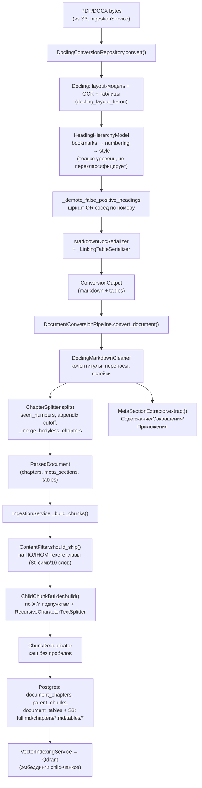
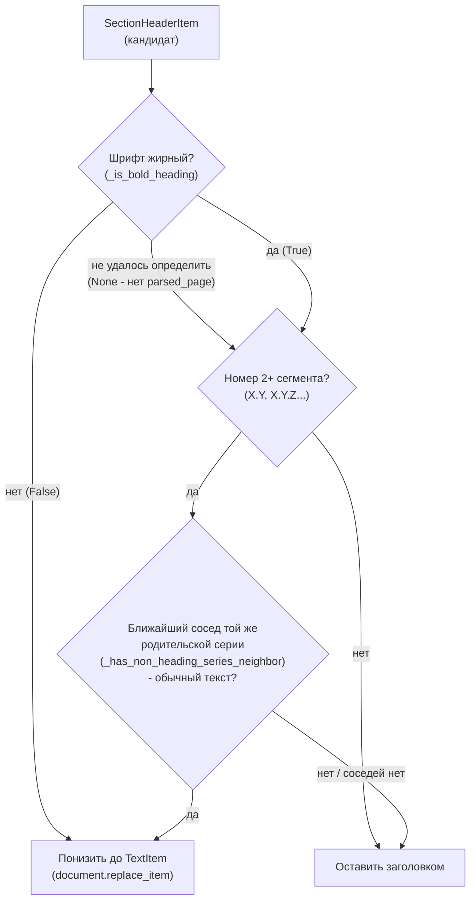
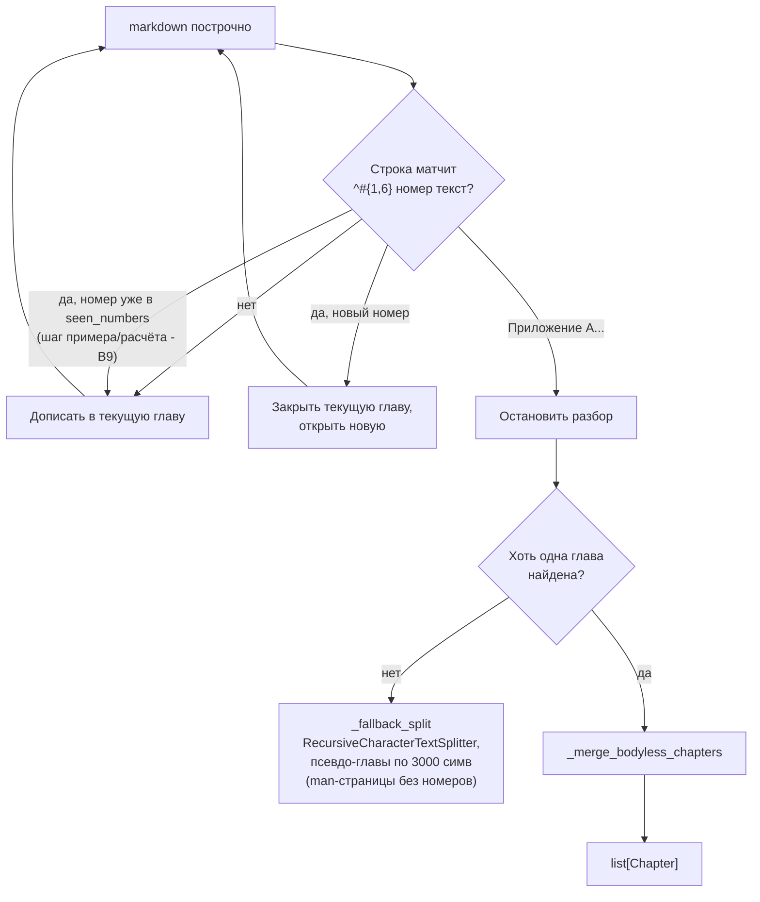

# Архитектура парсера документов (Docling → главы → чанки)

Полный путь документа от байтов PDF/DOCX до строк в Postgres/Qdrant. Актуально
на 2026-07-30 (включает фиксы false-positive заголовков этой сессии).

## Обзор

---

## Полная схема (все шаги, все проверки)

Тот же путь, но с каждой внутренней проверкой/веткой — для отладки, когда
непонятно, на каком именно шаге пропало содержимое.

```mermaid
flowchart TD
    START(["PDF/DOCX bytes + filename\nIngestionService.process_document"])

    %% ---------- Стадия 1: Docling ----------
    LAYOUT["Layout-модель docling_layout_heron\nклассифицирует регионы по картинке\n→ label (SECTION_HEADER/TEXT/TABLE/...)\nуровень по умолчанию плоский, level=1"]
    OCR["EasyOCR ru/en\nтолько области без текстового слоя"]
    TSTRUCT["TableStructureOptions\ndo_cell_matching=True"]
    HHM_BM{"HeadingHierarchyModel:\nbookmark уверенно совпал?"}
    HHM_BM_YES["level из bookmark\n(может промоутить ListItem→SectionHeaderItem)"]
    HHM_NUM{"use_numbering:\nномер распознан\n(dotted/roman/alpha/...)?"}
    HHM_NUM_YES["level из глубины номера\n(перевешивает style безусловно)"]
    HHM_STYLE["use_style: level из размера шрифта\n(нужен generate_parsed_pages=True)"]
    DOC1["DoclingDocument\ndoc.texts: .label/.level/.prov"]

    START --> LAYOUT --> OCR --> TSTRUCT --> HHM_BM
    HHM_BM -->|да| HHM_BM_YES --> DOC1
    HHM_BM -->|нет| HHM_NUM
    HHM_NUM -->|да| HHM_NUM_YES --> DOC1
    HHM_NUM -->|нет| HHM_STYLE --> DOC1

    %% ---------- Стадия 2: демоушен ложных заголовков ----------
    S2LOOP["для каждого SectionHeaderItem\nв list(document.texts) - один снимок"]
    FONT{"_is_bold_heading:\nfont_name пересекающихся\ntextline_cells содержит 'bold'?"}
    NUMCHECK{"_parse_number(text)\n>= 2 сегментов номера?"}
    NEIGH{"_has_non_heading_series_neighbor:\nближайший сосед той же серии\n(до ИЛИ после) - обычный текст?"}
    DEMOTE["document.replace_item\nSectionHeaderItem → TextItem"]
    KEEP["остаётся SectionHeaderItem"]
    DOC2["DoclingDocument (скорректированный)"]

    DOC1 --> S2LOOP --> FONT
    FONT -->|"False, не жирный"| DEMOTE
    FONT -->|"None, нет parsed_page/cells"| NUMCHECK
    FONT -->|"True, жирный"| NUMCHECK
    NUMCHECK -->|нет| KEEP
    NUMCHECK -->|да| NEIGH
    NEIGH -->|"сосед = текст"| DEMOTE
    NEIGH -->|"оба соседа заголовки\nили соседей нет вовсе"| KEEP
    DEMOTE --> DOC2
    KEEP --> DOC2

    %% ---------- Сериализация ----------
    TBLSER["_LinkingTableSerializer\nдля каждого TableItem"]
    TBLCONT{"продолжение таблицы\nс предыдущей страницы?\n(та же ширина, page_range<=1, без caption)"}
    TBLMERGE["pd.concat строк,\nперезаписать сохранённый CSV/HTML"]
    TBLNEW["новая таблица:\nCSV+HTML в SavedTable,\nссылка в markdown"]
    MDEXPORT["MarkdownDocSerializer.serialize()"]
    OUTPUT["ConversionOutput\nmarkdown + list[SavedTable]"]

    DOC2 --> TBLSER --> TBLCONT
    TBLCONT -->|да| TBLMERGE --> MDEXPORT
    TBLCONT -->|нет| TBLNEW --> MDEXPORT
    MDEXPORT --> OUTPUT

    %% ---------- Стадия 3: очистка ----------
    CLEAN1["DoclingMarkdownCleaner.remove_repeated_lines\nколонтитулы/номера страниц"]
    CLEAN2["...clean(): склейка переносов слов,\nнормализация пробелов"]

    OUTPUT --> CLEAN1 --> CLEAN2

    %% ---------- Стадия 4: ChapterSplitter + MetaSectionExtractor ----------
    CSSCAN["построчный скан очищенного markdown"]
    CSMATCH{"строка матчит\n^#{1,6} номер текст?"}
    CSAPPEND["дописать в current_lines"]
    CSSEEN{"номер уже в seen_numbers?\n(B9: шаг примера/расчёта\nпереиспользует номер)"}
    CSNEW["save_current(), открыть новую главу,\nadd в seen_numbers"]
    CSSTOP["Приложение А... → break"]
    CSEMPTY{"главы вообще нашлись?"}
    CSFALLBACK["_fallback_split:\nRecursiveCharacterTextSplitter\nпсевдо-главы по 3000 симв\n(man-страницы без номеров)"]
    CSMERGE_LOOP["_merge_bodyless_chapters\nдля каждой главы по порядку"]
    CSBODY{"тело главы (без строки\nзаголовка) >=80 симв\nИ >=10 слов?"}
    CSCHILD{"есть более поздняя глава\nс номером {this}.X?\n(настоящий родитель)"}
    CSGLUE["приклеить markdown\nк предыдущей главе"]
    CSKEEP["оставить отдельной главой"]
    METAEXTRACT["MetaSectionExtractor.extract\nСодержание / Сокращения / Приложение"]

    CLEAN2 --> CSSCAN --> CSMATCH
    CSMATCH -->|нет| CSAPPEND --> CSSCAN
    CSMATCH -->|"Приложение А..."| CSSTOP
    CSMATCH -->|"да, номер"| CSSEEN
    CSSEEN -->|да, уже видели| CSAPPEND
    CSSEEN -->|нет, новый| CSNEW --> CSSCAN
    CSSTOP --> CSEMPTY
    CSEMPTY -->|да| CSFALLBACK
    CSEMPTY -->|нет| CSMERGE_LOOP --> CSBODY
    CSBODY -->|да| CSKEEP
    CSBODY -->|нет| CSCHILD
    CSCHILD -->|да, есть подглавы| CSKEEP
    CSCHILD -->|нет| CSGLUE
    CLEAN2 --> METAEXTRACT

    PARSEDDOC["ParsedDocument\nchapters + meta_sections + tables + full_markdown"]
    CSFALLBACK --> PARSEDDOC
    CSKEEP --> PARSEDDOC
    CSGLUE --> PARSEDDOC
    METAEXTRACT --> PARSEDDOC

    %% ---------- Стадия 5: chunk building ----------
    BCLOOP["_build_chunks: для каждой главы"]
    CF{"ContentFilter.should_skip\nна ПОЛНОМ тексте главы\n(заголовок+тело) <80симв/<10слов?"}
    SKIPCHAPTER["глава целиком пропущена -\nни ParentChunk, ни child'ы"]
    DEDUPCHECK{"ChunkDeduplicator:\nхэш(текст без пробелов)\nуже встречался?"}
    SKIPDUP["дубликат, пропущен"]
    MAKEPARENT["ParentChunk создан"]
    CCB["ChildChunkBuilder.build(text)"]
    SPLITPOINTS{"_split_by_numbered_points:\nесть X.Y подпункты внутри?"}
    STRUCTCHUNKS["нарезка по подпунктам"]
    RECURS["RecursiveCharacterTextSplitter\nchunk_size=400, overlap=40"]
    SIZECHECK{"структурный кусок\n> 1500 символов?"}
    RESPLIT["досечь RecursiveCharacterTextSplitter\n(защита от лимита TEI 512 токенов)"]
    CHILDVALID{"_is_valid:\n>=80 симв И >=10 слов?"}
    CHILDOK["ChildChunk создан"]
    CHILDDROP["отброшен как шум"]

    PARSEDDOC --> BCLOOP --> CF
    CF -->|да| SKIPCHAPTER
    CF -->|нет| DEDUPCHECK
    DEDUPCHECK -->|да| SKIPDUP
    DEDUPCHECK -->|нет| MAKEPARENT --> CCB --> SPLITPOINTS
    SPLITPOINTS -->|да| STRUCTCHUNKS --> SIZECHECK
    SPLITPOINTS -->|нет| RECURS --> CHILDVALID
    SIZECHECK -->|да| RESPLIT --> CHILDVALID
    SIZECHECK -->|нет| CHILDVALID
    CHILDVALID -->|да| CHILDOK
    CHILDVALID -->|нет| CHILDDROP

    %% ---------- Стадия 6: хранение ----------
    STOREPARENT["Postgres parent_chunks\ncontent + headers.chapter_number"]
    STOREVEC["VectorIndexingService\n→ эмбеддинг → Qdrant"]
    STORECHAPTERS["Postgres document_chapters\nВСЕ главы из ParsedDocument.chapters -\nбезусловно, даже пропущенные фильтром выше"]
    STORETABLES["Postgres document_tables\n+ S3 CSV/HTML"]
    STORES3["S3: full.md, chapters/chapter_N.md,\ntables/*.csv|html"]

    MAKEPARENT --> STOREPARENT
    CHILDOK --> STOREVEC
    PARSEDDOC --> STORECHAPTERS
    PARSEDDOC --> STORETABLES
    PARSEDDOC --> STORES3
```

---

## Стадия 1 — Docling-конвертация

**Файл:** `rag_service/infrastructures/repositories/docling_conversion_repository.py`,
`DoclingConversionRepository._build_converter()`.

- Layout-модель `docling_layout_heron` классифицирует регионы страницы по
  картинке (не по тексту) в `DocItemLabel` (`SECTION_HEADER`, `TEXT`, `TABLE`...).
  По умолчанию все заголовки получают `level=1` плоско.
- `HeadingHierarchyOptions(enabled=True)` включает реальную иерархию через
  `HeadingHierarchyModel` (запускается после reading-order модели). Приоритет
  сигналов: **bookmarks → numbering → style**, `setdefault`-логика — style
  применяется только если numbering не смог распарсить номер. **Важно:** эта
  модель только переставляет `.level` у уже готовых `SECTION_HEADER` — она
  никогда не может отменить сам факт классификации (это решение приняла
  layout-модель раньше, ещё на этапе картинки).
- `generate_parsed_pages = True` — даёт доступ к `parsed_page.textline_cells`
  (шрифт/bbox по каждой строке текста), нужно для стадии 2.
- `do_ocr=True` (только для областей без текстового слоя), `do_table_structure=True`.

---

## Стадия 2 — Отлов ложных заголовков (работа этой сессии)

**Файл:** тот же, функции `_is_bold_heading` / `_find_same_series_neighbor` /
`_has_non_heading_series_neighbor` / `_demote_false_positive_headings`.

**Проблема:** на нормативных документах (СП/ГОСТ) layout-модель иногда путает
нумерованный пункт тела раздела с заголовком главы — из-за несогласованного
форматирования исходного PDF. Без фикса весь текст ДО следующего настоящего
заголовка ошибочно приписывается такому пункту (реальный пример: `4.2.3` в
СП 1.13130 утащил 19КБ чужого текста из раздела 4.2).

Два независимых сигнала, любой срабатывает (OR):

| Сигнал | Функция | Ловит | Не ловит |
|---|---|---|---|
| Шрифт | `_is_bold_heading` | `4.2.3`, `6.7.5` — визуально не жирные, слились бы с телом | `3.25` (жирный из-за пометки правки) |
| Сосед по номеру | `_has_non_heading_series_neighbor` | `3.25` — сосед `3.24` обычный текст | изолированный ложный заголовок без соседей той же серии вообще |

`_find_same_series_neighbor` ищет **ближайшего** (не арифметически точного)
соседа с тем же префиксом номера (все сегменты кроме последнего) — устойчиво
к разрывам нумерации (пункты "утратили силу" в более ранних поправках).
Настоящие многосоставные подглавы (`6.10.1`-`6.10.5` в СП 4.13130) не задеваются
— у каждой оба соседа тоже заголовки.

Оба сигнала работают на **одном замороженном снимке** `list(document.texts)` —
решения по соседям не зависят от уже принятых в этом же проходе решений по
другим пунктам (детерминированность, не каскадируем демоушены).

---

## Стадия 3 — Очистка markdown

**Файл:** `rag_service/domain/chunking/docling_text_cleaner.py`,
`DoclingMarkdownCleaner`. Вызывается из `DocumentConversionPipeline`.

Убирает повторяющиеся колонтитулы/номера страниц, склеивает слова, разорванные
переносом, нормализует пробелы. Работает на уже собранном полном markdown,
до нарезки на главы.

---

## Стадия 4 — Нарезка на главы

**Файл:** `rag_service/domain/chunking/docling_segmenter.py`, `ChapterSplitter.split()`.

`_merge_bodyless_chapters` (добавлено этой сессией) — глава без собственного
тела (короче 80 симв/10 слов **после строки заголовка**) — не самостоятельная
тема, а рядовой пункт (пример: `3.25` в СП 2.13130, короткая ссылка на ГОСТ).
Склеивается с предыдущей главой, **кроме** случая, когда у неё есть свои
подглавы дальше по документу (номер следующей главы начинается с `{номер}.`)
— тогда это настоящий организующий заголовок с короткой вводной частью
(`4` перед `4.1`-`4.4`, `5` перед `5.1`-`5.4`), трогать нельзя.

---

## Стадия 5 — Чанкинг

**Файлы:** `rag_service/application/ingestion_service.py::_build_chunks`,
`rag_service/domain/chunking/chunk_builder.py`.

1. `ContentFilter.should_skip(text)` — на **полном** тексте главы (заголовок +
   тело), порог 80 симв/10 слов. Если не проходит — глава целиком пропускается,
   `ParentChunk` не создаётся вообще (ни один child-чанк тоже). Это отдельная
   проверка от `_merge_bodyless_chapters` (та смотрит только на тело без
   заголовка, на уровне `ChapterSplitter`, до этой стадии) — если глава прошла
   мимо `_merge_bodyless_chapters` (например, есть подглавы), но сама всё равно
   совсем без текста, этот фильтр — последний рубеж.
2. `ChildChunkBuilder.build(text)`:
   - `_split_by_numbered_points` — режет parent-текст по внутренним подпунктам
     `X.Y`/`X.Y.Z`.
   - Кусок длиннее `max_structured_chunk=1500` символов — досекается
     `RecursiveCharacterTextSplitter` по границам предложений (защита от лимита
     TEI в 512 токенов — иначе эмбеддинг падает на 413).
   - `_is_valid` — отсекает child-чанки короче 80 симв/10 слов.
3. `ChunkDeduplicator` — хэш нормализованного (без пробелов) текста, убирает
   дубли между главами.

---

## Стадия 6 — Хранение

**Файл:** `IngestionService._store_structural_data`/`_store_docling_artifacts`.

- `document_chapters` (Postgres): `chapter_number`, `title`, `s3_md_path` — по
  **каждой** главе из `ParsedDocument.chapters`, **безусловно** (не зависит от
  `ContentFilter.should_skip`). Поэтому глава может быть видна в списке глав
  документа (UI), но не иметь ни одного `parent_chunk` — если её текст не
  прошёл фильтр на шаге 5.1.
- `parent_chunks` (Postgres) + Qdrant — только главы, прошедшие
  `ContentFilter`/дедупликацию, с child-чанками, векторизованными
  `VectorIndexingService`.
- `document_tables` (Postgres) + S3 CSV/HTML — таблицы, извлечённые
  `_LinkingTableSerializer` на стадии 1 (со склейкой разрывов по границе страниц).
- S3 `full.md`/`chapters/chapter_N.md`/`tables/*` — сырые артефакты про запас.

---

## Известные ограничения (не решены, осознанно)

| Ограничение | Где | Почему не решено |
|---|---|---|
| Изолированный ложный заголовок без соседей той же серии и без явного отличия шрифта | Стадия 2 | Ни один из двух сигналов не сработает — не наблюдалось на реальных документах сессии, не проектировали впрок |
| Оглавление (ToC) с номерами пунктов как обычным текстом может дать ложное "соседство" | Стадия 2 (`_has_non_heading_series_neighbor`) | Гипотетический случай, не воспроизведён ни на одном из 3 проверенных документов |
| `generate_parsed_pages=True` — цена по памяти на GPU с ограниченной VRAM | Стадия 1 | Осознанный компромисс ради шрифтового сигнала, не измерено на всём корпусе |
| Глава видна в `document_chapters`, но не имеет `parent_chunks` (контент невидим для поиска) | Стадия 5.1 | Существовало до этой сессии, отдельный класс проблемы (см. ISSUES.md) |

## Карта файлов

| Файл | Роль |
|---|---|
| `rag_service/infrastructures/repositories/docling_conversion_repository.py` | Docling-конвертация + отлов ложных заголовков (стадии 1-2) |
| `rag_service/domain/chunking/docling_text_cleaner.py` | Очистка markdown (стадия 3) |
| `rag_service/domain/chunking/docling_segmenter.py` | `ChapterSplitter`, `MetaSectionExtractor` (стадия 4) |
| `rag_service/application/docling_pipeline.py` | Оркестратор стадий 1-4, `ParsedDocument` |
| `rag_service/domain/chunking/chunk_builder.py` | `ContentFilter`, `ChildChunkBuilder`, `ChunkDeduplicator` (стадия 5) |
| `rag_service/application/ingestion_service.py` | Полный цикл, включая хранение (стадия 6) |
| `rag_service/tests/test_docling_conversion_repository.py` | Тесты стадии 2 |
| `rag_service/tests/test_docling_segmenter.py` | Тесты стадии 4 |
